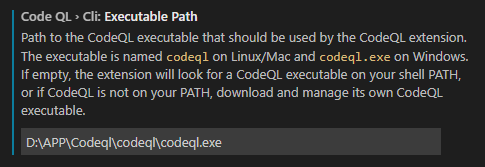
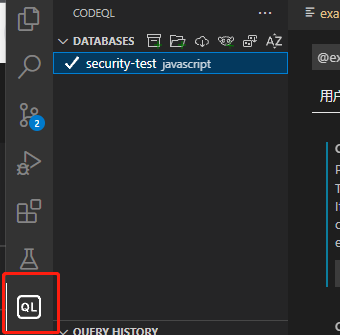

# 安装CodeQL

CodeQL的处理对象并不是源码本身，而是中间生成的AST结构数据库，所以我们先需要把我们的项目源码转换成CodeQL能够识别的CodeDatabase。

1. 创建数据库。
2. 对数据库进行查找。
3. 分析查询结果发现漏洞

现成的查询和代码库https://github.com/semmle/ql

### 安装codeql引擎

https://github.com/github/codeql-cli-binaries/releases下载解压后添加路径至环境变量

### 安装vscode拓展

安装后，添加引擎路径



选择添加数据库



### LGTM

CodeQL平台的云版本https://lgtm.com/query

练习lab[GitHub Learning Lab](https://lab.github.com/githubtraining)

# CodeQL语法

创建数据库

使用Codeql钱需要创建CodeQL数据库来在目标项目上运行查询语句。项目需要可build，且有所有依赖包。

在项目根目录下执行：

```
codeql database create <database> --language=<language-identifier>
```

- \<database>：待创建数据库路径
- --language：项目语言标识符

参数：

- --source-root：用于创建数据库的主要源文件夹，默认当前目录
- --db-cluster：多语言代码库，用于威一种以上的语言的项目创建数据库
- --command：python和js可以忽略该选项，该选项指定了调用编译器所需的构建命令。该命令从当前文件夹运行，或者 --source-root。 如果不包含 --command，CodeQL 将尝试使用内置的自动构建器自动检测build system。


基础查询语法：

```
/**
 *
 * Query metadata
 *
 */

import /* ... CodeQL libraries or modules ... */

/* ... Optional, define CodeQL classes and predicates ... */

from /* ... 变量声明 ... */
where /* ... 逻辑处理 ... */
select /* ... 表达式 ... */
```

import 

导入CodeQL库和模块

from

Optional，用于变量声明，变量需指定类型

where

Optional，对from字句中声明的变量做逻辑处理，可以使用聚合、谓词和逻辑公式筛选出满足条件的数据集合。

CodeQL 库对特定语言和框架的常用谓词进行分组。

select

```
select element, string
```

用来输出，通常放在文件的结尾。

至少包括两列，Element列用来返回触发规则的代码位置，String列用来描述生成该告警的描述信息

可以使用as关键字自定义字段名/列名

可以使用order by关键字排序

```
import javascript

from int x, int y
where x = 3 and y in [0 .. 2]
select  x, y, x * y as product, "product: " + product
    order by product desc
```

