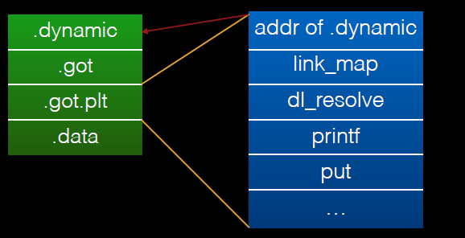

# 文件基本结构

## ELF文件按概要

### 简介

ELF （Executable and Linkable Format）文件，也就是在 Linux 中的目标文件：

- 可重定位文件（Relocatable File），包含由编译器生成的代码以及数据。连接器将它与其它目标文件链接起来创建可执行文件或共享目标文件。后缀一般为.o
- 可执行文件（Executable File）
- 共享目标文件（Shared Object File），包含代码和数据，称为库文件，一般以.so结尾，有两种使用情节：
  - 链接器Link eDitor, ld，处理它和其它可重定位文件以及共享目标文件，生成另外一个目标文件
  - 动态链接器Dynamic Linker 将它与可执行文件以及其他共享目标组合生成进程镜像

目标文件由汇编器和链接器创建，是文本程序的二进制形式，可以直接在处理器上运行。目标文件既会参与**程序链接**，又会参与**程序执行**。目标文件格式提供了其内容的两种并行视图：


 ELF 头部（ **ELF Header**），它给出了整个文件的组织情况。

程序头部表（Program Header Table）存在的话，它会告诉系统如何创建进程。用于生成进程的目标文件必须具有程序头部表，但是重定位文件不需要这个表。

程序头部表（Program Header Table）存在的话，它会告诉系统如何创建进程。用于生成进程的目标文件必须具有程序头部表，但是重定位文件不需要这个表。

节区头部表（Section Header Table）包含了描述文件节区的信息，每个节区在表中都有一个表项，会给出节区名称、节区大小等信息。

对于**执行视图**来说，其主要的不同点在于没有了 section，而有了多个 segment。其实这里的 segment 大都是来源于链接视图中的 section。

### Header

```c
#define EI_NIDENT   16

typedef struct {
    unsigned char   e_ident[EI_NIDENT];
    ELF32_Half      e_type;
    ELF32_Half      e_machine;
    ELF32_Word      e_version;
    ELF32_Addr      e_entry;
    ELF32_Off       e_phoff;
    ELF32_Off       e_shoff;
    ELF32_Word      e_flags;
    ELF32_Half      e_ehsize;
    ELF32_Half      e_phentsize;
    ELF32_Half      e_phnum;
    ELF32_Half      e_shentsize;
    ELF32_Half      e_shnum;
    ELF32_Half      e_shstrndx;
} Elf32_Ehdr;
```
**e_ident**

| 宏名称     | 下标 | 目的                                               |
| :--------- | :--- | :------------------------------------------------- |
| EI_MAG0    | 0    | 文件标识 0x7f                                      |
| EI_MAG1    | 1    | 文件标识 'E'                                       |
| EI_MAG2    | 2    | 文件标识 'L'                                       |
| EI_MAG3    | 3    | 文件标识 'F'                                       |
| EI_CLASS   | 4    | 文件类 0(invalid) 1(32bit) 2(64bit)                |
| EI_DATA    | 5    | 数据编码 0(invalid) 1(little endian) 2(big endian) |
| EI_VERSION | 6    | 文件版本                                           |
| EI_PAD     | 7    | 补齐字节开始处                                     |

**e_type**

标识目标文件类型。

| 名称      | 值     | 意义           |
| :-------- | :----- | :------------- |
| ET_NONE   | 0      | 无文件类型     |
| ET_REL    | 1      | 可重定位文件   |
| ET_EXEC   | 2      | 可执行文件     |
| ET_DYN    | 3      | 共享目标文件   |
| ET_CORE   | 4      | 核心转储文件   |
| ET_LOPROC | 0xff00 | 处理器指定下限 |
| ET_HIPROC | 0xffff | 处理器指定上限 |

**e_machine**

| 名称     | 值   | 意义           |
| :------- | :--- | :------------- |
| EM_NONE  | 0    | 无机器类型     |
| EM_M32   | 1    | AT&T WE 32100  |
| EM_SPARC | 2    | SPARC          |
| EM_386   | 3    | Intel 80386    |
| EM_68K   | 4    | Motorola 68000 |
| EM_88K   | 5    | Motorola 88000 |
| EM_860   | 7    | Intel 80860    |
| EM_MIPS  | 8    | MIPS RS3000    |

**e_entry: **系统转交控制权给 ELF 中相应代码的虚拟地址。如果没有相关的入口项，则这一项为 0。

**e_phoff:** **程序头部表**在文件中的字节偏移（**Program Header table OFFset**）

**e_shoff:** **节头表**在文件中的字节偏移（ **Section Header table OFFset** ）

**e_ehsize**:  ELF 文件头部的字节长度（ELF Header Size）

....

### Program Header Table

Program Header Table 是一个结构体数组，每一个元素的类型是 `Elf32_Phdr`，描述了一个`Segment`或者其它系统在准备程序执行时所需要的信息。ELF 头中的 `e_phentsize` 和 `e_phnum` 指定了该数组每个元素的大小以及元素个数。专门为 ELF 文件运行时中的段所准备的。ELF目标文件不需要被装在，所以没有程序 头表，只有可执行文件和共享库文件有。

```c
typedef struct {
    ELF32_Word  p_type;
    ELF32_Off   p_offset;
    ELF32_Addr  p_vaddr;
    ELF32_Addr  p_paddr;
    ELF32_Word  p_filesz;
    ELF32_Word  p_memsz;
    ELF32_Word  p_flags;
    ELF32_Word  p_align;
} Elf32_Phdr;
```

| 字段     | 说明                                                         |
| :------- | :----------------------------------------------------------- |
| p_type   | 该字段为段的类型，或者表明了该结构的相关信息。               |
| p_offset | 该字段给出了从文件开始到该段开头的第一个字节的偏移。         |
| p_vaddr  | 该字段给出了该段第一个字节在内存中的虚拟地址。               |
| p_paddr  | 该字段仅用于物理地址寻址相关的系统中， 由于 “System V” 忽略了应用程序的物理寻址，可执行文件和共享目标文件的该项内容并未被限定。 |
| p_filesz | 该字段给出了文件镜像中该段的大小，可能为 0。                 |
| p_memsz  | 该字段给出了内存镜像中该段的大小，可能为 0。                 |
| p_flags  | 该字段给出了与段相关的标记。                                 |
| p_align  | 可加载的程序的段的 p_vaddr 以及 p_offset 的大小必须是 page 的整数倍。该成员给出了段在文件以及内存中的对齐方式。如果该值为 0 或 1 的话，表示不需要对齐。除此之外，p_align 应该是 2 的整数指数次方，并且 p_vaddr 与 p_offset 在模 p_align 的意义下，应该相等。 |

段内容

一个段可能包括一到多个节区，必须需要各种各样的数据来使得程序可以执行以及动态链接等等。


### code Section

共享目标文件通过动态结构中的 DT_INIT 和 DT_FINI 来指定它们的初始化以及结束函数。在一般情况下，这些函数在. init 节与. fini 节中。

.init & .init_array
此节区包含可执行指令，是进程初始化代码的一部分。程序开始执行时，系统会在开始调用主程序入口（通常指 C 语言的 main 函数）前执行这些代码。

.text
此节区包含程序的可执行指令。

.fini & .fini_array
此节区包含可执行的指令，是进程终止代码的一部分。程序正常退出时，系统将执行这里的代码。

### Data Relater Sections

.BSS Section
未初始化的全局变量对应的节。此节区不占用 ELF 文件空间，但占用程序的内存映像中的空间。当程序开始执行时，系统将把这些数据初始化为 0。bss 其实是 block started by symbol 的简写。

.data Section
这些节区包含初始化了的数据，会在程序的内存映像中出现。

.rodata Section
这些节区包含只读数据，这些数据通常参与进程映像的不可写段。

### .symtab: Symbol Table

每个目标文件都会有一个符号表，包含了**一些通用的符号**，这部分信息在进行了 `strip` 操作后就会消失。这些符号信息可能包括变量名、函数名。

符号表可以被视为一个数组，数组中的每一个元素都是一个结构体，具体如下:

```c
typedef struct
{
    Elf32_Word st_name;     /* Symbol name (string tbl index) */
    Elf32_Addr st_value;    /* Symbol value */
    Elf32_Word st_size;     /* Symbol size */
    unsigned char st_info;  /* Symbol type and binding */
    unsigned char st_other; /* Symbol visibility */
    Elf32_Section st_shndx; /* Section index */
} Elf32_Sym;
```

| 字段     | 说明                                                         |
| :------- | :----------------------------------------------------------- |
| st_name  | 符号在字符串表中对应的索引。如果该值非 0，则它表示了给出符号名的字符串表索引，否则符号表项没有名称。 注：外部 C 符号在 C 语言和目标文件的符号表中具有相同的名称。 |
| st_value | 给出与符号相关联的数值，具体取值依赖于上下文，可能是一个正常的数值、一个地址等等。 |
| st_size  | 给出对应符号所占用的大小。如果符号没有大小或者大小未知，则此成员为 0。 |
| st_info  | 给出符号的类型和绑定属性。之后会给出若干取值和含义的绑定关系。 |
| st_other | 目前为 0，其含义没有被定义。                                 |
| st_shndx | 如果符号定义在该文件中，那么该成员为符号所在节在节区头部表中的下标；如果符号不在本目标文件中，或者对于某些特殊的符号，该成员具有一些特殊含义。 |

### String Section

.strtab: String Table

该节区描述默认的字符串表，包含了一系列的以 NULL 结尾的字符串。ELF 文件使用这些字符串来存储程序中的符号名，包括

- 变量名
- 函数名

一般通过对字符串的首个字母在字符串表中的下标来索引字符串。字符串表的首尾字节都是 NULL。此外，索引为 0 的字符串要么没有名字，要么就是名字为空。

### Dynamic Sections

.interp
这个节包含了程序对应的解释器。

在 exec (BA_OS) 过程中，系统会从该节中提取解释器的路径，并根据解释器文件的段创建初始时的程序镜像。也就是说，系统并不使用给定的可执行文件的镜像，而会首先为解释器构造独立的内存镜像。解释器需要从系统处获取控制权，然后为应用程序提供执行环境。

.dynamic

如果一个目标文件参与到动态链接的过程中，那么它的程序头部表将会包含一个类型为 PT_DYNAMIC 的元素。这个段包含了 .dynamic 节。ELF 使用 _DYNAMIC 符号来标记这个节。它的结构如下

```c
/* Dynamic section entry.  */
typedef struct
{
    Elf32_Sword d_tag; /* Dynamic entry type */
    union
    {
        Elf32_Word d_val; /* Integer value */
        Elf32_Addr d_ptr; /* Address value */
    } d_un;
} Elf32_Dyn;
extern Elf32_Dyn_DYNAMIC[];
```

d_tag 的取值决定了该如何解释 d_un。

- d_val
  - 这个字段表示一个整数值，可以有多种意思。
- d_ptr
  - 这个字段表示程序的虚拟地址。正如之前所说的，一个文件的虚拟地址在执行的过程中可能和内存的虚拟地址不匹配。当解析动态节中的地址时，动态链接器会根据原始文件的值以及内存的基地址来计算真正的地址。为了保持一致性，文件中并不会包含重定位入口来 "纠正" 动态结构中的地址。

### Global Offset Table

GOT 表在 ELF 文件中分为两个部分

- .got，存储导入变量的地址。
- .got.plt，存储导入函数的地址。

GOT 表中包含了隐藏的绝对地址，这使得在不违背位置无关性以及程序代码段共享的情况下，得到相关符号的绝对地址。类似PE文件中的IAT表，got 表中包含重定向所需要的信息。当一个系统为可加载的目标文件创建内存段时，动态链接器会处理重定位项，动态链接器会决定相关符号的值，计算它们的绝对地址，然后将合适的内存表项设置为相应的值。

在 Linux 的实现中，.got.plt 的前三项的具体的含义如下

- GOT[0]，.dynamic 的地址。这使得一个程序，例如动态链接器，在没有执行其重定向前可以找到对应的动态节。
- GOT[1]，指向 link_map 的指针，只会在动态装载器中使用，包含了进行符号解析需要的当前 ELF 对象的信息。每个 link_map 都是一条双向链表的一个节点，而这个链表保存了所有加载的 ELF 对象的信息。
- GOT[2]，指向动态装载器中 _dl_runtime_resolve 函数的指针。

.got.plt 后面的项则是程序中不同 .so 中函数的引用地址。



### Procedure Linkage Table

PLT 表将导入函数重定向到绝对地址。主要包括两部分

- **.plt**，与常见导入的函数有关，如 read 等函数。
- **.plt.got**，与动态链接有关系。

为了解决链接不使用模块的问题，ELF采用延迟绑定的做法，其基本思想是函数第一次被用到时才进行绑定（符号查找，重定位等），如果没有用则不进行绑定。程序开始执行前，模块间的函数调用都没有进行绑定，而是需要用到时才由动态链接器负责绑定。

惰性绑定流程如下，紫线表示首次执行的流程图，红线表示第二次以后调用的流程图：


过程解析：

当第一次建立程序的内存镜像时，**动态链接器将 GOT 表的第二个和第三个项设置为特殊的值**，下面的步骤会仔细解释这些数值。

如果过程链接表是位置独立的话，那么 **GOT 表的地址必须在 ebx 寄存器中**。每一个进程镜像中的共享目标文件都有独立的 PLT 表，并且程序只在同一个目标文件将控制流交给 PLT 表项。因此，调用函数负责在调用 PLT 表项之前，将全局偏移表的基地址设置为寄存器中。

1. 这里举个例子，假设程序调用了 name1，它将控制权交给了 lable .PLT1。
2. 那么，第一条指令将会跳转到全局偏移表中 name1 的地址。初始时，全局偏移表中包含 PLT 中下一条 pushl 指令的地址，并不是 name1 的实际地址。
3. 因此，程序将相应函数在 `rel.plt` 中的偏移（重定位偏移，reloc_index）压到栈上。重定位偏移是 32 位的，并且是非负的数值。此外，重定位表项的类型为 R_386_JMP_SLOT，并且它将会说明在之前 jmp 指令中使用的全局偏移表项在 GOT 表中的偏移。重定位表项也包含了一个符号表索引，因此告诉动态链接器什么符号目前正在被引用。在这个例子中，就是 name1 了。
4. 在压入重定位偏移后，程序会跳转到 .PLT0，这是过程链接表的第一个表项。pushl 指令将 GOT 表的第二个表项 (got_plus_4 或者 4(%ebx)，**当前 ELF 对象的信息**) 压到栈上，然后给动态链接器一个识别信息。此后，程序会跳转到第三个全局偏移表项 (got_plus_8 或者 8(%ebx)，**指向动态装载器中 `_dl_runtime_resolve` 函数的指针**) 处，这将会将程序流交给动态链接器。
5. 当动态链接器接收到控制权后，他将会进行出栈操作，查看重定位表项，解析出对应的符号的值，然后将 name1 的地址写入到全局偏移表项中，最后将控制权交给目的地址。
6. 过程链接表执行之后，程序的控制权将会直接交给 name1 函数，而且此后再也不会调用动态链接器来解析这个函数。也就是说，在 .PLT1 处的 jmp 指令将会直接跳转到 name1 处，而不是再次执行 pushl 指令。

### .rel(a).dyn & .rel(a).plt

- .rel.dyn 包含了动态链接的二进制文件中需要重定位的变量的信息
-  .rel.plt 包含了需要重定位的函数的信息

这两类重定位节都使用如下的结构

```c
typedef struct {
    Elf32_Addr        r_offset;
    Elf32_Word       r_info;
} Elf32_Rel;

typedef struct {
    Elf32_Addr     r_offset;
    Elf32_Word    r_info;
    Elf32_Sword    r_addend;
} Elf32_Rela;
```

| 成员     | 说明                                                         |
| :------- | :----------------------------------------------------------- |
| r_offset | **此成员给出了需要重定位的位置。**对于一个可重定位文件而言，此值是从需要重定位的符号所在节区头部开始到将被重定位的位置之间的字节偏移。对于可执行文件或者共享目标文件而言，其取值是需要重定位的**虚拟地址**，一般而言，也就是说我们所说的 GOT 表的地址。 |
| r_info   | **此成员给出需要重定位的符号的符号表索引，以及相应的重定位类型。** 例如一个调用指令的重定位项将包含被调用函数的符号表索引。如果索引是 STN_UNDEF，那么重定位使用 0 作为 “符号值”。此外，重定位类型是和处理器相关的。 |
| r_addend | 此成员给出一个常量补齐，用来计算将被填充到可重定位字段的数值。 |

# 程序加载

程序加载过程其实就是系统创建或者扩充进程镜像的过程。它只是按照一定的规则把文件的段拷贝到虚拟内存段中。程序加载过程其实就是系统创建或者扩充进程镜像的过程。它只是按照一定的规则把文件的段拷贝到虚拟内存段中。


对应的代码段以及数据段的解释如下


- 代码段的第一个页包含了 ELF 头，程序头部表，以及其他信息。
- 代码段的最后一页包含了数据段开始部分的副本。
- 数据段的最后一页包含了代码段的最后部分的副本。至于多少，暂未说明。
- 数据段的最后一部分可能会包含与程序运行无关的信息。

在上面给出的例子中，文件的代码段的最后一部分和数据段的开始部分都会被映射两次：分别在数据段的虚拟地址以及代码段的虚拟地址。

该文件对应的虚拟内存镜像如下（假设每一页大小为 4KB）


可执行文件通常来说包含绝对代码。为了能够使得程序正确执行，每一个段应该在用于构建可执行文件的虚拟地址处。因此，系统直接使用 p_vaddr 作为虚拟地址。

共享目标文件通常包含地址独立代码。这使得在不同的进程中，同一段的虚拟地址可能会有所不同，但这并不会影响程序的执行行为。尽管系统会为不同的进程选择不同的虚拟地址，但是它仍旧维持了段的相对地址。

# 程序链接

## 动态链接

动态链接主要是在程序初始化时或者程序执行的过程中解析变量或者函数的引用。

## Dynamic Linker

动态链接器可以用来帮助加载应用所需要的库并解析库所导出的动态符号（函数和全局变量）。当使用动态链接来构造程序时，链接编辑器会在可执行文件的程序头部添加一个 `PT_INTERP` 类型的元素，以便于告诉系统将动态链接器作为程序解释器来调用。

可执行程序和动态链接器会合作起来为程序创建进程镜像，具体的细节如下：

1. 将可执行文件的内存段添加到进程镜像中。
2. 将共享目标文件的内存段添加到进程镜像中
3. 为可执行文件以及共享目标文件进行重定位
4. 如果传递给了动态链接器一个文件描述符的话，就将其关闭
5. 将控制权传递给程序。这让我们感觉起来就好像程序直接从可执行文件处拿到了执行权限

因为所有的 UNIX System V 都会从一个共享目标文件中导入基本的系统服务，动态链接器会参与到每一个` TIS ELF-conforming` 的程序执行过程中。

## Function Address

可执行文件中的函数的地址引用和共享目标中与其相关的引用可能并不会被解析为一个值。共享目标文件中对应的引用将会被动态链接器解析到函数本身对应的虚拟地址处。可执行文件中对应的引用（来自于共享目标文件）将会被链接编辑器解析为过程链接表中对应函数的项中的地址。

## Share Object Dependencies

当链接编辑器在处理一个归档库的时候，它会提取出库成员并且把它们拷贝到输出目标文件中。

当一个动态链接器为一个目标文件创建内存段时，在 `DT_NEEDED `项中描述的依赖给出了需要什么依赖文件来支持程序的服务。通过不断地连接被引用的共享目标文件（即使一个共享目标文件被引用多次，它最后也只会被动态链接器连接一次）及它们的依赖，动态链接器建立了一个完全的进程镜像。当解析符号引用时，动态链接器会使用 BFS（广度优先搜索）来检查符号表。

>  首先DL检查可执行文件本身符号表，再按顺序检查`DT_NEEDED`入口的符号表，然后才会继续查看下一次以来。

# 程序执行

静态执行


动态执行


## 基本操作

### sys_execve

该函数主要用于执行一个新的程序，即执行我们想要执行的程序，会检查相应的 argv 以及 envp 等参数。

### do_execve

该函数打开目标映像文件，并从目标文件的开始处读入指定长度的（目前为 128）字节来获取相应目标文件的基本信息。

### search_binary_handler

该函数会搜索支持处理当前类型的二进制文件类型队列，以便于让各种可执行程序的处理程序进行相应的处理。

### load_elf_binary

1. 检查并获取elf文件头部信息

2. 若采用动态链接，用`.interp`节确定loader路径

3. 将program header记录的相应段映射到内存中，记录的相关信息如下

   1. 每一个段需要映射到的地址

   2. 每一个段相应的权限

   3. 记录哪些节属于哪些段

      

4. 分情况处理

   1. 动态：将 sys_execve 的返回地址改为 loader(ld.so) 的 entry point。
   2. 静态：将 sys_execve 的返回地址改为程序的入口点。

### ld.so

该文件功能：

- 主要用于载入ELF文件中的`DT_NEED`中记录的共享库
- 初始化工作
- 初始化GOT表
- 将system table合并到global symbol table

### _start

该函数将以下项目交给 libc_start_main

- 环境变量初始地址
- .init
- 启动main函数前的初始化工作
- fini
- 程序结束前的收尾工作

