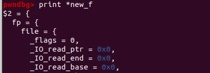
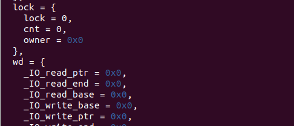
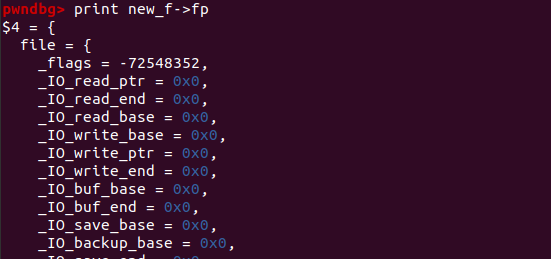
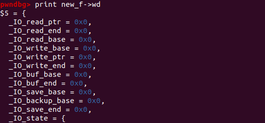
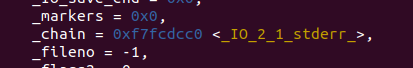
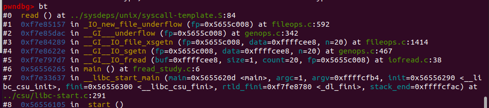
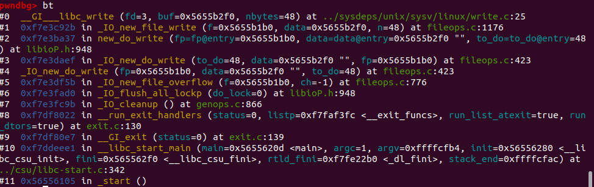

```c
struct _IO_FILE {
  int _flags;       /* High-order word is _IO_MAGIC; rest is flags. */
#define _IO_file_flags _flags

  /* The following pointers correspond to the C++ streambuf protocol. */
  /* Note:  Tk uses the _IO_read_ptr and _IO_read_end fields directly. */
  char* _IO_read_ptr;   /* Current read pointer */
  char* _IO_read_end;   /* End of get area. */
  char* _IO_read_base;  /* Start of putback+get area. */
  char* _IO_write_base; /* Start of put area. */
  char* _IO_write_ptr;  /* Current put pointer. */
  char* _IO_write_end;  /* End of put area. */
  char* _IO_buf_base;   /* Start of reserve area. */
  char* _IO_buf_end;    /* End of reserve area. */
  /* The following fields are used to support backing up and undo. */
  char *_IO_save_base; /* Pointer to start of non-current get area. */
  char *_IO_backup_base;  /* Pointer to first valid character of backup area */
  char *_IO_save_end; /* Pointer to end of non-current get area. */

  struct _IO_marker *_markers;

  struct _IO_FILE *_chain;

  int _fileno;
#if 0
  int _blksize;
#else
  int _flags2;
#endif
  _IO_off_t _old_offset; /* This used to be _offset but it's too small.  */

#define __HAVE_COLUMN /* temporary */
  /* 1+column number of pbase(); 0 is unknown. */
  unsigned short _cur_column;
  signed char _vtable_offset;
  char _shortbuf[1];

  /*  char* _save_gptr;  char* _save_egptr; */

  _IO_lock_t *_lock;
#ifdef _IO_USE_OLD_IO_FILE
#endif
#if defined _G_IO_IO_FILE_VERSION && _G_IO_IO_FILE_VERSION == 0x20001
  _IO_off64_t _offset;
# if defined _LIBC || defined _GLIBCPP_USE_WCHAR_T
  /* Wide character stream stuff.  */
  struct _IO_codecvt *_codecvt;
  struct _IO_wide_data *_wide_data;
  struct _IO_FILE *_freeres_list;
  void *_freeres_buf;
# else
  void *__pad1;
  void *__pad2;
  void *__pad3;
  void *__pad4;
# endif
  size_t __pad5;
  int _mode;
  /* Make sure we don't get into trouble again.  */
  char _unused2[15 * sizeof (int) - 4 * sizeof (void *) - sizeof (size_t)];
#endif

};
```

进程中的FILE结构会通过`_chain`域彼此连接形成一个链表，链表头部用全局变量`_IO_list_all`表示，通过这个值我们可以遍历所有的FILE结构。

每个程序启动时有三个文件流是自动打开的：stdin、stdout、stderr。因此在初始状态下，`_IO_list_all`指向了一个有这些文件流构成的链表。但这三个文件流在libc.so数据段上，fopen创建的文件流分配在堆内存上。

在libc.so中找到`stdin\stdout\stderr`等符号，

```
_IO_2_1_stderr_
_IO_2_1_stdout_	//printf/puts
_IO_2_1_stdin_	//scanf/gets
```

`_IO_FILE`结构外包裹着另一种结构`_IO_FILE_plus`，其中包含了一个重要的指针`vtable`指向了一系列函数指针。

```
struct _IO_FILE_plus
{
    _IO_FILE    file;
    IO_jump_t   *vtable;
}
```

`_IO_jump_t`中保存了一些函数指针，由vtable指向，标准IO函数中会调用这些函数指针，该类型在libc文件中的导出符号是`_IO_file_jumps`。

```
pwndbg> p _IO_file_jumps
$7 = {
  __dummy = 0, 
  __dummy2 = 0, 
  __finish = 0x7ffff7a8ac80 <_IO_new_file_finish>, 
  __overflow = 0x7ffff7a8b6d0 <_IO_new_file_overflow>, 
  __underflow = 0x7ffff7a8b480 <_IO_new_file_underflow>, 
  __uflow = 0x7ffff7a8c530 <__GI__IO_default_uflow>, 
  __pbackfail = 0x7ffff7a8d6e0 <__GI__IO_default_pbackfail>, 
  __xsputn = 0x7ffff7a8a500 <_IO_new_file_xsputn>, 
  __xsgetn = 0x7ffff7a8a210 <__GI__IO_file_xsgetn>, 
  __seekoff = 0x7ffff7a89870 <_IO_new_file_seekoff>, 
  __seekpos = 0x7ffff7a8caa0 <_IO_default_seekpos>, 
  __setbuf = 0x7ffff7a897e0 <_IO_new_file_setbuf>, 
  __sync = 0x7ffff7a89710 <_IO_new_file_sync>, 
  __doallocate = 0x7ffff7a7e7b0 <__GI__IO_file_doallocate>, 
  __read = 0x7ffff7a8a4e0 <__GI__IO_file_read>, 
  __write = 0x7ffff7a89ed0 <_IO_new_file_write>, 
  __seek = 0x7ffff7a89cd0 <__GI__IO_file_seek>, 
  __close = 0x7ffff7a897d0 <__GI__IO_file_close>, 
  __stat = 0x7ffff7a89ec0 <__GI__IO_file_stat>, 
  __showmanyc = 0x7ffff7a8d840 <_IO_default_showmanyc>, 
  __imbue = 0x7ffff7a8d850 <_IO_default_imbue>
}
```

- printf/puts 最终会调用`_IO_file_xsputn`
- fclose 最终会调用`_IO_FILE_FINISH`
- fwrite 最终会调用`_IO_file_xsputn_`
- fread 最终会调用`_IO_fiel_xsgetn`
- scanf/gets 最终会调用`_IO_file_xsgetn`


# fopen源码解析

fopen实际上是 `_IO_new_fopen`函数，该函数在`/libio/iofopen.c`文件中，可以看到它调用的是`__fopen_internal`，整个`__fopen_internal`函数包含四个部分：

1. `malloc`分配内存空间。
2. `_IO_no_init` 对file结构体进行`null`初始化。
3. `_IO_file_init`将结构体链接进`_IO_list_all`链表。
4. `_IO_file_fopen`执行系统调用打开文件。

malloc

首先调用`malloc`函数分配了一个`struct locked_FILE`大小的结构体，该结构体包含三个

- `_IO_FILE_plus`
- `_IO_lock_t`
- `_IO_wide_data`





_IO_no_init

接着就调用`_IO_no_init`函数去null初始化`_IO_FILE_plus`结构体，本上将所有的值都初始化为null以及默认值，同时将`_wide_data`字段赋值并初始化。





_IO_file_init

FILE结构体是通过`_IO_list_all`的单链表进行管理的，函数将`_IO_FILE_plus`结构体的vtable设置成了`_IO_file_jumps`，然后调用`_IO_file_init`将`_IO_FILE_plus`结构体链接进入`_IO_list_all`链表。

在没执行`_IO_file_init`函数前`_IO_list_all`指向的是`stderr`结构体


执行完后可以看到`_IO_list_all`指向的是申请出来的结构体，且FILE结构体chain字段指向`stderr`结构体




_IO_file_fopen

接下来就调用`_IO_new_file_fopen`函数，函数的主要功能就是执行系统调用`open`打开文件，并将文件描述符赋值给FILE结构体的`_fileno `字段，最后再次调用`_IO_link_in`函数，确保该结构体被链接进入`_IO_list_all`链表

总结

最后fopen程序返回FILE结构体指针，fopen返回之后`_IO_list_all`链表指向返回的FILE结构体，且FILE结构体的_chain字段指向之前的结构体。同时其他的字段大多都是默认的null值，`vtable`存储的是`__GI__IO_file_jumps`函数表。

# fread源码分析

整体流程为`fread`调用`_IO_sgetn`，`_IO_sgetn`调用vtable中的`_IO_XSGETN`也就是`_IO_file_xsgetn`，`_IO_file_xsgetn`是`fread`实现的核心函数。它的流程简单总结为：

1. 判断`fp->_IO_buf_base`输入缓冲区是否为空，如果为空则调用的`_IO_doallocbuf`去初始化输入缓冲区。
2. 在分配完输入缓冲区或输入缓冲区不为空的情况下，判断输入缓冲区是否存在数据。
3. 如果输入缓冲区有数据则直接拷贝至用户缓冲区，如果没有或不够则调用`__underflow`函数执行系统调用读取数据到输入缓冲区，再拷贝到用户缓冲区。

fread实际上是`_IO_fread`函数，会调用`_IO_sgetn`函数

`_IO_sgetn`函数里调用FILE结构体vtable中的`__GI__IO_file_xsgetn`：

- 第一部分，如果fp->_IO_buf_base为空的话，表明此时的FILE结构体中的指针未被初始化，则调用`_IO_doallocbuf`，建立输入缓冲区；
- 第二部分是输入缓冲区里有输入，即`fp->_IO_read_ptr`小于`fp->_IO_read_end`，此时将缓冲区里的数据直接拷贝至目标buff；
- 第三部分是输入缓冲区里的数据为空或者是不能满足全部的需求，则调用`__underflow`调用系统调用读入数据。

第一部分_IO_doallocbuf

```c
void _IO_doallocbuf (_IO_FILE *fp)
{
  if (fp->_IO_buf_base) 								// 如何输入缓冲区不为空，直接返回
    return;
  if (!(fp->_flags & _IO_UNBUFFERED) || fp->_mode > 0) 	//检查标志位
    if (_IO_DOALLOCATE (fp) != EOF) 					// 调用vtable函数
      return;
  _IO_setb (fp, fp->_shortbuf, fp->_shortbuf+1, 0);
}
libc_hidden_def (_IO_doallocbuf)
```

主要调用_IO_DOALLOCATE，是分配输入缓冲区的实现函数，首先调用`_IO_SYSSTAT`去获取文件信息，`_IO_SYSSTAT`函数是vtable中的` __stat`函数，获取文件信息，修改相应需要申请的size。空间申请出来后，调用`_IO_setb`，设置了`_IO_buf_base`和`_IO_buf_end`。初始化缓冲区就完成了，函数返回`_IO_file_doallocate`后，接着`_IO_doallocate`也返回，回到`_IO_file_xsgetn`函数中

第二部分 拷贝输入缓冲区数据

代码返回到`_IO_file_xsgetn`函数中，程序就进入到第二部分：拷贝输入缓冲区数据，如果输入缓冲区里存在已输入的数据，则把它直接拷贝到目标缓冲区里。

这部分比较简单，需要说明下的是从这里可以看出来`fp->_IO_read_ptr`指向的是输入缓冲区的起始地址，`fp->_IO_read_end`指向的是输入缓冲区的结束地址。

将`fp->_IO_read_end-fp->_IO_read_ptr`之间的数据通过`memcpy`拷贝到目标缓冲区里。

第三部分 执行系统调用读取数据

在输入缓冲区为0或者是不能满足需求的时候则会执行最后一步`__underflow`去执行系统调用`read`读取数据，并放入到输入缓冲区里。

第一次读取数据，此时的`fp->_IO_read_end`以及`fp->_IO_read_ptr`都是0，因此会进入到`__underflow`

```c
int
__underflow (_IO_FILE *fp)
{
  
  // 额外的检查
  ...
  if (fp->_IO_read_ptr < fp->_IO_read_end)
    return *(unsigned char *) fp->_IO_read_ptr;
  ...
  // 调用_IO_UNDERFLOW
  return _IO_UNDERFLOW (fp);
}
libc_hidden_def (__underflow)
```

`fp->_IO_read_ptr`小于`fp->_IO_read_end`则表明输入缓冲区里存在数据，可直接返回，微做一些检查就会调用`_IO_UNDERFLOW`函数，继续读取数据。其中`_IO_new_file_underflow`函数，是最终调用系统调用的地方，流程如下：

- 检查FILE结构体的`_flag`标志位是否包含`_IO_NO_READS`，如果存在这个标志位则直接返回`EOF`，其中`_IO_NO_READS`标志位的定义是`#define _IO_NO_READS 4 /* Reading not allowed */`。
- 如果`fp->_IO_buf_base`位null，则调用`_IO_doallocbuf`分配输入缓冲区。
- 接着初始化设置FILE结构体指针，将他们都设置成`fp->_IO_buf_base`
- 调用`_IO_SYSREAD`（vtable中的`_IO_file_read`函数），该函数**最终执行系统调用read**，读取文件数据，数据读入到`fp->_IO_buf_base`中，读入大小为输入缓冲区的大小`fp->_IO_buf_end - fp->_IO_buf_base`。
- 设置输入缓冲区已有数据的size，即设置`fp->_IO_read_end`为`fp->_IO_read_end += count`。

总结

`fread`在执行系统调用read前对vtable里的哪些函数进行了调用，调用栈如下



如果想通过IO FILE实现任意读的话，最关键的函数应是`_IO_new_file_underflow`，它里面有个标志位的判断，是后面构造利用需要注意的一个比较重要条件：

```c
  // 如果存在_IO_NO_READS标志，则直接返回
  if (fp->_flags & _IO_NO_READS)
    {
      fp->_flags |= _IO_ERR_SEEN;
      __set_errno (EBADF);
      return EOF;
    }
```

# fwrite

- `_IO_fwrite`函数调用了vtable的`_IO_new_file_xsputn`。
- `_IO_new_file_xsputn`函数调用了vtable中的`_IO_new_file_overflow`实现缓冲区的建立以及刷新缓冲区。
- vtable中的`_IO_new_file_overflow`函数调用了vtable的`_IO_file_doallocate`以初始化输入缓冲区。
- vtable中的`_IO_file_doallocate`调用了vtable中的`__GI__IO_file_stat`以获取文件信息。
- `new_do_write`中的`_IO_SYSWRITE`调用了vtable`_IO_new_file_write`最终去执行系统调用write。


`fwrite`的时候把数据拷贝到了输出缓冲区，并没有调用`write`函数，main函数返回的时候的` _IO_cleanup`中调用的`_IO_flush_all_lockp`函数.



后续如果想通过IO FILE输出缓冲区实现任意读写的话，最关键的函数应是`_IO_new_file_overflow`，它里面有个标志位的判断，是后面构造利用需要注意的一个比较重要条件：

```c
 // 判断标志位是否包含_IO_NO_WRITES
  if (f->_flags & _IO_NO_WRITES) /* SET ERROR */
    {
      f->_flags |= _IO_ERR_SEEN;
      __set_errno (EBADF);
      return EOF;
    }
```

# fclose

流程

fopen主要是建立了FILE结构体以及将其链接进入了`_IO_list_all`链表中，同时fread或fwrite会建立输入输出缓冲区，所以在fclose时会对这些操作进行相应的释放。

`fclose`函数实现主要是在`_IO_new_fclose`函数中，大致可分为三步，基本上可以与`fopen`相对应：

1. 调用`_IO_un_link`将文件结构体从`_IO_list_all`链表中取下。
2. 调用`_IO_file_close_it`关闭文件并释放缓冲区。
3. 释放FILE内存以及确认文件关闭。


# 利用

## libc2.24以下

### vtable劫持：

Linux 中的一些常见的 IO 操作函数都需要经过 FILE 结构进行处理。尤其是_IO_FILE_plus 结构中存在 vtable，一些函数会取出 vtable 中的指针进行调用。如果能够控制FILE结构体，实现对vtable指针的修改，使得vtable指向可控的内存，在该内存中构造好vtable，再通过调用相应IO函数，触发vtable函数的调用，即可劫持程序执行流。

修改方法：

- 修改内存已有的FILE结构体vtable字段
- 伪造整个vtable字段

最常见的利用方法就是修改`_IO_2_1_stdout_`结构，因为printf时会用到该结构，且最终会调用到该结构vtable里面的`_IO_file_xsputn`函数指针。

如果程序有调用`setbuf`或者`setvbuf`函数来设置stdin,stdout,stderr输入流等，那么程序的bss段上就会存在它的指针。

可以泄露libc地址的情况下，我们能够在libc文件中找到直接找到`_IO_2_1_stdout_`

#### IO调用vtable函数地址

fopen函数是在分配空间，建立FILE结构体，未调用vtable中的函数。

fread函数中调用的vtable函数有：

- `_IO_sgetn`函数调用了vtable的`_IO_file_xsgetn`。
- `_IO_doallocbuf`函数调用了vtable的`_IO_file_doallocate`以初始化输入缓冲区。
- vtable中的`_IO_file_doallocate`调用了vtable中的`__GI__IO_file_stat`以获取文件信息。
- `__underflow`函数调用了vtable中的`_IO_new_file_underflow`实现文件数据读取。
- vtable中的`_IO_new_file_underflow`调用了vtable`__GI__IO_file_read`最终去执行系统调用read。

fwrite 函数调用的vtable函数有：

- `_IO_fwrite`函数调用了vtable的`_IO_new_file_xsputn`。
- `_IO_new_file_xsputn`函数调用了vtable中的`_IO_new_file_overflow`实现缓冲区的建立以及刷新缓冲区。
- vtable中的`_IO_new_file_overflow`函数调用了vtable的`_IO_file_doallocate`以初始化输入缓冲区。
- vtable中的`_IO_file_doallocate`调用了vtable中的`__GI__IO_file_stat`以获取文件信息。
- `new_do_write`中的`_IO_SYSWRITE`调用了vtable`_IO_new_file_write`最终去执行系统调用write。

`fclose`函数调用的vtable函数有：

- 在清空缓冲区的`_IO_do_write`函数中会调用vtable中的函数。
- `_IO_SYSCLOSE`函数为vtable中的`__close`函数。
- `_IO_FINISH`函数为vtable中的`__finish`函数。

#### 替换思路

改函数指针我们可以填充为one_gadget,这样就不用考虑参数问题；若`one_gadget`的环境变量都不好使，可以考虑填充为system函数地址，传参的话，**多数vtable函数指针在被调用时，会将它的****`_IO_FILE_plus`****地址当作第一个参数传递**，所以我们可以将`_IO_FILE_plus`的`_flags`成员填成`“/bin/sh\x00”`,但这种方法通常也不好用，因为**调用vtable函数指针之前会对****`_IO_FILE_plus`****的结构进行检查**，通常改“/bin/sh\x00”之后会导致对`_flags`成员的检查不通过（亲测printf不行，但House of orange利用中出现的`_IO_flush_all_lockp`能检查通过）


利用场景：

fclose

劫持fp指针，伪造 _IO_FILE_plus 结构体。

- 32位需要伪造vtable
- 64位可以不伪造，绕过几个函数后，获得一次`call [rax + 0x10]`


32位调用`IO_FINISH(fp)`：_flags & 0x2000为0

```python
#注意flags字段，只需要_flags & 0x2000为0就会直接调用 IO_FINSH(fp)，IO_FINISH(fp)相当于调用fp->vtabl->__finish(fp)
#其中shell是后门函数
fake_file = "\x00" * 0x48 + p32(buf_add)
fake_file = fake_file.ljust(0x94, "\x00")
fake_file += p32(buf_add + 0x98 - 0x8)#fake_vtable_addr = buf_addr + 0x98 - 0x8
fake_file += p32(shell)
#不存在后门函数的情况
fake_file = "\x00" * 4 + ";sh" 
fake_file = fake_file.ljust(0x48,'\x00')+ p32(buf_add)
fake_file = fake_file.ljust(0x94, "\x00")
fake_file += p32(buf_add + 0x98 - 0x8)#fake_vtable_addr = buf_addr + 0x98 - 0x8
fake_file += p32(system)
```

32位调用`__fclose()`：\_flags & 0x2000不为0

```python
#_flags & 0x2000不为0最终会调用fp->vtabl->__fclose(fp)
fake_file = "/bin/sh\x00"
fake_file = fake_file.ljust(0x48,'\x00')
fake_file += p32(fake_lock_addr) # 指向一处值为0的地址
fake_file = fake_file.ljust(0x94, "\x00")
fake_file += p32(fake_vtable)#fake vtable address = buf_addr + 0x98 - 0x44
fake_file += p32(system)
```
