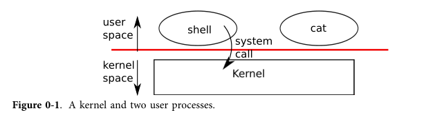
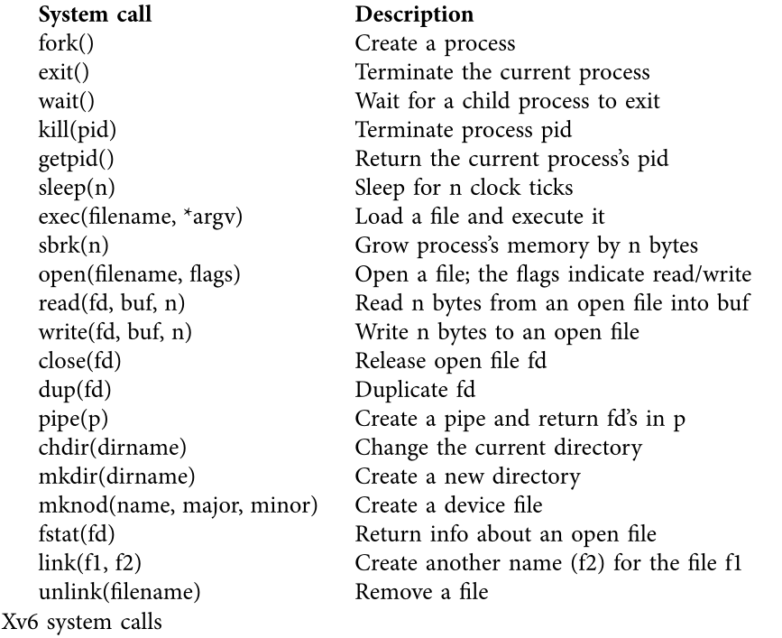
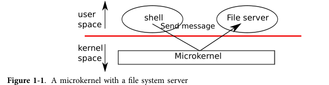
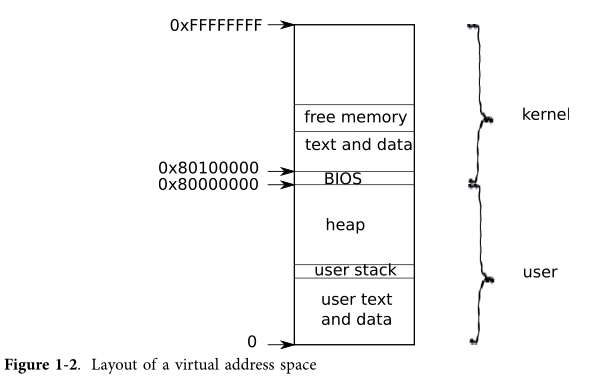
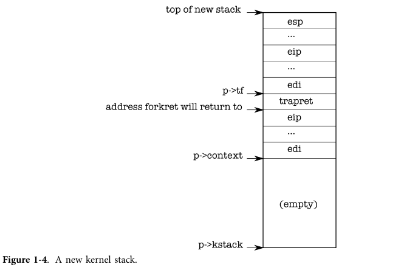

# Overview

本笔记旨在记录微内核学习过程

参考课程 [MIT6.828 Operating System Engineering](https://pdos.csail.mit.edu/6.828/2018/schedule.html)

follow the schedule

英文讲义已存在 Zetore

中文讲义： [第一章 第一个进程 | xv6 中文文档 (gitbooks.io)](https://th0ar.gitbooks.io/xv6-chinese/content/content/chapter1.html)

参考笔记：

[MIT6.828-神级OS课程-要是早遇到，我还会是这种 five 系列 - 知乎 (zhihu.com)](https://zhuanlan.zhihu.com/p/74028717)

[笔记03 - Lab 1:Booting a PC | 蓝色步行者 (jianzzz.github.io)](https://jianzzz.github.io/2017/08/20/笔记03-Lab-1-Booting-a-PC/)

参考代码：

[(39条消息) 操作系统_bysui的博客-CSDN博客](https://blog.csdn.net/bysui/category_6232831.html)

hw代码参考：

[MIT6.828-2016-Chinese/HW_Shell at master · double-free/MIT6.828-2016-Chinese (github.com)](https://github.com/double-free/MIT6.828-2016-Chinese/tree/master/HW_Shell)

相关概念：

jos：要实现的操作系统

xv6：一个类unix OS，jos在xv6基础上改写，实现jos过程中可参考xv6源码

实验环境：

Ubuntu22.04（vmware）

qemu（官方提供的版本 ）

```sh
git clone https://github.com/geofft/qemu.git -b 6.828-2.3.0
```

环境搭建：

大致流程：[(39条消息) MIT6.828 操作系统课程实验环境搭建_eye_water的博客-CSDN博客](https://blog.csdn.net/eye_water/article/details/80638463)

一些错误情况处理：[(39条消息) manjaro下6.828实验环境配置_uniquebby的博客-CSDN博客](https://blog.csdn.net/qq_20379795/article/details/88661348)

## Chapter 0

### OS Interface

当进程需要调用内核服务时，它会调用操作系统接口中的过程调用。这样的过程称为系统调用。系统调用进入内核；内核执行服务并返回。因此，进程在用户空间和内核空间中交替执行。



### Processes and memory

xv6的系统调用



Xv6使用ELF格式文件作为可执行文件

shell实现：

主循环getcmd读取用户一行输入，然后使用fork复制一个新的shell进程。主进程调用wait，子进程运行用户命令

xv6只有一个用户，所有进程都以root身份运行。

### IO and File descriptors

文件描述符是一个小整数，表示进程可以读取或写入的内核托管对象。

文件描述符接口抽象了文件、管道和设备之间的差异，使它们看起来都像字节流。 

控制台默认描述符：0（标准输入）、1（标准输出）、2（标准错误）。

文件描述符重定向： `2>&1` 将stderr重定向到stdout。但xv6不支持FD重定向操作

### Pipes

Pipes是内核的一个小缓冲区，作为暴露给进程一对的FD，一个用作读取，一个用作写入。将数据写入管道的一端，可以从管道的另一端读取数据。管道为进程提供了一种通信方式。 

```c
int p[2]
pipe(p);
```

### File system

xv6文件系统提供数据文件和目录，数据文件是未解释的字节数组，目录包含对数据文件和其他目录的命名引用。这些目录形成一棵树，从一个称为根的特殊目录开始。

开头 '/' 为根目录，没有则为相对目录

### real world

xv6不符合POSIX，只实现了部分系统调用。

## Chapter 1

### 微内核

为了降低内核中出错的风险，OS设计者可以最小化以内核模式运行的操作系统代码量，并以用户模式执行大部分操作系统。 这种组织模式成为**微内核**。以下例子文件系统作为用户级程序运行，系统服务被称为服务器，作为程序运行。允许应用访问文件服务器，kernel提供进程间通信机制，允许进程间传递信息。微内核中，内核接口由一些低级功能组成，用于启动应用程序、发送消息、访问设备硬件等。微内核允许内核相对简单，因为大多数操作系统都驻留在用户级服务器中。 xv6作为单一内核实现，遵循大多数Unix系统，xv6内核接口对应于OS系统接口，内核完整实现的操作系统。xv6不提供很多服务，所以要比一些微内核还要小。



### 进程概述

xv6中的隔离单元称为一个`process`。进程抽象防止一个进程破坏或监视另一个进程的内存、CPU、文件描述符等。 内核用于实现进程的机制，这些机制包括用户/内核模式标志、地址空间和线程的时间切片。 

xv6为每个进程维护一个页表，定义了每个进程的地址空间，映射内核的指令和数据以及用户程序的内存。用户空间包含指令、全局变量、堆栈空间等。当进程调用系统调用时，系统调用在进程地址空间的内核映射中执行，这种地址分布使得内核系统调用可以直接引用用户空间内存。



xv6使用`proc`结构体来维护每个的进程的状态，其中最重要的是进程页表、内核栈和运行状态。进程内有一个线程用来执行指令，线程可以被挂起和恢复。线程绝大多数状态存储在线程栈中。进程有一个用户栈和一个内核栈，当进程使用系统调用或执行中断时，会使用内核栈来执行内核代码，进程的用户栈仍会保存数据，但其处于没激活状态。进程的线程会主动在用户栈和内核栈之间交替。


### Code：创建第一个进程

[笔记07 - xv6 启动到执行第一个进程 | 蓝色步行者 (jianzzz.github.io)](https://jianzzz.github.io/2017/08/20/笔记07-xv6-启动到执行第一个进程/)

enrty调用main.c，main.c在完成一些设备和子系统的初始化之后，调用`userinit`来创建第一个进程。该函授首先调用`allocproc`，这个函数在每个新进程启动时都要调用，而`userinit`只在创建第一个进程时才调用。`allocproc`扫描程序表，选择为UNUSED状态的进程分配pid并开辟内核栈空间，之后为栈空间填入trapframe和context等内容。



内核线程从p->context->eip开始执行，设置为forkret会导致内核线程从这开始执行，这个函数会返回堆栈底部的地址，而context switch代码会设置栈指针指向p->context结尾。`allocproc`把p->context放在栈内，并在其上方放一个指向 `trapret` 的指针；这样运行完的 `forkret` 就会返回到 `trapret` 中了。`trapret` 接着从栈顶恢复用户寄存器然后跳转到 `process`（3027）的代码。

