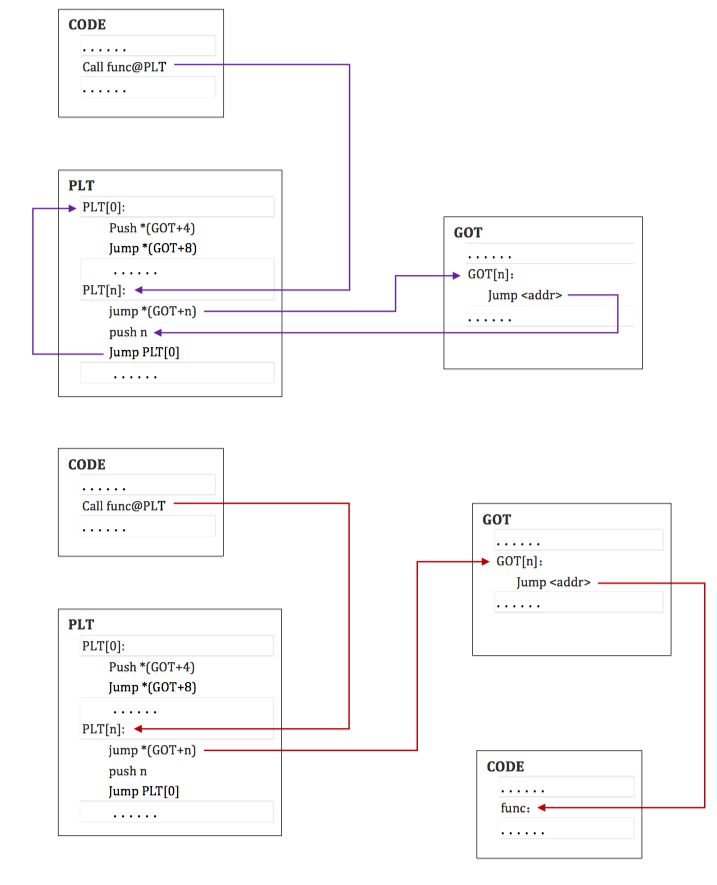
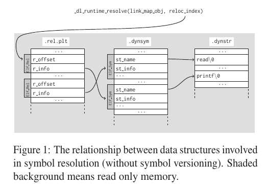

# 前置知识

[CTF-All-In-One/6.1.3_pwn_xdctf2015_pwn200.md at master · firmianay/CTF-All-In-One (github.com)](https://github.com/firmianay/CTF-All-In-One/blob/master/doc/6.1.3_pwn_xdctf2015_pwn200.md)

Procedure Linkage Table

PLT 表将导入函数重定向到绝对地址。主要包括两部分

- **.plt**，与常见导入的函数有关，如 read 等函数。
- **.plt.got**，与动态链接有关系。

为了解决链接不使用模块的问题，ELF采用延迟绑定的做法，其基本思想是函数第一次被用到时才进行绑定（符号查找，重定位等），如果没有用则不进行绑定。程序开始执行前，模块间的函数调用都没有进行绑定，而是需要用到时才由动态链接器负责绑定。

惰性绑定流程如下，紫线表示首次执行的流程图，红线表示第二次以后调用的流程图：



过程解析：

当第一次建立程序的内存镜像时，**动态链接器将 GOT 表的第二个和第三个项设置为特殊的值**，下面的步骤会仔细解释这些数值。

如果过程链接表是位置独立的话，那么 **GOT 表的地址必须在 ebx 寄存器中**。每一个进程镜像中的共享目标文件都有独立的 PLT 表，并且程序只在同一个目标文件将控制流交给 PLT 表项。因此，调用函数负责在调用 PLT 表项之前，将全局偏移表的基地址设置为寄存器中。

1. 这里举个例子，假设程序调用了 name1，它将控制权交给了 lable .PLT1。
2. 那么，第一条指令将会跳转到全局偏移表中 name1 的地址。初始时，全局偏移表中包含 PLT 中下一条 pushl 指令的地址，并不是 name1 的实际地址。
3. 因此，程序将相应函数在 `rel.plt` 中的偏移（重定位偏移，reloc_index）压到栈上。重定位偏移是 32 位的，并且是非负的数值。此外，重定位表项的类型为 R_386_JMP_SLOT，并且它将会说明在之前 jmp 指令中使用的全局偏移表项在 GOT 表中的偏移。重定位表项也包含了一个符号表索引，因此告诉动态链接器什么符号目前正在被引用。在这个例子中，就是 name1 了。
4. 在压入重定位偏移后，程序会跳转到 .PLT0，这是过程链接表的第一个表项。pushl 指令将 GOT 表的第二个表项 (got_plus_4 或者 4(%ebx)，**当前 ELF 对象的信息**) 压到栈上，然后给动态链接器一个识别信息。此后，程序会跳转到第三个全局偏移表项 (got_plus_8 或者 8(%ebx)，**指向动态装载器中 `_dl_runtime_resolve` 函数的指针**) 处，这将会将程序流交给动态链接器。
5. 当动态链接器接收到控制权后，他将会进行出栈操作，查看重定位表项，解析出对应的符号的值，然后将 name1 的地址写入到全局偏移表项中，最后将控制权交给目的地址。
6. 过程链接表执行之后，程序的控制权将会直接交给 name1 函数，而且此后再也不会调用动态链接器来解析这个函数。也就是说，在 .PLT1 处的 jmp 指令将会直接跳转到 name1 处，而不是再次执行 pushl 指令。


PLT[0] 处的代码将 GOT[1] 的值压入栈中，然后跳转到 GOT[2]。这两个 GOT 表条目有着特殊的含义，动态链接器在开始时给它们填充了特殊的内容：

- GOT[1]：一个指向内部数据结构的指针，类型是 link_map，在动态装载器内部使用，包含了进行符号解析需要的当前 ELF 对象的信息。在它的 `l_info` 域中保存了 `.dynamic` 段中大多数条目的指针构成的一个数组，我们后面会利用它。
- GOT[2]：一个指向动态装载器中 `_dl_runtime_resolve` 函数的指针。

```asm
_dl_runtime_resolve(link_map_obj, reloc_index) 
pwndbg> disassemble _dl_runtime_resolve
Dump of assembler code for function _dl_runtime_resolve:
   0xf7fe7ad0 <+0>:		endbr32 
   0xf7fe7ad4 <+4>:		push   eax
   0xf7fe7ad5 <+5>:		push   ecx
   0xf7fe7ad6 <+6>:		push   edx
   0xf7fe7ad7 <+7>:		mov    edx,DWORD PTR [esp+0x10]
   0xf7fe7adb <+11>:	mov    eax,DWORD PTR [esp+0xc]
   0xf7fe7adf <+15>:	call   0xf7fe1790 <_dl_fixup>
   0xf7fe7ae4 <+20>:	pop    edx
   0xf7fe7ae5 <+21>:	mov    ecx,DWORD PTR [esp]
   0xf7fe7ae8 <+24>:	mov    DWORD PTR [esp],eax
   0xf7fe7aeb <+27>:	mov    eax,DWORD PTR [esp+0x4]
   0xf7fe7aef <+31>:	ret    0xc
End of assembler dump.
```

`_dl_runtime_resolve`解析完成后，控制流就交到了那个函数手里，而下次再调用函数的 plt 时，就会直接进入目标函数中执行。



重定位项使用 Elf_Rel 结构体来描述，存在于 `.rep.plt` 段和 `.rel.dyn` 段中：

```c
// 32 位程序使用 REL，而 64 位程序使用 RELA。
typedef uint32_t Elf32_Addr;
typedef uint32_t Elf32_Word;

typedef struct
{
  Elf32_Addr    r_offset;       /* Address */
  Elf32_Word    r_info;         /* Relocation type and symbol index */
} Elf32_Rel;

typedef uint64_t Elf64_Addr;
typedef uint64_t Elf64_Xword;
typedef int64_t  Elf64_Sxword;

typedef struct
{
  Elf64_Addr    r_offset;       /* Address */
  Elf64_Xword   r_info;         /* Relocation type and symbol index */
  Elf64_Sxword  r_addend;       /* Addend */
} Elf64_Rela;
```


# 攻击思路

程序使用 `_dl_runtime_resolve(link_map_obj, reloc_offset)` 来对动态链接的函数进行重定位，控制相应的参数及其对应地址的内容就可以控制解析的函数。

动态链接器在解析符号地址时所使用的重定位表项、动态符号表、动态字符串表都是从目标文件中的动态节 `.dynamic` 索引得到的。能够修改其中的某些内容使得最后动态链接器解析的符号是我们想要解析的符号，那么攻击就达成了。

直接控制重定位表项内容：

动态链接器最后在解析符号的地址时，是依据符号的名字进行解析的。可以直接现代高修改动态字符串表 `.dynstr`，把某个函数在字符串表中对应的字符串修改为目标函数对应的字符串。但动态字符串表是只读的，重定位表项也是只读的。

需要伪造重定位了才能达到调用目标函数目的，比较麻烦

间接控制重定位表项相关内容：

动态链接器会从 `.dynamic` 节中索引到各个目标节，那如果我们可以修改动态节中的内容，那自然就很容易控制待解析符号对应的字符串，从而达到执行目标函数的目的。

伪造link_map：

动态连接器在解析符号地址时，主要依赖于 link_map 来查询相关的地址。因此，如果我们可以成功伪造 link_map，也就可以控制程序执行目标函数。


# XDCTF2015 pwn200

题目源码 

```c
#include <unistd.h>
#include <stdio.h>
#include <string.h>

void vuln()
{
    char buf[100];
    setbuf(stdin, buf);
    read(0, buf, 256);
}
int main()
{
    char buf[100] = "Welcome to XDCTF2015~!\n";

    setbuf(stdout, buf);
    write(1, buf, strlen(buf));
    vuln();
    return 0;
}
```

## 32位

### NO RELRO

```shell
> gcc -fno-stack-protector -m32 -z norelro -no-pie pwn200.c -o pwn200_norelro_32
> checksec pwn200_norelro_32 
[*] '/home/ubuntu/Desktop/365-days-get-xuanwulab-job/somefiles/pwn200_norelro_32'
    Arch:     i386-32-little
    RELRO:    No RELRO
    Stack:    No canary found
    NX:       NX enabled
    PIE:      No PIE (0x8048000)
```

利用思路：

1. 修改 .dynamic 节中字符串表的地址为伪造的地址
2. 在伪造的地址处构造好字符串表，将 read 字符串替换为 system 字符串。
3. 在特定的位置读取 /bin/sh 字符串。
4. 调用 read 函数的 plt 的第二条指令，触发 `_dl_runtime_resolve` 进行函数解析，从而执行 system 函数。