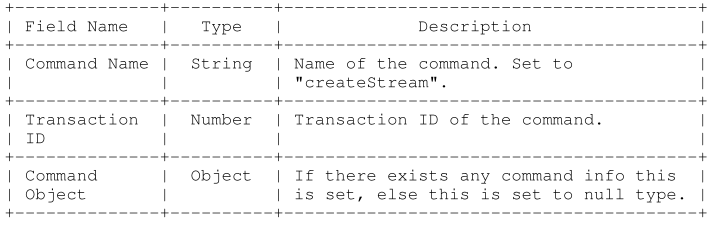

Real-Time-Message Protocol 实时消息传输协议

RTMP 是一种基于 TCP 的协议，旨在保持持久、低延迟的连接，进而提供流畅的流媒体体验。

传输流媒体音频、视频和数据。RTMP传输时对数据做格式化，称为 RTMP Message，发送端将其划分为带有Message ID的Chunk，每个chunk可能是单独的Message，也可能是Message一部分；接收端根据chunk包含data的长度、Message ID和Message长度把chunk还原完整的Message。

文档及参考：

[Adobe RTMP Specification · RTMP (veriskope.com)](https://rtmp.veriskope.com/docs/spec/#abstract)

[通过 wireshark 抓包了解直播流媒体 RTMP 协议基本过程 - 掘金 (juejin.cn)](https://juejin.cn/post/6844903864072667149)

chunk格式 (RTMP spec section 6.1)

```
    ---------------------------------------------------------------------
    |         |            |          |          |                      |
    |Msg type |Payload Len |timestamp |Stream ID |  Pay load            |
    | 1 Byte  | 3 bytes    |  4 bytes | 3 bytes  |  Size = Payload Len  |
    |         |            |          |          |                      |
    ---------------------------------------------------------------------
```


## Definitions

- Payload：包含在数据包里的数据，如音频样本、压缩视频数据。有对应的文件格式，不在RTMP文档中记录。
- Packet：数据包，包含固定头部和Payload数据。一些底层协议可能需要对要定义的数据包进行封装。
- Port：传输协议用于区分给定竹内多个目标的抽象。
- Transport address：由网络地址和指定传输层接收端的端口port组合。Packet从源专属地址传送到目标传输地址。
- Message stream：消息流中的逻辑通信信道。
- Message stream ID：每个Message都有一个ID，标识在哪个消息流中。
- Chunk：Message片段，发送之前分解为更小的chunk，chunk确保跨多个流的所有消息按时间戳、端到端的传输。
- Chunk stream：块在特定方向上流动的逻辑通信信道。
- Chunk stream ID：每个块都有一个与之关联的 ID，以标识它正在其中流动的块流。
- Multiplexing：多路复用，将单独的音频/视频数据制作成一个连贯的音频/视频流的过程，可以同时传输多个视频和音频。
- DeMultiplexing：逆多路复用：将交错的音视频数据组合起来，形成原始的音视频数据。
- Remote Procedure Call (RPC)：允许客户端或服务器在对等端发起调用子例程或过程的请求。
- Metadata：一些数据描述。
- Application Instance：客户端通过发送连接请求与之连接的服务器上的应用程序实例。
- Action Message Format (AMF)：一种压缩的二进制格式，用于序列化 ActionScript 对象图

## Byte Order, Alignment, and Time Format

所有整数字段采用大端序，文档中数字常量为十进制。RTMP所有数据都是字节对齐的，用0值填充。


### Message格式

必要字段：

- TIMESTAMP：消息时间戳，4字节
- LENGTH：消息Payload长度，若消息头无法忽略，则将其包含在长度中，3字节
- TYPE ID：chunk head中占1字节
- Message stream ID：多路复用到同一chunk stream上的不同消息流根据它们的Message stream ID 进行解复用。

### 握手

客户端向服务器按序发送 C0, C1, C2 三个chunk，服务器向客户端按序发送 S0, S1, S2三个chunk，才能进行有效信息传输。

客户端要等收到S1之后才能发送C2

客户端要等收到S2之后才能发送其他信息（控制信息和真实音视频等数据）

服务端要等到收到C0之后发送S1

服务端必须等到收到C1之后才能发送S2

服务端必须等到收到C2之后才能发送其他信息（控制信息和真实音视频等数据） 握手开始于客户端发送C0、C1块。服务器收到C0或C1后发送S0和S1。 当客户端收齐S0和S1后，开始发送C2。当服务器收齐C0和C1后，开始发送S2。 当客户端和服务器分别收到S2和C2后，握手完成。

**C0和S0格式**

```
 0 1 2 3 4 5 6 7
+-+-+-+-+-+-+-+-+
|    version    |
+-+-+-+-+-+-+-+-+
C0 and S0 bits
```

单8位字节，是为8个整数字段

- C0中表示客户端请求的RTMP版本
- S0中表示服务器选择的RTMP版本

文档中定义版本3，0-2为早期产品；4-31保留用于将来实现；32-255不允许。若无法识别请求，服务器以3响应，客户端可以选择降至3或放弃。

**C1和S1格式**

包含1536个字节

- TIME（4字节）：时间戳，作为后续所有块的起始，可能是0或任意值
- ZERO（4字节）：全为0
- Random Data（1528字节）：任意值

```
 0                   1                   2                   3
 0 1 2 3 4 5 6 7 8 9 0 1 2 3 4 5 6 7 8 9 0 1 2 3 4 5 6 7 8 9 0 1
+-+-+-+-+-+-+-+-+-+-+-+-+-+-+-+-+-+-+-+-+-+-+-+-+-+-+-+-+-+-+-+-+
|                        time (4 bytes)                         |
+-+-+-+-+-+-+-+-+-+-+-+-+-+-+-+-+-+-+-+-+-+-+-+-+-+-+-+-+-+-+-+-+
|                        zero (4 bytes)                         |
+-+-+-+-+-+-+-+-+-+-+-+-+-+-+-+-+-+-+-+-+-+-+-+-+-+-+-+-+-+-+-+-+
|                         random bytes                          |
+-+-+-+-+-+-+-+-+-+-+-+-+-+-+-+-+-+-+-+-+-+-+-+-+-+-+-+-+-+-+-+-+
|                         random bytes                          |
|                           (cont)                              |
|                             ...                               |
+-+-+-+-+-+-+-+-+-+-+-+-+-+-+-+-+-+-+-+-+-+-+-+-+-+-+-+-+-+-+-+-+
C1 and S1 bits
```

**C2和S2格式**

- TIME（4字节）：包含S1或C1中发送的时间戳
- TIME2（2字节）：包含读取对等方发送第一个数据包的时间戳
- Random ECHO（1528字节）:包含对等方发送的S1或S2里的随机数据字段

```
 0                   1                   2                   3
 0 1 2 3 4 5 6 7 8 9 0 1 2 3 4 5 6 7 8 9 0 1 2 3 4 5 6 7 8 9 0 1
+-+-+-+-+-+-+-+-+-+-+-+-+-+-+-+-+-+-+-+-+-+-+-+-+-+-+-+-+-+-+-+-+
|                        time (4 bytes)                         |
+-+-+-+-+-+-+-+-+-+-+-+-+-+-+-+-+-+-+-+-+-+-+-+-+-+-+-+-+-+-+-+-+
|                        time2 (4 bytes)                        |
+-+-+-+-+-+-+-+-+-+-+-+-+-+-+-+-+-+-+-+-+-+-+-+-+-+-+-+-+-+-+-+-+
|                          random echo                          |
+-+-+-+-+-+-+-+-+-+-+-+-+-+-+-+-+-+-+-+-+-+-+-+-+-+-+-+-+-+-+-+-+
|                          random echo                          |
|                            (cont)                             |
|                              ...                              |
+-+-+-+-+-+-+-+-+-+-+-+-+-+-+-+-+-+-+-+-+-+-+-+-+-+-+-+-+-+-+-+-+
C2 and S2 bits
```


握手过程示意图

```
+-------------+                           +-------------+
|    Client   |       TCP/IP Network      |    Server   |
+-------------+            |              +-------------+
      |                    |                     |
 Uninitialized             |               Uninitialized
      |          C0        |                     |
      |------------------->|         C0          |
      |                    |-------------------->|
      |          C1        |                     |
      |------------------->|         S0          |
      |                    |<--------------------|
      |                    |         S1          |
 Version sent              |<--------------------|
      |          S0        |                     |
      |<-------------------|                     |
      |          S1        |                     |
      |<-------------------|                Version sent
      |                    |         C1          |
      |                    |-------------------->|
      |          C2        |                     |
      |------------------->|         S2          |
      |                    |<--------------------|
   Ack sent                |                  Ack Sent
      |          S2        |                     |
      |<-------------------|                     |
      |                    |         C2          |
      |                    |-------------------->|
 Handshake Done            |               Handshake Done
      |                    |                     |
Pictorial Representation of Handshake
```

握手时一些状态：

- Uninitialized：在此阶段传递协议版本，双方都是未初始化的。客户端发送C0包，若服务器接受该版本，就发送S0和S1响应包。否则，RTMP关闭连接。
- VERSION SENT：客户端等待S1，服务器等待C1。接收到包之后，客户端发送C2，服务器发送S2，转换为ACK SENT状态。
- ACK SENT：双方分别等待S2和C2。
- HANDSHAKE DONE：双方开始交换信息。


### Chunking 分块

#### **chunk格式**

```
+--------------+----------------+--------------------+--------------+
| Basic Header | Message Header | Extended Timestamp |  Chunk Data  |
+--------------+----------------+--------------------+--------------+
|                                                    |
|<------------------- Chunk Header ----------------->|
Chunk Format
```

- Basic Header (1 to 3 bytes): 编码chunk的ID和type，type决定编码消息头的格式。长度完全取决于块流ID，是一个可变长度字段。
- Message Header (0, 3, 7, or 11 bytes): 该字段将正在传送的Message信息编码，长度取决于上面header指定的type。
- Extended Timestamp (0 or 4 bytes): 该字段在某些情况下存在，具体取决于Message header中的编码时间戳或时间戳增量字段
- Chunk Data (variable size): 该chunk的payload，最大为配置的最大块大小。

**Chunk Basic Header**

协议最大支持65597个流，对应ID为3-65599，0-2为保留ID。

ID 2-63可用一字节编码

```
 0 1 2 3 4 5 6 7
+-+-+-+-+-+-+-+-+
|fmt|   cs id   |
+-+-+-+-+-+-+-+-+
Chunk basic header 1
```

ID 64-319可用2字节编码

```
 0                   1
 0 1 2 3 4 5 6 7 8 9 0 1 2 3 4 5
+-+-+-+-+-+-+-+-+-+-+-+-+-+-+-+-+
|fmt|0 0 0 0 0 0|   cs id - 64  |
+-+-+-+-+-+-+-+-+-+-+-+-+-+-+-+-+
Chunk basic header 2
```

ID 64-65599 用3字节编码

```
 0 1 2 3 4 5 6 7 8 9 0 1 2 3 4 5 6 7 8 9 0 1 2 3
+-+-+-+-+-+-+-+-+-+-+-+-+-+-+-+-+-+-+-+-+-+-+-+-+
|fmt|0 0 0 0 0 1|          cs id - 64           |
+-+-+-+-+-+-+-+-+-+-+-+-+-+-+-+-+-+-+-+-+-+-+-+-+
Chunk basic header 3
```

**Chunk Message Header**

四种格式，由basic header的fmt字段选择

**type0**，11字节长度。必须在块流开始使用这种type

```
0                   1                   2                   3
0 1 2 3 4 5 6 7 8 9 0 1 2 3 4 5 6 7 8 9 0 1 2 3 4 5 6 7 8 9 0 1
+-+-+-+-+-+-+-+-+-+-+-+-+-+-+-+-+-+-+-+-+-+-+-+-+-+-+-+-+-+-+-+-+
|                 timestamp                     |message length |
+-+-+-+-+-+-+-+-+-+-+-+-+-+-+-+-+-+-+-+-+-+-+-+-+-+-+-+-+-+-+-+-+
|      message length (cont)    |message type id| msg stream id |
+-+-+-+-+-+-+-+-+-+-+-+-+-+-+-+-+-+-+-+-+-+-+-+-+-+-+-+-+-+-+-+-+
|            message stream id (cont)           |
+-+-+-+-+-+-+-+-+-+-+-+-+-+-+-+-+-+-+-+-+-+-+-+-+
Chunk Message Header - Type 0
```

**type1**，7字节长度。没有ID字段，该类型chunk使用与之前chunk相同的流ID

```
0                   1                   2                   3
0 1 2 3 4 5 6 7 8 9 0 1 2 3 4 5 6 7 8 9 0 1 2 3 4 5 6 7 8 9 0 1
+-+-+-+-+-+-+-+-+-+-+-+-+-+-+-+-+-+-+-+-+-+-+-+-+-+-+-+-+-+-+-+-+
|                timestamp delta                |message length |
+-+-+-+-+-+-+-+-+-+-+-+-+-+-+-+-+-+-+-+-+-+-+-+-+-+-+-+-+-+-+-+-+
|     message length (cont)     |message type id|
+-+-+-+-+-+-+-+-+-+-+-+-+-+-+-+-+-+-+-+-+-+-+-+-+
Chunk Message Header - Type 1
```

**type2**，3字节长度，没有ID和长度字段。与之前chunk有相同的消息流ID和消息长度。具有恒定大小消息的流（例如，某些音频和数据格式）应该在第一个消息之后的每个消息的第一个块中使用这种type

```
0                   1                   2
0 1 2 3 4 5 6 7 8 9 0 1 2 3 4 5 6 7 8 9 0 1 2 3
+-+-+-+-+-+-+-+-+-+-+-+-+-+-+-+-+-+-+-+-+-+-+-+-+
|               timestamp delta                 |
+-+-+-+-+-+-+-+-+-+-+-+-+-+-+-+-+-+-+-+-+-+-+-+-+
Chunk Message Header - Type 2
```

**type3**，0字节长度，单个消息被拆分成块，除了第一个块外的所有块都应该使用这种类型。

头部的一些字段

- **timestamp delta (3 bytes)**：前一个块与当前块的时间戳差异
- **message length (3 bytes)**：发送消息的长度
- **message type id (1 byte)**：发送消息的类型
- **message stream id (4 bytes)**：消息流ID，小端序存储


### Protocol Control Message

块流用消息类型ID作为协议控制信息，这些信息包括RTMP块流协议需要的信息。协议控制消息必须有消息流ID 0（控制流），在块流ID 2中发送。协议控制消息一收到就生效，忽略时间戳

Set Chunk Size 设置块大小 

块大小默认128字节，可由双方设置

```
 0                   1                   2                   3
 0 1 2 3 4 5 6 7 8 9 0 1 2 3 4 5 6 7 8 9 0 1 2 3 4 5 6 7 8 9 0 1
+-+-+-+-+-+-+-+-+-+-+-+-+-+-+-+-+-+-+-+-+-+-+-+-+-+-+-+-+-+-+-+-+
|0|                     chunk size (31 bits)                    |
+-+-+-+-+-+-+-+-+-+-+-+-+-+-+-+-+-+-+-+-+-+-+-+-+-+-+-+-+-+-+-+-+
Payload for the ‘Set Chunk Size’ protocol message
```

Abort Message 

通知对等方，是否正在等待块完成消息，丢弃在块流上部分接收的消息

 Acknowledgement 

客户端或服务器必须在接收到等于窗口大小的字节后向对等方发送确认。

Window Acknowledgement Size

客户端或服务器发送此消息以通知对等方在发送确认之间使用的窗口大小

## RTMP Message Formats

#### Message Header 消息头：

多字节字段均为大端序存储

```
 0                   1                   2                   3
 0 1 2 3 4 5 6 7 8 9 0 1 2 3 4 5 6 7 8 9 0 1 2 3 4 5 6 7 8 9 0 1
+-+-+-+-+-+-+-+-+-+-+-+-+-+-+-+-+-+-+-+-+-+-+-+-+-+-+-+-+-+-+-+-+
| Message Type  |                Payload length                 |
|    (1 byte)   |                   (3 bytes)                   |
+-+-+-+-+-+-+-+-+-+-+-+-+-+-+-+-+-+-+-+-+-+-+-+-+-+-+-+-+-+-+-+-+
|                           Timestamp                           |
|                           (4 bytes)                           |
+-+-+-+-+-+-+-+-+-+-+-+-+-+-+-+-+-+-+-+-+-+-+-+-+-+-+-+-+-+-+-+-+
|                 Stream ID                     |
|                 (3 bytes)                     |
+-+-+-+-+-+-+-+-+-+-+-+-+-+-+-+-+-+-+-+-+-+-+-+-+
Message header
```

- 消息字段类型
- 长度
- 时间戳
- 消息流ID

#### payload：

一些视频或音频文件，对payload解析不在文档范畴内

### User Control Messages 用户控制信息

message type ID 4 作为用户控制信息，控制信息包含RTMP在流层使用的一些信息。带有 ID 1, 2, 3, 5, 6的协议信息 则用作RTMP块流协议。

用户控制信息应该使用消息流ID 0，且当使用块流传输时，应该在块流ID 2中传输。当在流中收到用户控制信息时会立刻生效，忽略时间戳。

## RTMP Messages

客户端与服务器间交换的不同类型的消息和命令。

### RTMP Message Types

#### command Message（20，17）

载荷为AMF编码的命令，这类信息用于在对等方执行connect、createStream、publish、play、pause等命令

- 信息类型码20为AMF0编码
- 信息类型码17为AMF3编码

#### Shared Object Message（19， 16）

共享对象是跨客户端、实例等同步的Flash实例

- 19对应AMF0
- 16对应AMF3

```
+------+------+-------+-----+-----+------+-----+ +-----+------+-----+
|Header|Shared|Current|Flags|Event|Event |Event|.|Event|Event |Event|
|      |Object|Version|     |Type |data  |data |.|Type |data  |data |
|      |Name  |       |     |     |length|     |.|     |length|     |
+------+------+-------+-----+-----+------+-----+ +-----+------+-----+
       |                                                            |
       |<- - - - - - - - - - - - - - - - - - - - - - - - - - - - - >|
       |              AMF Shared Object Message body                |
The shared object message format
```

#### Aduio Message（8）

#### Video Message (9)

#### AggregateMessage (22)


## Command

## Netconnet command

### connect


### call


### createStream



---

## NetStream


由客服端送往服务器的相关命令，服务器发送 OnStatus 命令来更新 NetStream 状态


play


```
// 消息头中的消息类型ID，决定Payload内容
typedef enum <ubyte> MessageTypeIDs {
    // Chunk Stream Protocol Control Message
    ID_SetChunkSize = 0x01,
    ID_AbortMessage = 0x02,
    ID_Acknowledgement = 0x03,
    ID_WindowsAcknowledgement = 0x05,
    ID_SetPeerBandwidth = 0x06,
    
    // User control messages used for RTMP stream layer, detail in EventTypeID
    ID_UserControlMessage = 0x04,  

    // Type of Message //
    // Command Message
    ID_CommandMessageAMF0 = 20,
    ID_CommandMessageAMF3 = 17,
    
    // Data Message //
    ID_DataMessageAMF0 = 18,
    ID_DataMessageAMF3 = 15,

    // Shared Object Message //
    ID_SharedObjectMessageAMF0 = 19,
    ID_SharedObjectMessageAMF3 = 16,
    
    ID_AudioMessage = 8,
    ID_VideoMessage = 9,
    ID_AggregateMessage = 22
    
} MsgTypeID;
```

