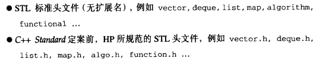
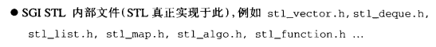
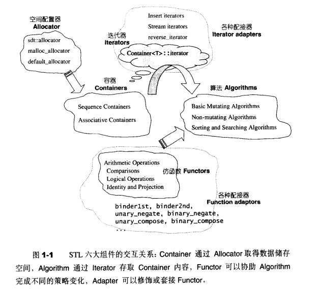
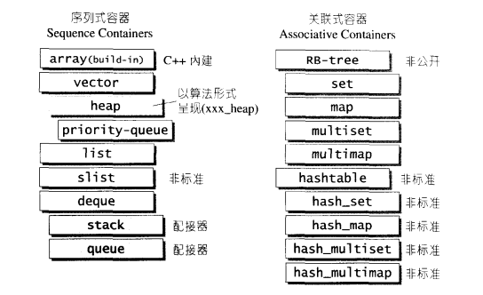

SGI STL文件分布：

STL6大组件：

1. 容器（Container）
2. 空间配置器（allocator）
3. 算法（Algorithm）
4. 迭代器（Iterator）
5. 仿函数（Function object）
6. 适配器（Adaptor）

# 空间配置器allocator

容器使用配置器来进行内存空间的 **分配**、 **释放**，在代码中用`#include <memory>`来包含它，它的实际实现在三个文件中：

- stl_construct.h: 对象的构造和析构
- stl_alloc.h: 空间的配置和释放
- stl_uninitialized.h: 内存基本工具，用于提升性能

空间分配器有如下两种：

1. 第一级分配器`__malloc_alloc_template`，即时分配即时释放，
2. 第二级分配器`__default_alloc_template`，小型内存池。

容器中通过调用配置器的静态函数来 **分配**、**释放** 内存，而配置器则在底层调用`malloc`和`free`来满足用户需求。

# 迭代器iterators

迭代器的相关实现 (源码位于`stl_iterator.h`和`stl_iterator_base.h`)

迭代器向用户和算法提供统一的数据访问方式，理应集中实现。但是各种容器千差万别，迭代器的内部实现对容器依赖较强，所以迭代器由每个容器自身包含并实现，对外开放统一的接口。

# 序列容器sequence containers

序列容器的元素可序 ordered，但未必有序 sorted，stack和queue基于deque实现，归类为配接器。

## Vector

标准头文件为vector，容器vector的真正实现在stl_vector.h中