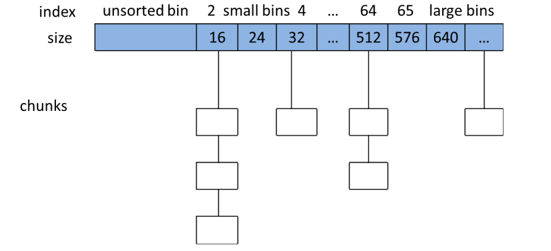
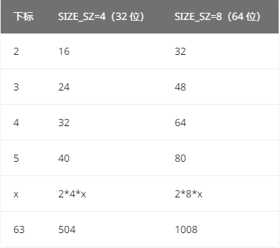
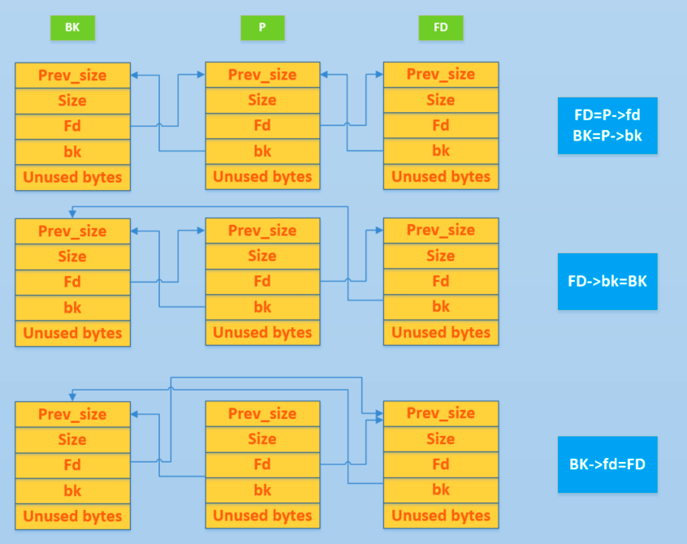

## 堆数据结构

### Arena

- Main_arena主分配区、non_main_arena非主分配区

每个进程只有一个主分配区，但有很多个非主分配区，两者都有个互斥mutex锁，防止多线程下的资源竞争情况。主分配区可以访问进程的heap区区域mmap映射区域，可以使用sbrk和mmap申请虚拟内存；非主分配区只能访问进程mmap区域。

对应malloc_state结构，用来管理堆，记录每个 arena 当前申请的内存的具体状态，比如说是否有空闲 chunk，有什么大小的空闲 chunk 等等。无论是 thread arena 还是 main arena，它们都只有一个 malloc state 结构。

每个进程只有一个主分配区main arena，可能存在多个非主分配区。main arena，

#### **main_arena**

**main arena 的 malloc_state 并不是 heap segment 的一部分，而是一个全局变量，存储在 libc.so 的数据段。**可以用这个来泄露libc基址。

- 集中管理bins链的结构体，使用含fd和bk的bin头一对一管理各个free的chunk
- 分释放配堆块是基于main_arena来寻址的，首先找的是fastbin，其次再找bins
- main_arena存储在libc上，用以管理所有bins的头和尾，每个bins链头的fd和尾的bk与之连接

main_arena:用来管理整个bin链的结构体，总共128个bin，10个fastbin

每个bin头可以简化为fd和bk两个前后项指针

glibc ---> main_arena ---> 对应的bins头的fd和bk ---> 遍历找到对应free的chunk

main_arena存放在libc中，其中存放的是每一个bin链的头尾

```c
typedef struct _heap_info
{
  mstate ar_ptr; /* Arena for this heap. */
  struct _heap_info *prev; /* Previous heap. */
  size_t size;   /* Current size in bytes. */
  size_t mprotect_size; /* Size in bytes that has been mprotected PROT_READ|PROT_WRITE. */
  /* Make sure the following data is properly aligned, particularly that sizeof (heap_info) + 2 * SIZE_SZ is a multiple of MALLOC_ALIGNMENT. */
  char pad[-6 * SIZE_SZ & MALLOC_ALIGN_MASK];
} heap_info;
```

一个

### malloc_chunk

glibc内存管理单元是以chunk来组织的

由 malloc 申请的内存为 chunk 。这块内存在 ptmalloc 内部用 malloc_chunk 结构体来表示。程序申请的 chunk 被 free 后，会被加入到相应的空闲管理列表中。

**无论一个 chunk 的大小如何，处于分配状态还是释放状态，它们都使用一个统一的结构。**但根据chunk是否被释放，其表现形式会有不同，malloc_chunk 结构体定义如下：

```c
struct malloc_chunk {

  INTERNAL_SIZE_T      prev_size;  /* Size of previous chunk (if free).  */
  INTERNAL_SIZE_T      size;       /* Size in bytes, including overhead. */

  struct malloc_chunk* fd;         /* double links -- used only if free. */
  struct malloc_chunk* bk;

  /* Only used for large blocks: pointer to next larger size.  */
  struct malloc_chunk* fd_nextsize; /* double links -- used only if free. */
  struct malloc_chunk* bk_nextsize;
};
```

- **prev_size**：如果该 chunk 的**物理相邻的前一地址 chunk（两个指针的地址差值为前一 chunk 大小）**是空闲的话，则该字段记录的是前一个 chunk 的大小 (包括 chunk 头)。否则，该字段可以用来存储物理相邻的前一个 chunk 的数据。**这里的前一 chunk 指的是较低地址的 chunk** 。
- **size** ，该 chunk 的大小，大小必须是 2 * SIZE_SZ 的整数倍。
  - 最低位P，表示前一个块是否正在使用，P为0表示前一个chunk空闲，这时候这个chunk的prev_size才有效，可以用来得到前一个chunk的起始地址；P为1时，表示前一个chunk正在使用，prev_size无效。ptmalloc分配到的第一个chunk的P位总置1，来防止程序引用到不存在的区域。
  - M位标识当前chunk从哪个内存区域获得的虚拟内存，1标识从mmap区域，0标识heap区域
  - A位标识chunk属于主分配区Main Arena(0)或非主分配区(1)

- **fd，bk**：chunk 处于分配状态时，从 fd 字段开始是用户的数据。chunk 空闲时，会被添加到对应的空闲管理链表中，其字段的含义如下：
  - fd 指向下一个（非物理相邻）空闲的 chunk
  - bk 指向上一个（非物理相邻）空闲的 chunk
  - 通过 fd 和 bk 可以将空闲的 chunk 块加入到空闲的 chunk 块链表进行统一管理
- **fd_nextsize， bk_nextsize**，也是只有 chunk 空闲的时候才使用，不过其用于较大的 chunk（large chunk）

一个已经分配的 chunk 的样子如下。**称前两个字段称为 chunk header，后面的部分称为 user data。每次 malloc 申请得到的内存指针，其实指向 user data 的起始处。**

当一个 chunk 处于使用状态时，它的下一个 chunk 的 prev_size 域无效，所以下一个 chunk 的该部分也可以被当前 chunk 使用。**这就是 chunk 中的空间复用。**

```
chunk-> +-+-+-+-+-+-+-+-+-+-+-+-+-+-+-+-+-+-+-+-+-+-+-+-+-+-+-+-+-+-+-+-+
        |             Size of previous chunk, if unallocated (P clear)  |
        +-+-+-+-+-+-+-+-+-+-+-+-+-+-+-+-+-+-+-+-+-+-+-+-+-+-+-+-+-+-+-+-+
        |             Size of chunk, in bytes                     |A|M|P|
  mem-> +-+-+-+-+-+-+-+-+-+-+-+-+-+-+-+-+-+-+-+-+-+-+-+-+-+-+-+-+-+-+-+-+
        |             User data starts here...                          .
        .                                                               .
        .             (malloc_usable_size() bytes)                      .
next    .                                                               |
chunk-> +-+-+-+-+-+-+-+-+-+-+-+-+-+-+-+-+-+-+-+-+-+-+-+-+-+-+-+-+-+-+-+-+
        |             (size of chunk, but used for application data)    |
        +-+-+-+-+-+-+-+-+-+-+-+-+-+-+-+-+-+-+-+-+-+-+-+-+-+-+-+-+-+-+-+-+
        |             Size of next chunk, in bytes                |A|0|1|
        +-+-+-+-+-+-+-+-+-+-+-+-+-+-+-+-+-+-+-+-+-+-+-+-+-+-+-+-+-+-+-+-+
```

被释放的 chunk 被记录在链表中（可能是循环双向链表，也可能是单向链表）。

```
chunk-> +-+-+-+-+-+-+-+-+-+-+-+-+-+-+-+-+-+-+-+-+-+-+-+-+-+-+-+-+-+-+-+-+
        |             Size of previous chunk, if unallocated (P clear)  |
        +-+-+-+-+-+-+-+-+-+-+-+-+-+-+-+-+-+-+-+-+-+-+-+-+-+-+-+-+-+-+-+-+
`head:' |             Size of chunk, in bytes                     |A|0|P|
  mem-> +-+-+-+-+-+-+-+-+-+-+-+-+-+-+-+-+-+-+-+-+-+-+-+-+-+-+-+-+-+-+-+-+
        |             Forward pointer to next chunk in list             |
        +-+-+-+-+-+-+-+-+-+-+-+-+-+-+-+-+-+-+-+-+-+-+-+-+-+-+-+-+-+-+-+-+
        |             Back pointer to previous chunk in list            |
        +-+-+-+-+-+-+-+-+-+-+-+-+-+-+-+-+-+-+-+-+-+-+-+-+-+-+-+-+-+-+-+-+
        |             Unused space (may be 0 bytes long)                .
        .                                                               .
 next   .                                                               |
chunk-> +-+-+-+-+-+-+-+-+-+-+-+-+-+-+-+-+-+-+-+-+-+-+-+-+-+-+-+-+-+-+-+-+
`foot:' |             Size of chunk, in bytes                           |
        +-+-+-+-+-+-+-+-+-+-+-+-+-+-+-+-+-+-+-+-+-+-+-+-+-+-+-+-+-+-+-+-+
        |             Size of next chunk, in bytes                |A|0|0|
        +-+-+-+-+-+-+-+-+-+-+-+-+-+-+-+-+-+-+-+-+-+-+-+-+-+-+-+-+-+-+-+-+
```

**一般情况下**，物理相邻的两个空闲 chunk 会被合并为一个 chunk 。

chunk空间复用

当一个 chunk 处于使用状态时，它的下一个 chunk 的 prev_size 域肯定是无效的，所以这个空间也可以被当前 chunk 使用。

## 空闲chunk容器


### bins

用户释放掉的 chunk 不会马上归还给系统，ptmalloc 会统一管理 heap 和 mmap 映射区域中的空闲的 chunk。当用户再一次请求分配内存时，ptmalloc 分配器会试图在空闲的 chunk 中挑选一块合适的给用户。这样可以避免频繁的系统调用，降低内存分配的开销。大小相似的chunk用双向链表链接起来，称为一个bin。

ptmalloc 采用**分箱式方法**对空闲的 chunk 进行管理,根据空闲的 chunk 的大小以及使用状态将 chunk 初步分为 4 类：

- fast bins
- small bins
- large bins
- unsorted bin

每类中仍然有更细的划分，在每类 bin 的内部仍然会有多个互不相关的链表来保存不同大小的 chunk。

对于 small bins，large bins，unsorted bin 来说，ptmalloc 一个维护128个bin，存储在同一个数组中。这些 bin 对应的数据结构在 malloc_state 中，如下

```c
#define NBINS 128
/* Normal bins packed as described above */
mchunkptr bins[ NBINS * 2 - 2 ];
```



数组中的 bin 依次如下

1. 第一个为 unsorted bin，字如其面，这里面的 chunk 没有进行排序，存储的 chunk 比较杂。
2. 索引从 2 到 64 的 bin 称为 small bin，同一个 small bin 链表中的 chunk 的大小相同。两个相邻索引的 small bin 链表中的 chunk 大小相差的字节数为 **2 个机器字长**，即 32 位相差 8 字节，64 位相差 16 字节。
3. small bins 后面的 bin 被称作 large bins。large bins 中的每一个 bin 都包含一定范围内的 chunk，**其中的 chunk 按 fd 指针的顺序从大到小排列。**相同大小的 chunk 同样按照最近使用顺序排列。

**任意两个物理相邻的空闲 chunk 不能在一起**。

注意不是所有的 chunk 被释放后就立即被放到 bin 中。ptmalloc 为了提高分配的速度，会把一些小的 chunk **先**放到 **fast bins** 的容器内。**而且，fastbin 容器中的 chunk 的使用标记总是被置位的，所以不满足上面的原则，因此它们不会和其它被释放的 chunk 合并**。

#### Fast Bins

**64位机器**下属于fast bin的chunk**大小在0x20 – 0x80**之间，每个bin链表之间以0x10字节大小递增，共计7条bin链；**32位机器**下为**0x10 – 0x40**，每个bin链表之间以0x8字节递增，共计7条。

**Fast bins为单链表形式**为提升堆利用效率，避免在对chunk的合并、分割和中间检查上花费太多时间，ptmalloc专门设计Fast Bin，不大于**max_fast(64B)**的chunk释放后，首先会放到Fast Bins中，变量定义为：

```c
typedef struct malloc_chunk *mfastbinptr;
mfastbinptr fastbinsY[ NFASTBINS ];
```

glibc 采用单向链表对其中的每个 bin 进行组织，并且**每个 bin 采取 LIFO 策略**，最近释放的 chunk 会更早地被分配，更加适合于局部性。所有增加和删除节点操作都在链表尾部完成。

> 当用户需要的 chunk 的大小小于等于max_fast时， ptmalloc 会首先判断 fastbin 中相应的 bin 中是否有对应大小的空闲块，如果有的话，就会直接从这个 bin 中获取 chunk。如果没有的话，ptmalloc 才会做接下来的一系列操作。

fastbin内的chunk不会与其他释放的chunk合并，但当释放的 chunk 与该 fastbin chunk 相邻的空闲 chunk 合并后的大小大于 **FASTBIN_CONSOLIDATION_THRESHOLD** 时，内存碎片可能比较多了，我们就需要把 fast bins 中的 chunk 都进行合并，并将合并的chunk放入unsorted bin中，然后再将unsorted bin里的chunk放入bins。**malloc_consolidate 函数可以将 fastbin 中所有能和其它 chunk 合并的 chunk 合并在一起。**

#### small bin

small bins 中一共有 62 个循环双向链表，每个链表存储的chunk大小都一致。small bins 中每个 chunk 的大小与其所在的 bin 的 index 的关系为：**chunk_size = 2 * SIZE_SZ *index**。**small bins 中每个 bin 对应的链表采用 FIFO 的规则**，所以同一个链表中先被释放的 chunk 会先被分配出去。



#### large bin

large bins 中一共包括 63 个 bin，每个 bin 中的 chunk 的大小不一致，而是处于一定区间范围内。此外，这 63 个 bin 被分成了 6 组，每组 bin 中的 chunk 大小之间的公差一致:


以 32 位平台的 large bin 为例，第一个 large bin 的起始 chunk 大小为 512 字节，位于第一组，所以该 bin 可以存储的 chunk 的大小范围为 [512,512+64)。

#### Unsorted Bin

unsorted bin 可以视为空闲 chunk 回归其所属 bin 之前的缓冲区。unsorted bin 处于我们之前所说的 bin 数组下标 1 处。故而 unsorted bin 只有一个双向循环链表。

如果被用户释放的 chunk 大于 max_fast， 或者 fast bins 中的空闲 chunk 合并后，这些 chunk 首先会被放到 unsorted bin 队列中

在进 行 malloc 操作的时候，如果在 fast bins 中没有找到合适的 chunk，则 ptmalloc 会先在 unsorted  bin 中查找合适的空闲 chunk，然后才查找 bins。如果 unsorted bin 不能满足分配要求。malloc 便会将 unsorted bin 中的 chunk 加入 bins 中。然后再从 bins 中继续进行查找和分配过程。

Unsorted Bin 在使用的过程中，采用的遍历顺序是 FIFO 

### Top chunk

程序第一次进行 malloc 的时候，heap 会被分为两块，一块给用户，剩下的那块就是 top chunk。top chunk 就是处于当前堆的物理地址最高的 chunk。

当所有的 bin 都无法满足用户请求的大小时，如果其大小不小于指定的大小，就进行分配，并将剩下的部分作为新的 top chunk。否则，就对 heap 进行扩展后再进行分配。在 main arena 中通过 sbrk 扩展 heap，而在 thread arena 中通过 mmap 分配新的 heap。

top chunk 的 prev_inuse 比特位始终为 1，否则其前面的 chunk 就会被合并到 top chunk 中，如果回收的 chunk 恰好 与 top chunk 相邻，那么这两个 chunk 就会合并成新的 top chunk，。**初始情况下，我们可以将 unsorted chunk 作为 top chunk。**

### mmaped chunk

当需要分配的 chunk 足够大，而且 fast bins 和 bins 都不能满足要求，甚至 top chunk 本 身也不能满足分配需求时，ptmalloc 会使用 mmap 来直接使用内存映射来将页映射到进程空间。free的时候直接解除映射，再次引用该内存区域会导致段错误。

### Last remainder

像 top chunk 和 mmaped chunk 一样，不会 在任何 bins 中找到这种 chunk。当需要分配一个 small chunk，但在 small bins 中找不到合适 的 chunk，如果 last remainder chunk 的大小大于所需的 small chunk 大小，last remainder chunk 被分裂成两个 chunk，其中一个 chunk 返回给用户，另一个 chunk 变成新的 last remainder chunk。


## 堆基础操作

### unlink

unlink 用来将一个双向链表（只存储空闲的 chunk）中的一个元素取出来，可能在以下地方使用：

- malloc
  - 从恰好大小合适的 large bin 中获取 chunk，注意 **fastbin 与 small bin 就没有使用 unlink，所以漏洞会经常出现在它们这里**
  - 从比请求的 chunk 所在的 bin 大的 bin 中取 chunk
- free
  - 后向合并，合并物理相邻低地址空闲 chunk。
  - 前向合并，合并物理相邻高地址空闲 chunk（除了 top chunk）。
- malloc_consolidate
  - 同free
- realloc
  - 前向扩展，合并物理相邻高地址空闲 chunk（除了 top chunk）。



unlink后P的fd和bk指针没有变化，可以用来泄露地址，如[libc 地址]()和堆地址

### 申请内存

**\_\_libc_malloc 函数**只是用来简单封装 \_int_malloc 函数。_int_malloc 才是申请内存块的核心。首先检查是否有内存分配函数的钩子函数（__malloc_hook），主要用于用户自定义的堆分配函数，方便用户快速修改堆分配函数并进行测试。

```c
// wapper for int_malloc
void *__libc_malloc(size_t bytes) {
    mstate ar_ptr;
    void * victim;
    // 检查是否有内存分配钩子，如果有，调用钩子并返回.
    void *(*hook)(size_t, const void *) = atomic_forced_read(__malloc_hook);
    if (__builtin_expect(hook != NULL, 0))
        return (*hook)(bytes, RETURN_ADDRESS(0));
    arena_get(ar_ptr, bytes);				// 寻找一个 arena 来试图分配内存
    victim = _int_malloc(ar_ptr, bytes);	// 调用 _int_malloc 函数去申请对应的内存
    /* Retry with another arena only if we were able to find a usable arena
       before.  */
    if (!victim && ar_ptr != NULL) {
        LIBC_PROBE(memory_malloc_retry, 1, bytes);
        ar_ptr = arena_get_retry(ar_ptr, bytes);
        victim = _int_malloc(ar_ptr, bytes);
    }
    if (ar_ptr != NULL) __libc_lock_unlock(ar_ptr->mutex);	// 申请到了，在退出之前还得解锁
    assert(!victim || chunk_is_mmapped(mem2chunk(victim)) ||
           ar_ptr == arena_for_chunk(mem2chunk(victim)));	// 判断申请状态
    return victim;
}
```

**_int_malloc 是内存分配的核心函数**

根据用户申请的**内存块大小**以及**相应大小 chunk 通常使用的频度**，依次实现了不同的分配方法

由小到大依次检查不同的 bin 中是否有相应的空闲块可以满足用户请求的内存。

当所有的空闲 chunk 都无法满足时，它会考虑 top chunk

1. 当 top chunk 也无法满足时，堆分配器才会进行内存块申请。

### 释放内存

free() 函数接受一个指向分配区域的指针作为参数，释放该指针所指向的 chunk。而具 体的释放方法则看该 chunk 所处的位置和该 chunk 的大小。f


## tcache

tcache 是 glibc 2.26 (ubuntu 17.10) 之后引入的一种技术，全名（Thread Local Caching）目的是提升堆管理的性能。但提升性能的同时舍弃了很多安全检查。

每个线程（tcache）默认使用64个单链表结构bins，每个bins最多存7个chunk，大小从0x20到0x410（64位机器，16字节递增），以上大小的chunk释放后都会先行存入到tcache bin中，prev_inuse标记位都不会被清除，所以其中的chunk不会合并。

tcache机制出现后，每次产生堆都会先产生一个0x250大小的堆块，该堆块位于堆的开头，用于记录64个bins的地址（0x40后每8这季节记录一条tcache bins链开头地址）和每个bins中chunk的数量（前0x40个字节，每个字节表示一条tcache bins链chunk数）。

tcache bin中的fd指针是指向malloc返回的地址，也就是用户数据部分，而不是像fast bin单链表那样fd指针指向chunk头。


tcache 引入了两个新的结构体，`tcache_entry` 和 `tcache_perthread_struct`。

`tcache_entry` 用于链接空闲的 chunk 结构体，其中的 `next` 指针指向下一个大小相同的 chunk

```c
/* We overlay this structure on the user-data portion of a chunk when
   the chunk is stored in the per-thread cache.  */
typedef struct tcache_entry
{
  struct tcache_entry *next;
} tcache_entry;
```

每个 thread 都会维护一个 `tcache_perthread_struct`，它是整个 tcache 的管理结构，一共有 `TCACHE_MAX_BINS` 个计数器和 `TCACHE_MAX_BINS`项 tcache_entry。

```c
/* There is one of these for each thread, which contains the
   per-thread cache (hence "tcache_perthread_struct").  Keeping
   overall size low is mildly important.  Note that COUNTS and ENTRIES
   are redundant (we could have just counted the linked list each
   time), this is for performance reasons.  */
typedef struct tcache_perthread_struct
{
  char counts[TCACHE_MAX_BINS];
  tcache_entry *entries[TCACHE_MAX_BINS];
} tcache_perthread_struct;

# define TCACHE_MAX_BINS                64

static __thread tcache_perthread_struct *tcache = NULL;
```

- tcache_entry用单项链表链接相同大小空闲状态的chunk，与fastbins相似
- counts记录tcache_entry链上空闲chunk的数量，每条链最多有7个chunk

### libc 2.29 对 tcache 新增防护机制

tcache_entry结构体增加了一个新指针`key`放在bk的位置，用于检测double free。

```c
typedef struct tcache_entry
{
  struct tcache_entry *next;
  /* This field exists to detect double frees.  */
  struct tcache_perthread_struct *key; /* 新增指针 */
} tcache_entry;
```


### 基本工作方式

- 第一次 malloc 时，会先 malloc 一块内存用来存放 `tcache_perthread_struct` 。
- free 内存，且 size 小于 small bin size 时
  - 先放到对应的 tcache 中，直到 tcache 被填满（默认是 7 个）
  - tcache 被填满之后，再次 free 的内存和之前一样被放到 fastbin 或者 unsorted bin 中
  - tcache 中的 chunk 不会合并（不取消 inuse bit）
- malloc 内存，且 size 在 tcache 范围内
- 先从 tcache 取 chunk，直到 tcache 为空
- tcache 为空后，从 bin 中找
- tcache 为空时，如果 `fastbin/smallbin/unsorted bin` 中有 size 符合的 chunk，会先把 `fastbin/smallbin/unsorted bin` 中的 chunk 放到 tcache 中，直到填满。之后再从 tcache 中取；因此 chunk 在 bin 中和 tcache 中的顺序会反过来


fck addr is 0x7fffffffddd8

malloc1 = 0x5555555596b0

malloc2 = 0x555555559740


# ptmalloc源码笔记
