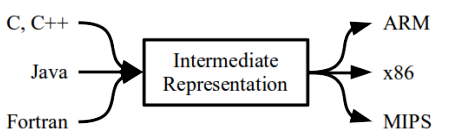
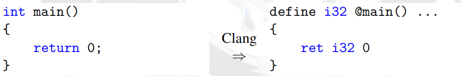
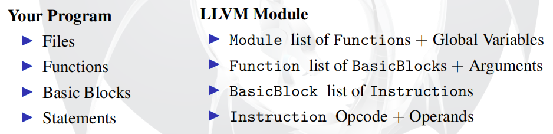
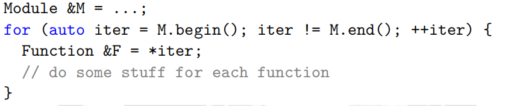
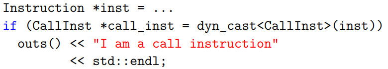
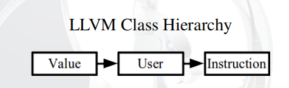

https://github.com/UofT-EcoSystem/CSCD70

https://github.com/eternalsakura/sakura_llvm_opt

llvm参考资料

https://llvm.org/docs/tutorial/index.html

https://llvm-tutorial-cn.readthedocs.io/en/latest/index.html （翻译版）

C++ PReview

- 引用传参

- Public继承

- STL

LLVM Analysis Pass

LLVM

- 类似于GCC的先进的编译框架
- 模块化、较好文档化


IR 



IR与汇编有相似的语法和语义



分析和转换PASS

将优化PASSes分类为分析与转换：

- 分析pass：汇集程序信息
- 转换pass：变异程序

分离好处：

- 更好的可读性
- 一些使用频率高的pass可能需要相同的信息，分离可以避免重复分析

LLVM IR实际上有三种表示：

1. .ll 格式：人类可以阅读的文本。
2. .bc 格式：适合机器存储的二进制文件。
3. 内存表示

llvm一些tools：

- .c -> .ll：`clang -emit-llvm -S a.c -o a.ll`
- .c -> .bc: `clang -emit-llvm -c a.c -o a.bc`

- `llvm-as`：把LLVM IR从人类能看懂的文本格式汇编成二进制格式。注意：此处得到的**不是**目标平台的机器码。
- `llvm-dis`：`llvm-as`的逆过程，即反汇编。 不过这里的反汇编的对象是LLVM IR的二进制格式，而不是机器码。
- `opt`：优化LLVM IR。输出新的LLVM IR。
- `llc`：把LLVM IR编译成汇编码。需要用`as`进一步得到机器码。
- `lli`：解释执行LLVM IR。

对于LLVM IR来说，.ll文件就相当于汇编，.bc文件就相当于机器码


如何编写LLVM Analysis PASS？

- LLVM Module：程序在LLVM中如何被翻译
- Iterators：如何遍历module
- Downcasting：如何获取iterator更多信息
- LLVM Pass Interfaces：接口提供了什么

**LLVM Module**：Module相当于我们的程序



Module：函数Function列表+全局变量

Function：基本块列表+参数

BasicBlock：指令列表

Insrtuction：操作码+操作数

**Iterators**

迭代器，与STL vector容器语法相似



**Downcasting**

> 现有一个指令，如何知道它是一个什么类型的指令？

Downcasting可以检索iterators中更多信息



**LLVM Pass Interfaces**

对于不同module层次提供了不同的pass接口

- FunctionPass
- LoopPass

使用Public继承来使用这些接口

```c++
class ModulePass {
virtual bool runOnModule(Module &M) = 0;
};
```

```cpp
class MyModulePass : public ModulePass {
bool runOnModule(Module &M) { for (iter = ... }
};
```


LLVM Transform PASS

User-Use-Value

以下待优化IR代码会导致程序崩溃，因为没有正确地更新引用

```
%2 = add %1, 0 ; Algebraic Identity
%3 = mul %2, 2
```

LLVM的User-Use-Value关系可以正确地更新所有引用



**Value：**

- Value类是LLVM种最重要的基类，所有对象类型都继承这个类
- 一个Value有类型，使用getType获取
- Value可以有名字也可以没有，hasName, getName
- Value有一个正在使用它的**Users**列表


**指令作为User**

每个User（指令）有一个正在使用的Values的列表，这些Values通常是Operands（操作数）或类型

```c
User &Inst = ...
for (auto Iter = Inst.op_begin();
Iter != Inst.op_end(); ++Iter)
{ Value *Operand = *Iter; }
// %2 = add %1, 0 → operand %1 & 0
```


**指令作为Usee**

如LLVM指令：

```
%2 = add %1, 0
```

这个语句不能理解为：指令`add %1, 0`的结果分配到`%2`

正确理解是：`%2`是代表`add %1, 0`指令的Value

因此，后续使用`%2`这个Value，都表示使用指令`add %1, 0`

---

afl-llvm-pass插桩解析

- afl-fast-clang
- **afl-llvm-pass**
- afl-llvm-rt


**注册PASS**

```c
static void registerAFLPass(const PassManagerBuilder &,
                            legacy::PassManagerBase &PM) {

  PM.add(new AFLCoverage());

}


static RegisterStandardPasses RegisterAFLPass(
    PassManagerBuilder::EP_ModuleOptimizerEarly, registerAFLPass);

static RegisterStandardPasses RegisterAFLPass0(
    PassManagerBuilder::EP_EnabledOnOptLevel0, registerAFLPass);
```

向PassManager注册新pass，每个pass彼此独立，由PassManager同一注册和调度。

llvm源码摘要：

```c
/// Registers a function for adding a standard set of passes.  This should be
/// used by optimizer plugins to allow all front ends to transparently use
/// them.  Create a static instance of this class in your plugin, providing a
/// private function that the PassManagerBuilder can use to add your passes.
class RegisterStandardPasses {
  PassManagerBuilder::GlobalExtensionID ExtensionID;

public:
  RegisterStandardPasses(PassManagerBuilder::ExtensionPointTy Ty,
                         PassManagerBuilder::ExtensionFn Fn) {
    ExtensionID = PassManagerBuilder::addGlobalExtension(Ty, std::move(Fn));
  }

  ~RegisterStandardPasses() {
  ...
  }
};
/*
当我创建了一个类RegisterStandardPasses之后，就会调用它的构造函数，然后调用PassManagerBuilder::addGlobalExtension，这是一个静态函数，这个函数会创建一个tuple保存Ty和Fn还有一个id，并将其添加到一个静态全局vector里，以供PassManagerBuilder在需要的时候，将其添加到PM里。
这个添加的时机就是ExtensionPointTy来指定的。
*/

class PassManagerBuilder {
public:
  /// Extensions are passed to the builder itself (so they can see how it is
  /// configured) as well as the pass manager to add stuff to.
  typedef std::function<void(const PassManagerBuilder &Builder,
                             legacy::PassManagerBase &PM)>
      ExtensionFn;
  typedef int GlobalExtensionID;

  enum ExtensionPointTy {
    /// EP_ModuleOptimizerEarly - This extension point allows adding passes
    /// just before the main module-level optimization passes.
    EP_ModuleOptimizerEarly,
    ...
    /// EP_EnabledOnOptLevel0 - This extension point allows adding passes that
    /// should not be disabled by O0 optimization level. The passes will be
    /// inserted after the inlining pass.
    EP_EnabledOnOptLevel0,
    ...
    }
    ...
    ...
  /// Adds an extension that will be used by all PassManagerBuilder instances.
  /// This is intended to be used by plugins, to register a set of
  /// optimisations to run automatically.
  ///
  /// \returns A global extension identifier that can be used to remove the
  /// extension.
  static GlobalExtensionID addGlobalExtension(ExtensionPointTy Ty,
                                              ExtensionFn Fn);
    ...
  }
...
...
/// PassManagerBase - An abstract interface to allow code to add passes to
/// a pass manager without having to hard-code what kind of pass manager
/// it is.
class PassManagerBase {
public:
  virtual ~PassManagerBase();

  /// Add a pass to the queue of passes to run.  This passes ownership of
  /// the Pass to the PassManager.  When the PassManager is destroyed, the pass
  /// will be destroyed as well, so there is no need to delete the pass.  This
  /// may even destroy the pass right away if it is found to be redundant. This
  /// implies that all passes MUST be allocated with 'new'.
  virtual void add(Pass *P) = 0;
};
```

**AFLCoverage::runOnModule**

getContext来获取LLVMContext，其保存了整个程序里分配的类型和常量信息。

通过这个Context来获取type实例Int8Ty和Int32Ty

- Type是所有type类的一个超类。**每个Value都有一个Type**，所以这经常被用于寻找指定类型的Value。

环境变量AFL_INST_RATIO给变量inst_ratio，其值默认为100，这个值代表一个插桩概率，本来应该每个分支都必定插桩，而这是一个随机的概率决定是否要在这个分支插桩

```c
  GlobalVariable *AFLMapPtr =
      new GlobalVariable(M, PointerType::get(Int8Ty, 0), false,
                         GlobalValue::ExternalLinkage, 0, "__afl_area_ptr");

  GlobalVariable *AFLPrevLoc = new GlobalVariable(
      M, Int32Ty, false, GlobalValue::ExternalLinkage, 0, "__afl_prev_loc",
      0, GlobalVariable::GeneralDynamicTLSModel, 0, false);
```

获取全局变量中指向共享内存的指针（\__afl_area_ptr），以及上一个基础块的编号（__afl_prev_loc）

```c
 for (auto &F : M)
    for (auto &BB : F) {
    	BasicBlock::iterator IP = BB.getFirstInsertionPt();
      	IRBuilder<> IRB(&(*IP));
    }
```

遍历每个基本块，找到此基本块中适合插入instrument的位置，后续通过初始化IRBuilder的一个实例进行插入。

```c
unsigned int cur_loc = AFL_R(MAP_SIZE);
ConstantInt *CurLoc = ConstantInt::get(Int32Ty, cur_loc);
LoadInst *PrevLoc = IRB.CreateLoad(AFLPrevLoc);
PrevLoc->setMetadata(M.getMDKindID("nosanitize"), MDNode::get(C, None));
Value *PrevLocCasted = IRB.CreateZExt(PrevLoc, IRB.getInt32Ty());
```

随机创建一个当前基本块的编号，并通过插入load指令来获取前一个基本块的编号。

```c
LoadInst *MapPtr = IRB.CreateLoad(AFLMapPtr);
MapPtr->setMetadata(M.getMDKindID("nosanitize"), MDNode::get(C, None));
Value *MapPtrIdx =
        IRB.CreateGEP(MapPtr, IRB.CreateXor(PrevLocCasted, CurLoc));
```

通过插入load指令来获取共享内存的地址，并通过CreateGEP函数来获取共享内存里指定index的地址，这个index通过cur_loc和prev_loc取xor计算得到。

```C
LoadInst *Counter = IRB.CreateLoad(MapPtrIdx);
Counter->setMetadata(M.getMDKindID("nosanitize"), MDNode::get(C, None));
Value *Incr = IRB.CreateAdd(Counter, ConstantInt::get(Int8Ty, 1));
IRB.CreateStore(Incr, MapPtrIdx)
        ->setMetadata(M.getMDKindID("nosanitize"), MDNode::get(C, None));
```

通过插入load指令来读取对应index地址的值，并通过插入add指令来将其加一，然后通过创建store指令将新值写入，更新共享内存。

```C
StoreInst *Store = IRB.CreateStore(ConstantInt::get(Int32Ty, cur_loc >> 1), AFLPrevLoc);
Store->setMetadata(M.getMDKindID("nosanitize"), MDNode::get(C, None));
```

将当前cur_loc的值右移一位，然后通过插入store指令，更新`__afl_prev_loc`的值。


总结
总的来说就是通过遍历每个基本块，向其中插入实现了如下伪代码功能的instruction ir来进行插桩。

```
cur_location = <COMPILE_TIME_RANDOM>; 
shared_mem[cur_location ^ prev_location]++; 
prev_location = cur_location >> 1;
```
