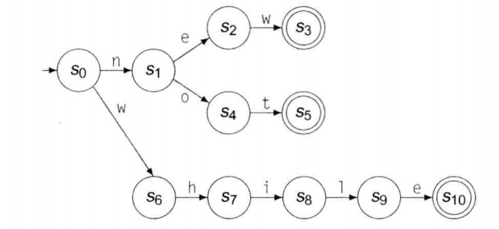
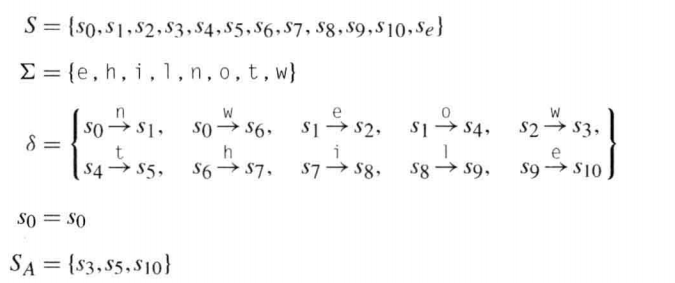
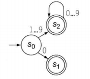
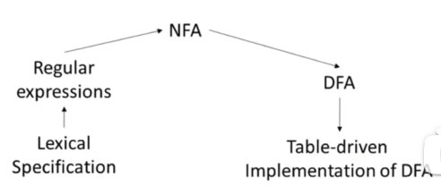
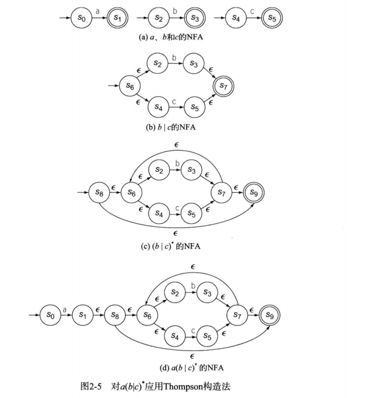
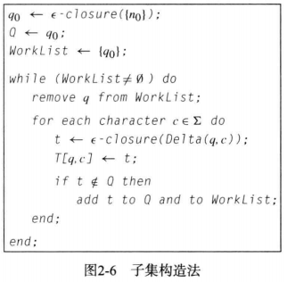
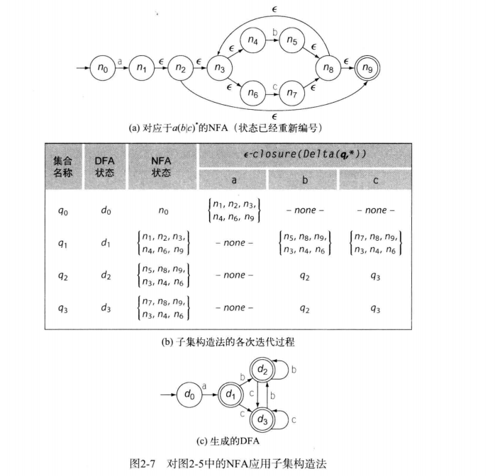

词法分析是编译器处理输入程序的第一阶段

- 手工编写的词法分析器
- 生成的词法分析器

词法分析器读取字符构成的输入流，应用一组描述编程语言的此法结构规则(**微语法 microsyntax**)，产生包含单词的输出流，每个单词都标记了**语法范畴**。

一些单词称为**关键字**，为特定语法目的而保留的单词，不能用作标识符



上图为new/not的识别器，s0 对应于输入 n 和 w 的转移，识别器有三个接受状态 s3, s5, s10。遇到无法匹配的某个转移，识别器转移到错误状态。

# **有限状态机 FA**

识别器的一种形式化方法，是一个五元组
$$
(S,\Sigma,\delta,s_0,S_A)
$$

- S：识别器中的有限状态集，以及一个错误状态$s_e$，FA进入错误状态就会一直停留，直至耗尽输入流
- $\Sigma$：识别器使用的有限字母表，也是转移图中边标签的集合
- $\delta(s,c)$：识别器中的转移函数，将每个状态和每个字符 $s \in S, c \in \Sigma$ 的组合映射到下一个状态
- $s_0$：起始状态
- $S_A$：接受状态的集合，上图中双圈的状态集合 

上图转换FA形式为：



# 正则表达式 RE

FA 接受的单词的集合，形成一种语言，记作 $L(\digamma)$ 

可以使用正则表达式的符号表示法来描述FA，RE描述的语言为**正则语言**

一些规则

- | 表示 or：new or not -> `n(ew|ot)`，new or while -> `new|while`
- $x^*$ 表示 “**x的零或多次出现**”，* 运算符称为**柯林闭包**
- $R^i$ ，i 为任一整数，表示R出现一次到 i 次的情形，称为**有限闭包**
- $R^+$，R出现一次或多次，**正闭包**
- $a \in \Sigma$，则 a 也是一个RE，表示仅包含 a 的集合
- $\epsilon$ 是一个RE，表示仅包含空串的集合
- 括号具有最高优先级，其次为闭包、连接、选择
- 求补 ^

可以用RE表达为：$0|(1|2|...|9)(0|1|2|...|9)*$

RE有三个基本操作构建

- 选择：两个字符串集合R和S的交替或并集，记作 R | S
- 连接：R和S的连接记作 RS
- 闭包：R的柯林闭包，记作 R*

一些例子：

Algol标识符

```
([A...Z]|[a...z])([A...Z][a...z][0...9])*
```

无符号整数

```
0|[1...9][0...9]*
```

无符号实数
$$
(0|[1...9][0...9]^*)(\epsilon|.[0...9]^*)
$$
科学计数法
$$
(0|[1...9][0...9]^*)(\epsilon|.[0...9]^*)E(\epsilon|+|-)(0|[1...9][0...9]^*)
$$
字符串识别，C/C++ JAVA注释识别

```
"(^")*"
```

```
"(^(\n|"))*", //(^\n)*\n
```

# 词法分析器

$\epsilon 转移$ ，针对空输入进行转移，不改变输入流中的读写位置

非确定性有限自动机 NFA：允许空船输入 $\epsilon $ 上进行转移的FA，其状态对同一字符输入可能有多种转移

确定性有限自动机 DFA：转移函数为单值的FA，不允许 $\epsilon $ 转移

下图为词法分析器流程图



RE到NFA

目的对每种正则表达式定义一个NFA

Thompson构造法 a(b|c)*




NFA到DFA 

$\epsilon-close $：其基本思想是状态选择，表示能从某状态出发通过$\epsilon$ 转移所能到达的任何状态。对于上面的NFA，$\epsilon-close(S_6)=[S_6,S_2,S_4] $ ，$\epsilon-close(S_7)=[S_7,S_6,S_2,S_4] $ 





# 实现此法分析器

表驱动

使用框架此法分析器用于控制，用表生成来编码特定语言的知识，由正则表达式指定此法模式，词法生成器生成用于驱动框架此法分析器的表。

直接编码

直接编码可以降低DFA转移成本，用隐式表达简化查表计算过程，消除了伴有的内存访问。

# 实现

目标：实现cool语言的lexer。核心就是通过flex自动化生成lexer。[flex文档地址](https://garudaxc.github.io/BisonTest/#Introduction)

> flex 是一个生成扫描仪的工具。 扫描仪是一种识别文本中词汇模式的程序。 flex 程序读取给定的输入文件，如果没有给出文件名，则读取其标准输入，以生成扫描仪的描述。 描述采用成对的正则表达式和 C 代码的形式，称为规则。 flex 默认生成一个 C 源文件“lex.yy.c”作为输出，它定义了一个例程 yylex()。 该文件可以编译并与 flex 运行时库链接以生成可执行文件。 当可执行文件运行时，它会分析其输入中是否出现正则表达式。 只要找到一个，它就会执行相应的 C 代码。
