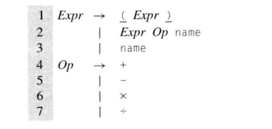
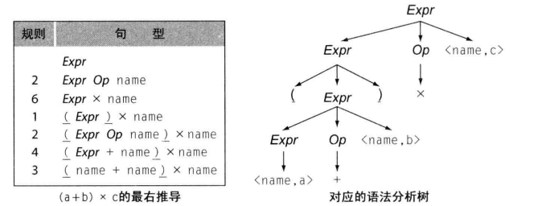
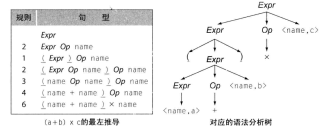
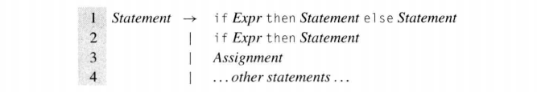
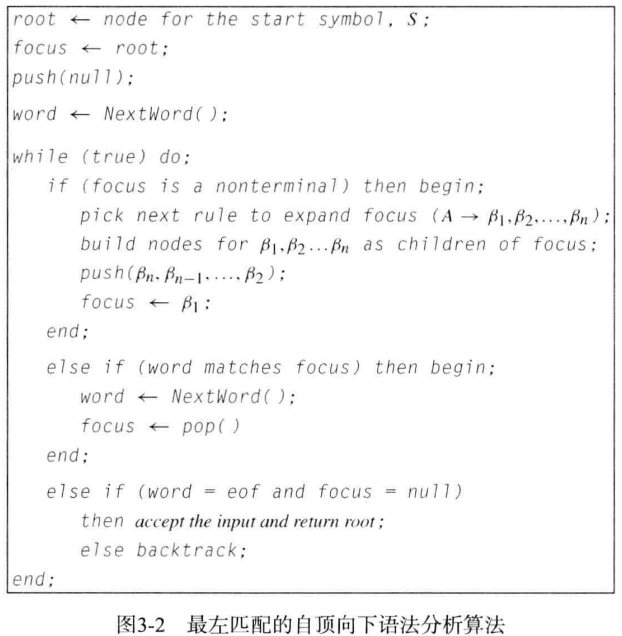

语法分析是编译器前端第二阶段，处理词法分析器生成的程序。为程序单词流推到一个语法结构，将各个单词适配源程序设计语言的语法模型。确定程序在源语言是否是一个语法上有效的语句。该模型表示为一个形式语法G，若某个单词串属于G定义的语言，就说G可以推导出s。对于单词流s和语法G，语法分析器构建一个构建性证明，表明s可以在G中推导出来，这个过程称为**语法分析**。

由于RE无法表明运算符优先级、匹配括号左右平衡的所有表达式等限制，所以不适合描述一些重要的程序语言特性。

上下文无关语法 CFG，这种符号表示法用于规定程序设计语言的语法，是一组规则，描述了语句如何形成。可以从G中导出的语句集称为G定义的语言，记作 $L(G)$ 。

> - 产生式：CFG中每个规则都称为一个产生式
> - 非终结符：语法产生式中使用的语法变量
> - 终结符：出现在语句中的单词，单词包含一个词素及其语法范畴

上下文无关语法是一个四元组$(T,NT,S,P)$

- T：终结符或语言 $L(G)$ 中单词的集合，终结符对应词法分析器返回的语法范畴
- NT：G的产生式中出现的非终结符集合。非终结符是语法变量，引入非终结符在产生式中提供抽象和结构
- S：$S\in NT$，是一个非终结符，被指定为语法的目标符号或起始符号。S表示为 $L(G)$ 中语句的集合
- P：产生式，是G中产生或重写规则的集合 $X->Y_1Y_2...Y_n$ 

语法分析树Parse tree：表示推导的图。叶子节点上是终结符，非终结符位于内部节点。叶子节点的中序遍历所得结果就是我们的原始输入

例子：(a+b)*c

最右（左）推导：一种推导，每个步骤都重写最右（左）侧的非终结符，两种推导都有相同的语法分析树

二义性：L(G)中某个语句有一个以上最右（左）推导（有多个以上最右或最左推导），那么语法G就是二义性的

**二义性说明**

给出以下if-then-else结构的简明语法

对于 $if \space Expr1\space then \space if \space Expr2\space then\space Assignment1\space else \space Assignment2$

有两种不同的最右推导（else关联不同的if），导致编译后代码具有不同行为，必须修改该语法来确定哪个if来控制特定的else。

重写语法为：

添加了规则：每个else绑定到最内层、尚未闭合的if。这样可以确保每个else无歧义匹配到某个if，消除了二义性

语法分析器要为输入程序生成一个推导，或对无效程序给出错误信息。对于无歧义的语言，语法分析树等价于推导，可认为语法分析器的输出是语法分析树，定义其工作为”为输入程序构建语法树“。

程序的根是已知的，表示语法起始符号，叶节点也是已知的，从左到右逐一匹配词法分析器返回的单词流。困难在于找到叶子节点与根节点间的语法关联。两种构建语法树方法：

- 自顶向下语法分析器：从根开始构建语法树，每一步在树的下边缘选择一个表示某非终结符的节点，用一个子树来扩展该节点，子树表示了重写非终结符所用产生式的右侧部分；
- 自底向上语法分析器：从叶子节点开始构建语法树，每一步在树上的边缘处识别出一个连续的子串，该子串与某个产生式的右侧匹配，接下来构建一个节点表示该产生式左侧，并连接到树种。

# 自顶向下语法分析

从根开始，向下扩展树，直至树的叶节点与词法分析器返回的一归类单词相匹配。过程在树的下边缘选择一个非终结符，选定某个适用于该非终结符的产生式，用产生式右侧相对应的子树来扩展该节点，直到：

- 树的下边缘只包含终结符，且输入流耗尽（成功）
- 部分完成的树下边缘个节点，与输入流存在明确不匹配（失败）

## 递归下降语法分析器

也称为预测分析，算法基本思路：

- 为每个非终结符构造一个分析函数，每个函数名是相应的非终结符，函数体则是根据规则右部符号串的结构和顺序编写
- 文法是LL(1)文法

该算法主要由循环组成，focus与语法分析树下边缘最左侧的不匹配符号：

- 若focus是非终结符，则向下扩展语法分析树；
- 选择一个产生式，在树中构建对应部分；
- 转移关注点，考察新增部分中最左侧符号。

- 若focus是终结符，将其与输入流中下一个单词比较；
- 若匹配那么移动关注点，考察边缘下一个符号，在输入流中前进一个位置；
- 若不匹配，则进行**回溯**，在更高一层次重新考虑产生式选择；
- 若这个过程都无法匹配输入，报告语法错误

回溯的实现：

算法将focus设置为在部分构建的语法分析树中的父节点，将focus子节点从树上断开，若还有左侧为focus且未试过的规则，语法分析器架构使用该规则扩展focus

## LL(1)语法分析器