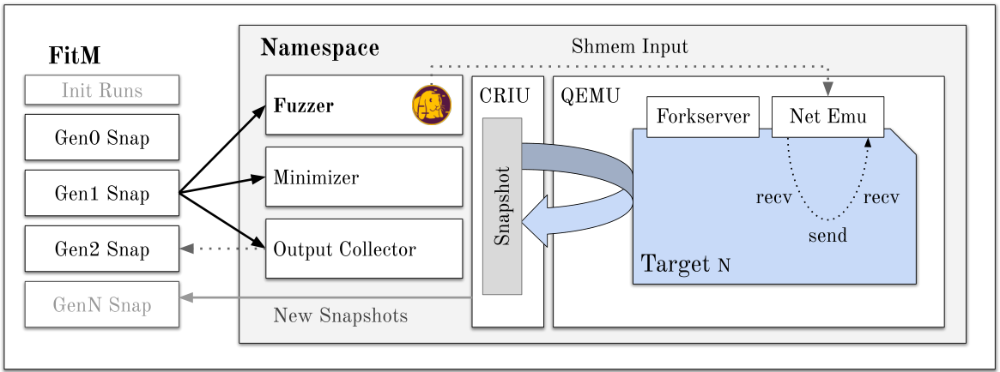
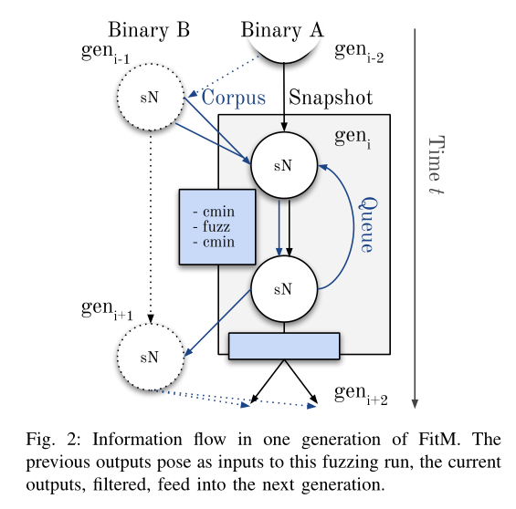
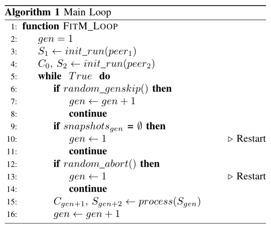
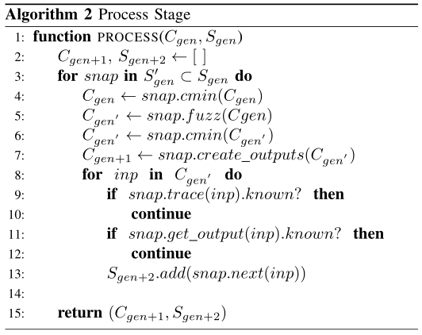
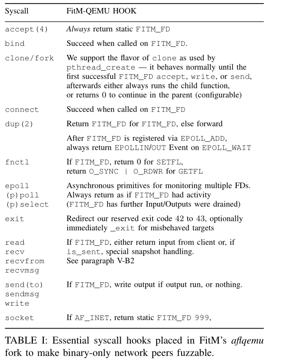

# Introduction

基于qemuafl的以覆盖率为引导的fuzzer，可以对客户端和服务器进行fuzzing。

FitM qemu使用网络层仿真，能够处理同步和异步网络交互

网络系统调用挂钩通过共享映射而不是套接字传递输入，速度提高了很多倍。 

对于每个潜在的新状态，对应着一个新的recv-send-recv，fitM使用CRIU为此状态创建一个持久化的snapshot。快照允许随时停止或继续Fuzzing目标状态，甚至用strace来回放快照。

基于新的socket输出和唯一的AFL映射，实现了waypoint和智能状态创建，能够单独fuzz某个状态。

### challenge

- 什么时候拍摄snapshot
- 如何调度
- 如何自动探索有状态协议

### Contribution

- 我们设计、开发并开放源代码FitM，这是一种新型的中间覆盖引导模糊器，用于纯二进制目标。 
- 我们提出了一种状态快照和状态模糊的方案。 
- 我们通过模糊感知网络仿真层扩展了qemuafl，消除了内核交互的需要。它模拟同步和异步套接字。
- 我们将FitM与AFLNet进行了比较，AFLNet是一种最先进的网络协议覆盖引导模糊器，结果令人满意。 
- 通过模糊FTP服务器并在其他网络服务器和客户端上运行，我们在GNU Inetutils的FTP客户端中发现了一个以前未知的缓冲区溢出。

# BackGround

### A. 覆盖率引导的陷阱

由于随机变异，一般Fuzzer难以探索深层次的协议状态空间，目前最好的解决方案（AFLSmart、Nautilus、Superion、AFLNet等），仍然需要用户指定的语法和输入。几乎没有自动化的方法能从pcap文件中提取数据流或甚至学习其中的语法。

越来越多研究提出使用Snapshot进行fuzzing（Falk、Nyx、Agamotto等），Snapshot可以保存程序的状态，有利于网络协议的fuzzing。大多数Snapshot引擎在hypervisor层次工作，这会导致较大开销，userspace层次的快照拍摄可以达到更快的测试速率。

### B. QEMU qemuafl

FitM在qemuafl基础上改写。使用qemu-user，qemuafl提升并重新编译执行过程中遇到的基本块，添加AFL++兼容的覆盖率插桩，用作未来变异的反馈。完全控制目标程序，可以替换任何syscall，添加不支持的调用，hook这些调用，改变程序行为等。

# Challenges

### A. State Explosion 状态爆炸

$gen_i$的输出会被输入到$gen_{i+1}$的一个新快照，平均每个快照可以产生超过一个输出，每一gen产生状态的数量与其中状态的数量成正比，构成指数级增长，会导致状态爆炸问题。这回导致FitM难以到达通信后期阶段，然而安全问题往往存在于后期阶段。

解决措施：

1. 最小化前几次产生的输入、用afl-cmin精简当前语料库
2. 为当前Fuzzing loop随机选取快照
3. 使用字符串相似性消除重复输出

### B. Dead Ends

客户端和服务器可能会不断重复setup、teardown或error消息。通常Fuzzer无法从这种循环中恢复。对每个新快照的追踪对比，可以捕捉到新状态与老状态行为完全相同的情况。

### C. Desynchronisation Between Generations

当要作为下一代的输入时，每一代都应产生转换到下一个状态的输出。 

FTP作为例子，首先banner消息体制连接建立，之后客户端发送user登录请求，服务器收到后，响应密码请求。若没有收到登录请求，则不会响应密码请求，这也可能客户端再次收到banner消息，造成客户端缺失一代gen，从而导致双方同步缺失。服务端已从gen1转换到gen3，而客户端卡在了gen2，并且服务端gen3没有收到任何相关信息。

使用多代的输出提供给下一代输入来解决同步缺失的问题。

# Design

FitM由Rust编写，使用CRIU持久化快照。使用常规AFL-style的Forkserver模式进行fuzzing。

FitM代理网络交互，直接拦截通信双方，将socket要发送的内容通过共享内容输入到目标程序，不需要内核交互的开销。

服务器只回复遵守规则的输入，为了达到更深的状态，每个交互阶段的输入都必须正确。FitM收集每个交互阶段双方的响应，这些是完全遵从规则的。对于发送服务器的请求，收集服务器的响应；对于服务器发送的响应，收集客户端下一次的请求。

- 蓝线表示测试用例流
- 黑线表示快照
- 虚线和元素表示其他的gen

可以根据所选目标配置客户端或服务器是否开始通信。然后，每个收集到的输出都是下一阶段的输入，并为该阶段的Fuzzing种子。

一旦Fuzzer为后续状态找到多个输入，简单地按顺序重新运行这些输入就可能会导致不同的行为。即使交换的信息相同，目标中的随机性也会阻碍再现性和进一步发展。因此，每当目标需要新输入时（即在recv系统调用时），FitM都会创建一个新的快照，而不是重新运行。 

以下为一些Challenge的解决方案

# Implement

## Algorithm

FitM工作流程主要包含两种算法，一种表示整个gen如何处理，另一种表示强调一个单一gen

1. Main Loop：第一个概念性步骤是在客户端和服务器上运行init_run函数。该函数将为每个目标生成初始状态S1和S2。此外，它将记录目标协议中首先发送的目标的输出作为语料库C0。以下情况不对当然gen做处理：

   - 以7%概率随机跳过，强调更深层次状态
   - 当前gen为空，触发从第一代重新启动。从头开始运行可能会发现并探索早期版本新代码路径
   - 每次运行超过另一个2%的随机阈值，中止所有gen的运行，触发从第一代重新启动。

   如果这三个检查均未成功，则调用过程，触发算法2。对于下一步，返回后续语料库Cgen+1。然后为下一个循环步骤之后的循环步骤创建快照Sgen+2

   

2. Process Stage：贯穿当前gen，处理其子集，该子集大小恒定，随机选择。子集内每个快照需要被fuzzed，收集测试结果。fuzz之前使用afl-cmin对语料库Cgen作最小化处理，对最小化后的语料库进行fuzz。之后再对fuzz输出做一次最小化处理，为了减少create_outputs生成的Cgen+1潜在输出数量。

   C′gen中的每个input，若通过条件判断，则加入下一gen的快照内。

   

## QEMU Syscalls

patchQWMU的syscall转换层，解决网络开销问题。通过strace运行FitM-QEMU对所有网络仿真进行HOOK，然后修改这些系统调用。引入伪文件描述符FITM_FD，用于处理所有AF_INET套接字操作，甚至在目标上进行多路复用。

