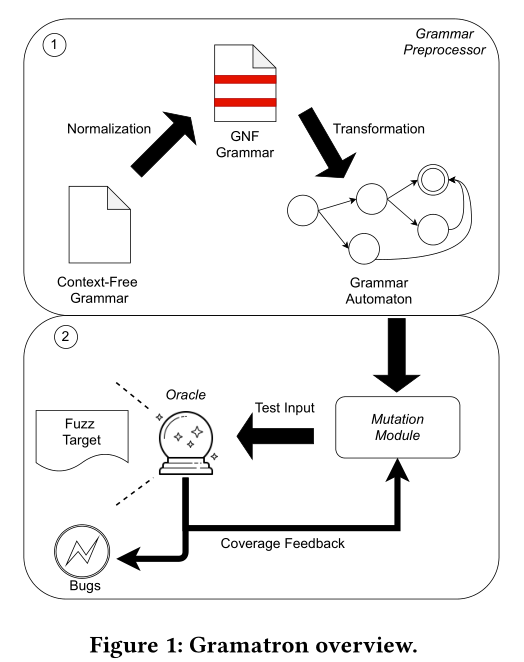
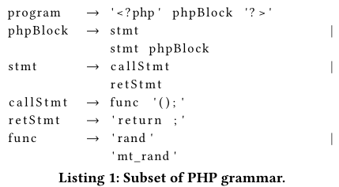
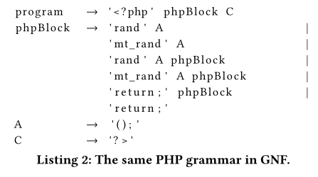
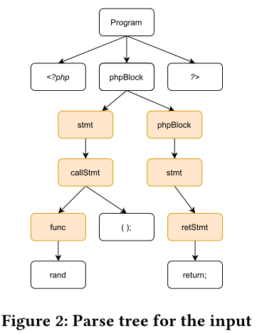

# Gramatron: Effective Grammar-Aware Fuzzing

项目地址：[HexHive/Gramatron: Coverage-guided grammar aware fuzzer that uses grammar automatons (github.com)](https://github.com/HexHive/Gramatron)

# 摘要：

现有的语法感知Fuzzer在很难触发一些综合复杂的bug的原因：

- 在输入用例生成阶段，由于它们的构造，语法器会引入采样偏差
- 现有解析树的变异操作通常只在局部小范围上起作用

Gramatron使用激进变异操作的语法自动机，来更快更高效地生成综合复杂bug的触发器。通过语法自动机解决采样偏差问题。 

重新构造语法，允许从输入状态空间进行无偏差采样，重新设计语法感知变异，使得可以进行更加激进、大范围地变异。

语言解释器是有价值的测试目标，对解析器的测试对于确保运行在这些解析器上的软件（如web应用）的安全至关重要。

# INTRODUCTION

传统无语法感知Fuzzing缺点：

- 生成样例违反解析器语法
- 随机变异会改变一些keywords

Fuzzing语义分析组件需要生成语法上有效的输入，现有的语法感知Fuzzers技术

1. 利用上下文无关语法CFG来生成测试用例
2. 使用语法解析树表示输入的语法结构

这些Fuzzer使用语法对语法解析树进行变异，生成语法上有效的测试用例

但现有的语法感知Fuzzing存在两个问题：

- **偏差采样**：Fuzzer在使用现有语法时，会从输入状态空间执行偏差采样。偏差采样出现原因是CFG中的产生式如何分布，以生成输入。这种偏差会导致Fuzzer难以生成那些触发复杂bug的triggers，这种triggers通常需要连接输入状态空间的多个部分。
- **小规模的变异**：语法感知Fuzzer使用语法解析树来生成或变异测试样例。但现有的变异操作只对语法解析树执行局部小规模变异。当尝试用复杂的trigger来探索bug时，如果把时间浪费到无法触发bug的语法部分，会使得Fuzzer效率降低。

文中提出的两个解决方案：

- 重构语法中的产生式，以减少采样偏差
- 重新设计变异操作，以进行大规模的改变

在语法解析树之类的输入表达上实现这两个方案会引入性能开销，因为需要在生成或变异测试用例的时候需要以输入派生结构（ input derivation structure）来保存每个输入的元数据。

为解决开销，文中将输入语法转换成有限状态自动机，称之为语法自动机。语法自动机重构语法减少采样偏差，并允许激进的变异操作来避免陷入局部语法搜索。

文中提出了Gramatron，证明语法自动机对于语法感知Fuzzing时有效的解决方案。将输入转换为自动机，并用激进的更快的语法感知变异操作进行变异。

**Contribution：**

- 利用语法自动机来重组语法，以可靠地生成高度多样化的输入，作为合成复杂bug triggers的有效方法；
- 重新设计和优化语法自动机的变异操作符，使它们能够进行积极的变异，以更快地发现具有复杂触发器的bug；
- 构建并评估了Gramatron，一种高效的语法感知模糊器；
- 在10天的模糊化活动中发现了10个新漏洞，到目前为止，已经分配了一个CVE。 


# BACKGROUND

CFG

Gramatron使用CNF结合GNF，以重构语法。

自动机类别

- 有限状态自动机FSA

- 下推自动机PDA

语法感知变异

- 随机变异（随机挑选一个非叶子非终结符节点并创建一棵新子树）
- 随机递归（找到递归产生式并展开最多n次）
- 拼接（保留语法的同时组合两个输入）

# OVERVIEW

Gramatron是以覆盖率为引导，语法感知生成的Fuzzer。将target接受的CFG作为输入，输出crash的测试样例。



主要两阶段：预处理阶段和fuzzing阶段

预处理阶段：

将语法转换相应的语法自动机，首先将语法转换成无偏输入采样的形式，并从中创建语法自动机。这是一个FSA，将语法代表的输入空间进行编码。

fuzzing阶段：

通过自动机和重写的变异操作进行高速激进变异，允许生成复杂的triggers，用覆盖率进行引导Interesting的语法部分。

# 语法自动机

随机选择替换规则进行扩展时，传统的语法结构在输入生成过程中引入偏差。语法规则分布方式可能会导致难以生成输入状态空间的特定部分。这种偏差会导致Fuzzer生成特定模式效率降低。当前变异操作主要针对语法解析树做局部小规模变异，这种变异不足以触发语法中bug相关的代码时，对Fuzzing是有害的。

对CFG执行两部转换来创建语法自动机，首先将CFG转换为GNF范式，然后将语法的GNF转换成自动机。Gramatron将遵守语法的任何输入编码为自动机（？），实现无偏采样

## EXAMPLE



Listing1展示了传统结构强制Fuzzer从输入分布执行有偏采样。从这个CFG会生成从`program`开始，然后以迭代方式继续应用规则，直到生成的字符串没有非终结符。callstmt可以生成对于retstmt两倍的子树，所有有50%概率选择其中一个，这就使得Fuzzer对callstmt子树欠采样。这会导致生成的输入多样性较低，从而降低效率。



GNF允许gramatron进行无偏差采样。GNF重构语法，显示枚举每个非终结符可以生成的所有不同子树。因此与函数调用对应的子树被选中生成的可能性是原来两倍，因为生成两倍多的子树。

给定输入字符串和变异点，Gramatron进行变异，直到相对于变异点的字符串结束。自动机比解析树更加利于激进变异。

**变异例子：**

```php
<?php rand (); return; ? >
```



 解析树与上图所示，Gramatron会将此输入表示为一系列自动机转换：`[0_1, 1_4, 4_1, 1_3, 3_1]`

将`return;`作为变异点，若想对非终结节点stmt做激进变异，需要维护一个跟踪未扩展的非终端节点的解析栈。维护这个解析栈的开销为O(n)，n为解析树节点个数。通过在基于自动机的表示上执行这种变异，可以避免维护解析栈的这种开销。这是因为解析堆栈是在自动机状态中隐式编码的。


### 自动机构建

**构建算法**

Gramatron执行两步程序将语法转换为相应的自动机：

（i）将语法转换为其GNF：Gramatron将语法G转换为其CNF，然后在其CNF上执行定点迭代以将其转换为GNF

（ii）将转换后的语法转换为自动机


Gramatron通过首先为每个CFG产生式规则指定PDA的转换函数来执行其语法构造。

对于GNF中的语法，转换函数为：$δ（q，t，a）={(q，W)|a→ tW∈ R}$ 。t是终结符，a是非终结符，W对应于非终结符集。Gramatron使用该函数来构造自动机，枚举（如果可能）属于CFG的所有有效PDA堆栈状态来实现。语法自动机中的最终状态对应于空堆栈。对于每个堆栈状态，语法自动机中都存在一个状态。 


基于worklist的算法，worklist初始化为tuple，tuple包含初始状态机状态以及其带有开始覆盖G的解析栈。迭代worklist直至为空，每次迭代操作如下：

1. worklist中pop一个元素

2. 从元素解析栈（P）中，pop栈顶符号S，创造一个新的栈P'，对于堆栈符号，根据转换函数查找所有可能的转换 

3. 对于每个转换，通过反向push栈符号，从P'中计算新的栈P''

3. 1. 如果P''相当于先前生成的自动机解析栈，使用终结符t创建从当前状态到该状态的转换
   2. 如果P''是一个新的栈，使用终结符t创建从当前状态到具有栈P''的自动机状态的转换，并将新的自动机状态及其解析栈添加到worklist中
   

在FSA上执行自动机会创建新的种子输入。

**构造挑战/见解**

由于一种具有无限自动机状态的自嵌入语法，理论上不存在一种算法可以将任意CFG转换成FSA。如果CFG包含$ω ∗⇒ u ω v|{u, v}∈ T+,ω∈ N  $ 这样形式的产生式，则该CFG是自嵌入的。

