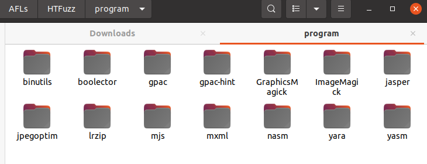
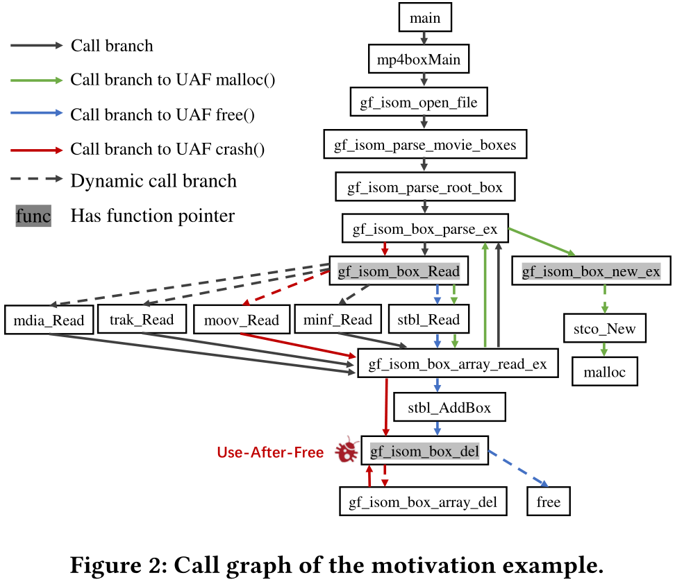
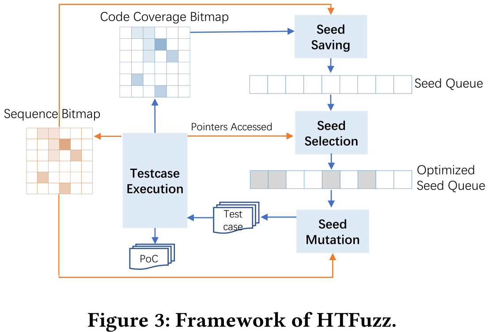
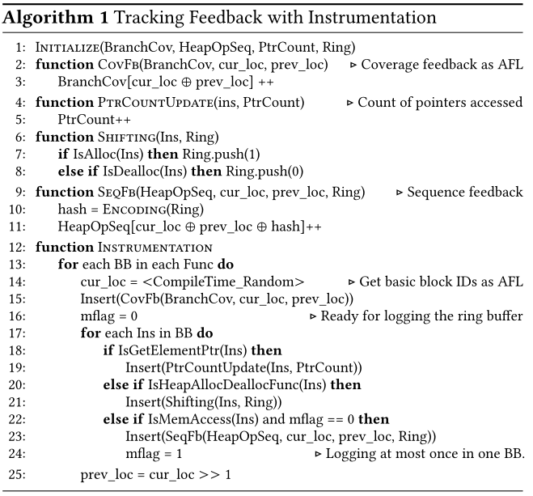
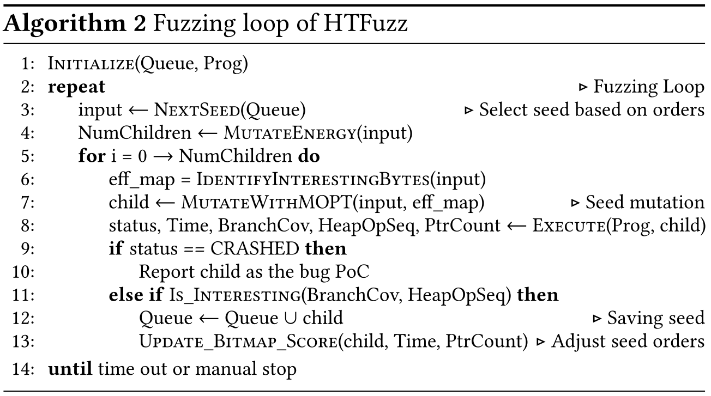
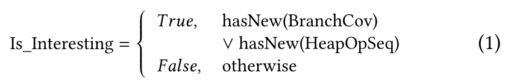
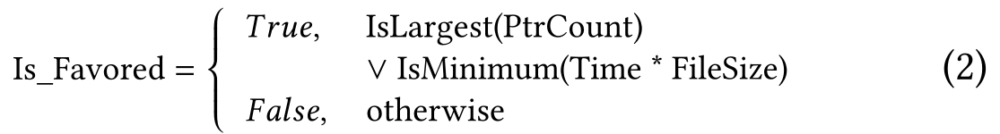

# 摘要部分

堆时序漏洞（UAF、Double-Free、null pointer dereference等）对对操作序列高度敏感，可以集成堆操作序列反馈来扩展传统代码覆盖引导的模糊测试。本篇论文利用fuzzing来提高堆操作序列覆盖率和这些堆操作访问的指针多样性，前者反映控制流，后者反映堆操作序列的数据流。随着这两者的增加，fuzzer可以发现更多基于堆时序的漏洞。提出HTFuzz原型，并在14个开源软件上进行测试，结果显示HTFuzz在发现堆时序漏洞上效果更好，并发现了37个CVE。



# Introduction

由于AFL覆盖率过于简单，有很多工具如TortoiseFuzz、AFL-sensitive和Ankou，用不同的方法来提高覆盖率的灵敏度，但是都缺乏对堆操作序列的感知。包括PathAFL等，都无法针对堆时序漏洞进行检测。

为了在模糊测试中检测堆漏洞，研究人提出的一些方案：

- 依赖先前知识和静态分析来识别候选的漏洞操作，然后像定向fuzz一样引导fuzzer到这些代码区域进行fuzzing。比如UAFL利用静态分析来找到候选HT-Vul和相关堆操作，并将这些堆操作之间的转换作为新反馈，以引导模糊器朝向目标操作序列并触发候选HT-Vuls。
- LTL-Fuzzer依靠专家知识在与潜在时间违规相关的位置对应用程序插桩，指导模糊器探索此类检测位置，并在运行时验证违规。
- UAFuzz使用定向Fuzz来探索用户预定义的UAF站点。

本文中，我们提出了一种新的堆操作序列敏感模糊化解决方案HTFuzz。它不依赖于预定义或预先分析的候选操作序列。相反，我们建议增加堆操作序列的多样性，而不是专注于探索一组有限的候选操作序列。体来说，我们尝试跟踪堆操作序列，将其用作代码覆盖率之外的新反馈，并引导模糊器增加多样性。堆操作序列的多样性越大，就越有可能找到潜在的HT-Vul。有以下三个问题需要解决：

1. **获取堆操作序列反馈的开销**：测试用例的执行跟踪中的堆操作数量非常大，记录这些信息需要大量时间和内存。此外很难对两个测试用例的堆操作序列进行对比。HTFuzz使用**环形缓冲区**来跟踪堆的申请和释放操作，每次访问内存操作都使用环形缓冲区的哈希值作为索引来更新序列覆盖图。意思就是在内存节点将一个完整的堆分配/释放操作序列拆分为几个固定长度的段，将所有段（类似AFL的边）记录在序列覆盖位图中。
2. **指针别名的敏感度**：堆漏洞还需要堆操作访问的指针，指针可能有不同的别名和不同的生命周期，这会给开发者带来管理上的麻烦，理论上指针别名越多，更有可能触发堆漏洞。但是在Fuzzing中跟踪别名消耗较高，HTFuzz解决方案是：Fuzzing过程中统计堆操作访问的指针（和别名）的数量，在能量调度阶段堆访问更多指针的测试用例进行优先级排序。
3. **堆操作序列引导与代码覆盖率协同**：代码覆盖率也是很有效的，但是两种引导机制会发生冲突。AFL使用effector map来记录那些可以触发新代码覆盖的interesting字节，在Fuzzing过程中跳过其他字节的变异。但是那些跳过的字节可能有助于堆操作序列的多样化。HTFuzz升级了AFL对应算法，利用MOPT算法来动态调度变异操作来平衡代码覆盖引导和堆操作序列引导。

总结就是：

1. 引入一种新的堆操作序列反馈给模糊器，并调整其种子保存策略，这将增加堆操作序列控制流的多样性；
2. 计算堆操作访问的指针（和别名）的数量，以调整种子选择策略，这将使种子在堆操作序列的数据流中具有更大的多样性；
3. 调整种子变异策略，以使新的反馈与现有的代码覆盖反馈一起工作。 

### contribution

- 提出了一种新的堆操作序列敏感模糊化解决方案HTFuzz，以有效地发现HT-Vul。
- 实现了一个HTFuzz原型，并对其有效性进行了评估。在堆操作序列的数量和发现的HT -Vul方面，它超过了所有11个最先进的模糊器。此外，我们还发现了37个新漏洞，包括32个新的HT-Vul。 
- 开源了HTFuzz和相关数据

# MOTIVATION

```cpp
typedef struct{
    const struct box_registry_entry *registry;
    ...
} GF_Box;
static struct box_registry_entry {
    GF_Box * (*new_fn)();
    void (*del_fn)(GF_Box *a);
    GF_Err (*read_fn)(GF_Box *s, GF_BitStream *bs);
    ...
} box_registry;
        
//isomedia/box_funcs.c
void gf_isom_box_del(GF_Box *a) {
    other_boxes = a->other_boxes; { use()} //crash
    if (!a->registry && use_dump_mode)
    a->registry->del_fn(a); // del_fn =free,...
    }
GF_Box *gf_isom_box_new_ex(...) {
    a = box_registry[idx].new_fn(); //new_fn =stco_New,...
}
GF_Err gf_isom_box_read(GF_Box *a, GF_BitStream *bs) {
    return a->registry->read_fn(a,bs); //read_fn =stbl_Read,minf_Read...
}
GF_Err gf_isom_box_parse_ex(...){
    if (...)
    newBox = gf_isom_box_new_ex(...); ->stco_New() ->malloc()
    if (...)
    e = gf_isom_box_read(newBox, bs);
}
//isomedia/box_code_base.c
GF_Err stbl_AddBox(GF_Box *s, GF_Box *a) {
    switch (a->type) {
        case GF_ISOM_BOX_TYPE_STCO:
        gf_isom_box_del(s->ChunkOffset); ->free();
        }}
GF_Err stbl_Read(GF_Box *s, GF_BitStream *bs) {
    e = gf_isom_box_array_read(s, bs, stbl_AddBox);
    CALL(gf_isom_box_array_read_ex(..., GF_Err (*add_box)))//do callback
    {
        while (parent->size>=8){
            e = gf_isom_box_parse_ex(...); ->gf_isom_box_new_ex()
            e = add_box(parent, a); //if add_box = stbl_AddBox
}}}
//isomedia/box_funcs.c
GF_Err gf_isom_box_array_read_ex(...,GF_Err(*add_box)(GF_Box*,GF_Box*)) {
    GF_Err e;
    GF_Box *a = NULL;
    while (parent->size>=8){
        e = gf_isom_box_parse_ex(&a, ...); ->gf_isom_box_read()
        if (e && a) gf_isom_box_del(a);
        e = add_box(parent, a);
        ...
}}
int main(){
    ...
    -> gf_isom_box_array_read_ex(...);
}
```

以上是一个堆时序漏洞样例，来自**MP4Box**，the UAF vulnerability CVE-2019-20164，对应CG如图所示，节点表示函数，边表示调用关系。



 触发该UAF分为三步：

1. `main()`一直运行到`gf_isom_box_new_ex`，这个函数alloc一个堆内存对象
2. 后续`stbl_AddBox`被调用，调用`gf_isom_box_del`把这个堆对象释放
3. 最后，当`gf_isom_box_del`访问了指向以上这个危险堆内存对象的指针时就会发生crash

触发该UAF的代码行序列：

```
 [56-45-49-24-28-21-22-36-41-24-26 (malloc)-42-31-34-13-14 (use)-16 (free)-50-13-14 (crashed use)]
```

传统代码覆盖率引导fuzzer忽略了时间线性关系的信息。有两个种子`seed1 [mal-loc,use1,use2,free]`  和`seed2 [malloc,use1,free,use2]`，他们对于代码覆盖率来说是相同的，因此seed2会被丢弃，尽管seed2更有保留价值。

# Methodology

## Overview

基于AFL，主要修改三个部分：

1. 种子保留
2. 种子筛选
3. 变异算法



## 堆操作序列反馈💥

堆操作序列反馈是模糊处理中种子保存、选择和变异的基础。

使用二进制数表示堆操作节省记录空间，如1表示分配，0表示释放。堆操作序列由此可以表示为一串数字。将堆操作序列分割成为片段来更有效地记录。在内存访问操作前将堆操作序列投影到执行时间线上，这些序列由具有堆分配、释放和访问操作的段组成。由于在随后的存储器访问时刻的堆操作序列源自先前存储器访问的状态，序列记录可能会重叠。因此只在内存访问操作之前记录长度为L的最新的堆操作序列。

使用长度为L的环形缓冲区跟踪最新的堆操作。假设堆操作序列表示为`[1, 1, access, 0,0, access, 1, access, access, 0]`，若L设置为3，则序列被分割为[0, 1, 1]、[1, 0, 0]、[0, 0, 1]、[0, 0, 1]，然后进一步将缓冲区编码为十进制3、4、1、1，然后使用内存访问操作位置作为下标保存到新位图中。这个位图大致记录了Fuzzing期间堆操作序列的反馈。

L值越大，反馈对堆操作组合越敏感。但由于开销，L过大会降低Fuzzing效率，通过经验来选择L合适的值，缓解了爆炸问题，提高比较差异的效率。

## 指针别名追踪

堆操作序列的感知可能会使模糊器保存太多Interesting的种子，我们应该优先考虑有价值的种子，以在实践中加速HT-Vul的模糊化过程。 

指针别名多样性是发现HT-Vul另一重要因素，在种子选择阶段使用更多的指针对种子进行优先级排序。静态标识那些与指针（别名）访问相关指令，并计算种子执行期间这些指令的频率来粗略表示种子的访问次数。

## 堆操作序列协同

种子变异阶段，AFL使用 “bitflip 8/8” 的变异方法来提高变异效率， `effector map` 是用于标识输入中有用的字节，后续避免对那些没有用的字节进行变异。有人指出变异操作的影响差异很大，提出了MOPT算法来动态调度变异操作，以提高代码覆盖率。这两种变异方法都是为代码覆盖率设计的，不适合堆操作序列的探索。

HTFuzz修改了 effector map 的识别算法，将能产生更多新堆操作序列的interesting测试用例的字节也做了标记。此外，基于新的interesting测试用例，引用MOPT算法来调度变异操作，这些测试用例来自堆操作序列反馈以及原始代码覆盖率反馈。

# Implementation

## 插桩

LLVM插桩，除了代码覆盖率，增加追踪堆操作序列和一些指针信息，如算法1所示。



对**基本块**（line15）进行插桩，收集代码覆盖率作为 `BranchCov`，存于bitmap。此外，对**指针检索相关指令**（line18-19）进行插桩，这些指令的操作码为 `GetElementPtr` 或者操作数为 `GetElementPtr` 表达式，然后计算runtime时指针访问的次数。

对**内存分配和释放函数**（line20-21）进行插桩 malloc()、realloc()和free()，在每次调用时进行检测，记录长度为L的环形缓冲区中最新的堆操作。实验部分将L设置为3。

最后，对**基本块内的第一次内存访问指令**（line22-24）插桩，将环形缓冲区记录到附加映射`HeapOpSeq`中，这个附加映射用于记录堆操作作为序列反馈。使用`mayReadFromMemory`和`mayWriteToMemory`两个LLVM的API来判断是否为一个内存访问指令。

## Fuzzing Loop

优化原生AFL的反馈机制，如算法2所示，并升级了种子变异算法和周公子保留和筛选策略。



变异一个种子的时，和AFL一样为这个种子构建一个 `effector map` 来识别interesting的字节。改进该算法，使得fuzzer也会考虑产生新堆操作序列反馈的那些字节。然后使用MOPT算法对变异操作进行调度，对种子进行变异产生新测试用例。

那些产生新代码覆盖或产生新堆操作序列反馈的种子认为是interesting的用例，并加入种子队列中。公式如下：



改进种子筛选策略（line13），升级AFL的 Update_Bitmap_score()，这个函数用作与调整种子队列里种子的顺序并把一些种子标记为favor。主要改动是把那些有更多指针访问的种子也标记为favor。



# Evaluation

RQ1：HTFuzz是否能找到真实世界的堆时序漏洞？

RQ2：HTFuzz对于堆时序漏洞的fuzzing有多大的提升？

RQ3：HTFuzz与其他fuzzer相比如何？

> 后面分享论文的时候再看实验部分