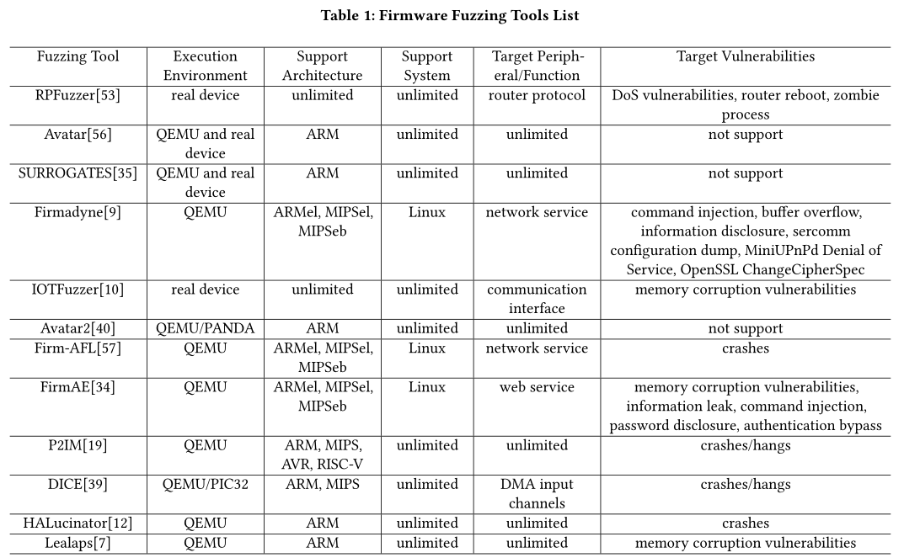

总结了物联网固件模糊化方法的典型类型，分析了这些工作的贡献，总结了现有模糊化方法存在的不足。 设计了几个研究问题，从研究问题中提取关键词，然后使用关键词搜索相关文献。

将现有的固件模糊化工作分为基于realdevice的模糊化和基于仿真的模糊化，基于模拟的模糊化是未来的主流；现有模糊化方法针对的主要漏洞类型是内存崩溃漏洞

研究问题：

RQ1：固件模糊化的执行环境是什么

RQ2：固件模糊化可以检测到哪些主要类型的漏洞

RQ3：固件模糊和一般软件模糊有什么区别？ 

## 结论

### 基于仿真的模糊化是未来的主流 RQ1

物联网设备的类型和形式正在迅速增长。例如，物联网设备的CPU架构包括ARM、MIPS、X86等；芯片外外围设备包括无线、蓝牙、ZigBee、陀螺仪、温度计等。CPU架构类型和外围设备类型的快速增长给物联网设备的仿真带来了很大困难。因此，早期的固件模糊化是在真实设备上进行的。

RPFuzzer[53]通过向真实路由器设备发送正常数据包来检测路由器协议中的漏洞，同时监控路由器的CPU利用率并检查系统日志以检测DoS漏洞和路由器重新启动。

IOTFuzzer[10]通过分析移动应用程序与物联网固件之间的交互，获得物联网固件通信协议中的信息，并基于此信息生成测试用例。此过程不需要获取物联网设备的固件。

基于真实设备的模糊测试无法获得特定的运行时信息（覆盖率等），测试需要获得大量的实际设备。基于仿真的模糊化可以解决上述问题，成为当前的研究主流。目前主流的虚拟平台包括QEMU和Simics。

Avatar[56]通过在模拟器中执行代码并在真实设备中执行I/O操作，解决了模拟器无法模拟外围设备的问题。SURROGATES[35]基于Avatar，提高了模拟器和硬件之间的通信能力。Avatar2[40]具有更强大的编排功能，允许不同的分析框架、调试工具、模拟器和真实设备相互交互。FIRMADYNE[9]基于QEMU的全系统仿真和插桩后内核，以实现在模拟器中fuzzing基于Linux固件的网络连接现成商用设备。FIRM-AFL[57]基于FIRMADYNE，将QEMU的全系统仿真和用户模式仿真协调起来，提高模拟器性能。FirmAE[34]允许FIRMADYNE模拟更多固件。Laelaps[7]使用concolic执行，通过约束求解生成合格的外围输入，以弥补模拟器无法模拟外围设备，并且不需要任何固件知识。P2IM[19]和DICE[39]对外围设备进行建模，以生成外围设备输入，保持固件平稳运行。 HALucinator[12]通过替换硬件抽象层（hardware Abstraction  Layers，HAL）代码将硬件与固件解耦，然后模拟器可以无障碍模拟外围设备。

### 内存损坏漏洞是主要检测目标 RQ2

基于真实设备的模糊化只能获得有限的信息，因此无法判断漏洞的确切类型和具体位置。

RPFuzzer[53]**监控CPU利用率**以检测DoS漏洞，向路由器发送正常消息，并**分析系统日志**以检测系统崩溃、重启和僵尸进程。

IOTFuzzer[10]旨在发现物联网设备中的**内存损坏漏洞**，并通过发送心跳消息推断设备的有效性。

Avatar[56]、SURROGATES[35]和Avatar2[40]作为编配框架的目的是使不同的工具能够相互交互，并且它没有检测漏洞的能力。FIRMADYNE[9]和FirmAE[34]实现了注册为回调的自动动态分析传递，以检测包括信息泄漏、缓冲区溢出和命令注入等漏洞。**FIRM-AFL**[57]、**Halucinator**[12]、**P2IM**[19]和**DICE**[39]使用AFL[27]作为模糊器，并**根据崩溃情况**确定是否存在内存损坏漏洞。Laelaps[7]基于Muench等人[41]的工作，并使用PANDA[36]插件检测六种类型的内存崩溃漏洞。 

通过比较发现基于真实设备的模糊可以获得的运行时信息有限，因此很难找到漏洞的确切类型和位置。基于仿真的模糊化可以获得更详细的固件运行时信息。现阶段工作重点仍然是弥补模拟硬件中缺少模拟器的问题，有些甚至不关注检测漏洞，而是使用覆盖率来表示生成外围设备输入的能力。

### 固件模糊化比一般软件模糊化面临更多困难 RQ3

第一，在固件测试中，**固件的获取**存储在嵌入式设备中，并与设备一起销售。固件升级可以完全自动化，无需从网站进行额外下载。用户没有足够的工具和能力从设备中提取固件。 IOTFuzzer[10]提出了一种在不获取设备固件的情况下直接与设备交互的方法，解决了物联网设备与移动应用程序交互时的通信加密问题。 

其次，**固件的执行环境**很难构建。通用软件模糊化在运行时通过在编译时插桩或运行时通过IntelPT等硬件协助获得特定信息[32]。基于真实设备的模糊化可以以足够高的速度运行，但无法获得足够的运行时信息。Arm  Cortex-M微控制器中有一个调试组件ETM[3]，其功能类似于IntelPT，可用于跟踪固件的执行路径，但此功能需要特定的物理接口和调试工具J-trace[47]。基于仿真的模糊化可以获得足够的运行时信息，但不能达到一般软件模糊化的速度。FIRM-AFL[57]结合了全系统仿真和用户模式仿真，以提高仿真性能，但仍无法与实际执行相媲美。

第三，**固件二进制文件**比一般软件更复杂。由于物联网设备的底层硬件架构更丰富，固件二进制指令集比通用软件更复杂。固件需要考虑与底层硬件交互，一般软件不需要考虑。这对静态分析、符号执行等技术造成很大障碍，因为符号执行需要适应特定指令集和内存架构。

第四，**固件输入**比一般软件更复杂。固件的外围输入可分为两类。一种是来自**感知层**的外围输入，如麦克风、摄像头、重力传感器、温度传感器、陀螺仪等。这种外围输入主要基于图像、声音和数值，最后以数字形式写入内存。构建这种输入需要一些特定外围设备的领域知识，例如视频编码和解码，但通用软件的模糊化不需要考虑这些，只提供视频和图片等信息作为软件的测试用例。另一种是来自**传输层**的通信外围输入，如无线、蓝牙、ZigBee等，这些外围输入主要以数据包的形式，需要以字符串的形式写入内存，但这类输入通常包含状态，输入的结构，需要对通信协议和设备使用环境进行建模，这种输入类似于协议模糊测试。固件中的另一个重要输入是**中断**。这种输入在一般软件中相对罕见。为了确定其输入时间和输入值，有必要对代码和使用环境进行深入分析。Laelaps[7]、P2IM[19]和DICE[39]都在模糊化中添加了对中断的支持。 