现有的Kernal Fuzzing主要策略是利用系统调用的类型和依赖关系。但系统调用参数通常是嵌套的，并且彼此依赖，因此若不对系统调用类型进行识别就难以生成有意义的测试用例。

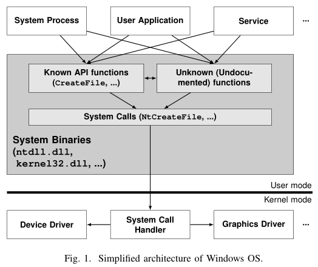

在上层运行着系统进程，用户应用，系统服务，它们使用windows提供的一些API（文档化的/未文档化的），通过系统自带的dll中封装的系统调用执行kernel提供的服务

在windows中大部分的API是没有文档化的，只有一部分的API使用可以在[文档](https://docs.microsoft.com/en-us/windows/win32/api/)中找到，这些API在windows自带的dll中(`aka system binaries`)可以找到实现，这些dll中封装了大部分对系统调用的使用，目前windows大概有1600多个系统调用。

本研究通过静态分析这些`system binaries`，来推断系统调用所使用的参数，目前选取的这些dll中，包含了大概80%的系统调用

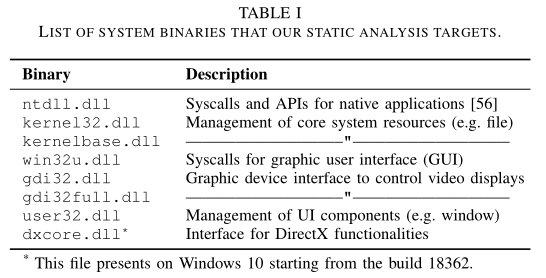

# MOTIVATION EXAMPLE

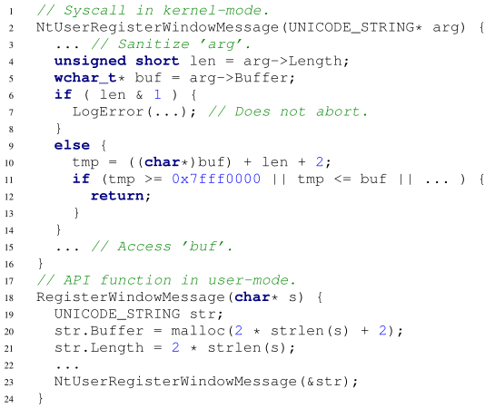

对于上述代码，NtUserRegisterWindowMessage使用一个类型为UNICODE_STRING的指针变量作为参数，该函数在11行对输入参数进行安全性检验，保证访问正确的内存区域。但在第6行，函数会在输入长度为奇数的时候就直接跳过11行的安全检查，达到绕过的效果，攻击者通过精心构造的输入可以提权并访问内核空间的内存。

```
kd> dt UNICODE_STRING
urlmon!UNICODE_STRING
   +0x000 Length           : Uint2B
   +0x002 MaximumLength    : Uint2B
   +0x004 Buffer           : Ptr32 Wchar
```

提出的问题：

1. 对于fuzzer来说，在没有感知NtUserRegisterWindowMessage类型情况下，很难触发这样一个bug。因为盲目生成一个值不太可能为指向一个UNICODE_STRING结构的指针，并且要求Length为奇数，Buffer为无效区域。

2. 我们可以从documented的API参数来推断其如何初始化生成为undocumented函数的参数，对于这个例子可以观察RegisterWindowMessage如何使用char*类型的参数来初始化UNICODE_STRING结构。

3. API层面的fuzzing可能不会触发特别严重的bug。比如在如上代码中的22行，总是将Length设为一个偶数值，使得第6行的判断永远为假，只对API进行fuzz将永远无法触发此bug。因此直接对syscall进行fuzz是很重要的。

# NTFUZZ整体架构：

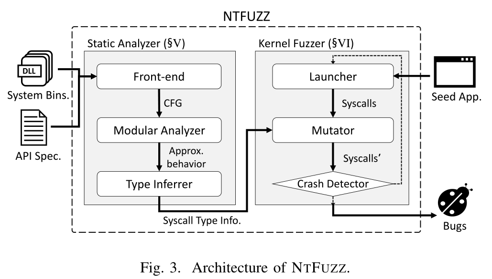

主要分为两部分：

- **静态分析器**：输入system binary和APIsec，输出syscall类型信息
  - **Front-end**：将system binary转换为中间层表示，构建控制流图(CFG)。解析给定的API规则（归档API函数的类型信息）成适合分析的格式；
  - **Modular Analyzer**：遍历过程间CFG，观察system binary何如构造syscall参数，特别关注API参数如何流入syscall参数；
  -  **Type Inferrer**：基于以上的行为分析决定每个syscall的参数类型。为提高准确度，从syscall的多个调用点获取信息并聚合，来决定最终的参数类型。
- **内核Fuzzer**：重复运行种子程序，基于类型信息聚合来对调用到的syscall的参数进行编译
  - **Launcher**：为syscall hook做准备，并运行种子程序；
  - **Mutator**：在执行应用程序时，基于静态分析的结果对syscall参数进行变异；
  - **Crash Detector**：检测内核是否出现crash（蓝屏），若出现crash，检索相关的内存堆栈信息，否则啥都不干。

## Modular Analyzer

将目标程序分割成数个模块，之后再汇总各个部分的分析结果。

NTFUZZ将一个程序分为若干个函数，分析器调查每个函数的语义并构造摘要对函数行为进行描述。当已有摘要的函数在后面被其他函数调用，我们会将其关联到这个摘要而不是重新分析。

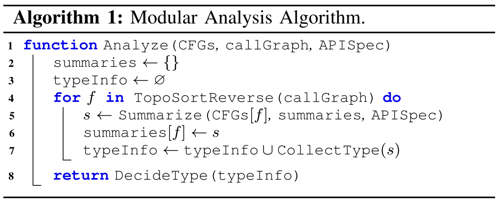

把控制流图CFGs，callGraph函数调用图和API文档解析结果作为输入，对函数调用图进行拓扑排序，从叶节点开始对其进行逆向检索，调用图中的每个函数都用抽象表达框架进行了摘要处理。

函数的摘要主要记录：

1. 函数f主要以什么参数调用了哪些syscall
2. 运行函数f，堆栈内存发生了哪些变化

从叶节点逆序遍历函数调用图，看成是一个自底向上的过程，可以重用已经总结好的摘要信息。DecideType使用循环中每个函数积累的信息返回最终的syscall类型。

优点与不足：

这种模块化分析的结果大大提高了分析的效率（相对于直接分析整个二进制文件），同时也是过程间相关、上下文相关的；但是由于模块化分析要求被调用者在调用者之前被分析，无法处理间接调用和递归调用。文中直接向递归调用和未分析的间接调用直接忽略为nop，但分析结果仍有一定的准确度。

### 运行样例

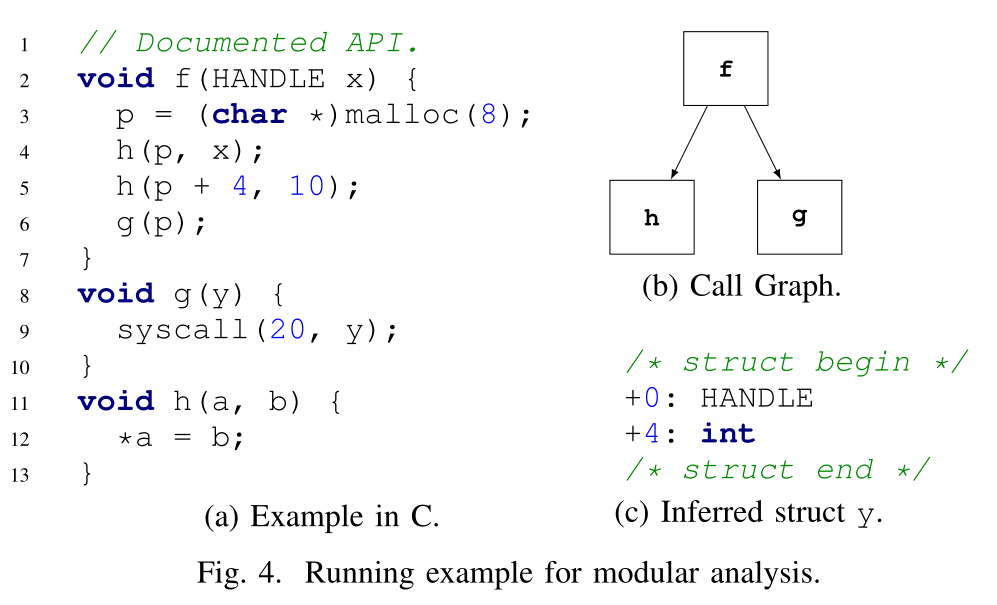

f为唯一已知的documented API；为简化操作，将malloc和syscall视为内存分配和系统调用的内置原始函数。以C语言为例，但实际上在二进制文件上进行分析，所以g和h的参数和变量都是未知的。主要目的就是找到第9行syscall的参数类型：

1. 有两种可能的遍历序列：`h->g->f`和`g->h->f`，假设使用前者；
2. 首先分析h，`*a = b`，表示a为一个指针，指向b的地址空间；
3. 然后分析g，可以得到系统调用的第一个参数是一个整数，第二个参数对应g的参数
4. 最后分析f，通过重用h和g的摘要
   - 从API文档中获取f的参数类型HANDLE
   - 实例化利用h的摘要副作用，通过两个h后，观察第3行生成的堆对象如何被写入
   - p作为第二个参数传入syscall，表示一个结构体（HANDLE, INT）
   - 最后推断出y的类型为上图c所示

现存一些挑战：

- 二进制分析时要跟踪跨函数的数据流，例如在示例中，应该知道f到g的数据流，同时需要理解g中的参数来自于第三行的p
- 需要跟踪内存状态，分析器应该知道如何分配p，并且在函数h中设置p的具体内容

## STATIC ANALYZER

### Front-End

本文使用B2R2实现转换

`“B2R2: Building an efficient front-end for binary analysis,”`：将二进制代码装换成中间表示层IR，这种IR仅使用一些基本操作就可以描述二进制代码语义，具体语法如下，忽略了很多表达式（一元表达式和除call之外的分支语句），然后根据jump等语句建立函数的CFG，最后再根据call语句建立CG。

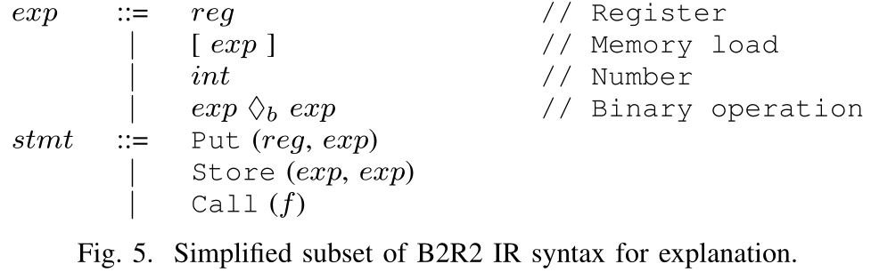

为了减少CG的大小，先找到执行sysenter的函数作为syscall的存根函数，然后从这些函数逆向遍历CG直到找到文档化的API函数，将所有遍历到的函数（包括根函数）标记为$S_1$。然后从$S_1$出发，收集所有能够遍历到的集合，记为$S_2$，这样可以捕获到所有$S_1$中出现的副作用。最后只使用$S_1$和$S_2$中的函数对CG进行精简。

从SDK头文件中获取API文档，对里面的函数声明进行解析获取参数类型信息，同时也对其中的注释(SAL)进行解析，因为这通常会标识数组类型参数的大小。

### Modular Analyzer

#### 抽象域

抽象域规则定义如下，Z表示整数域；symbol为在函数的每个参数处引入的新符号；V为三元组集合，包括值I、位置L、类型约束T。

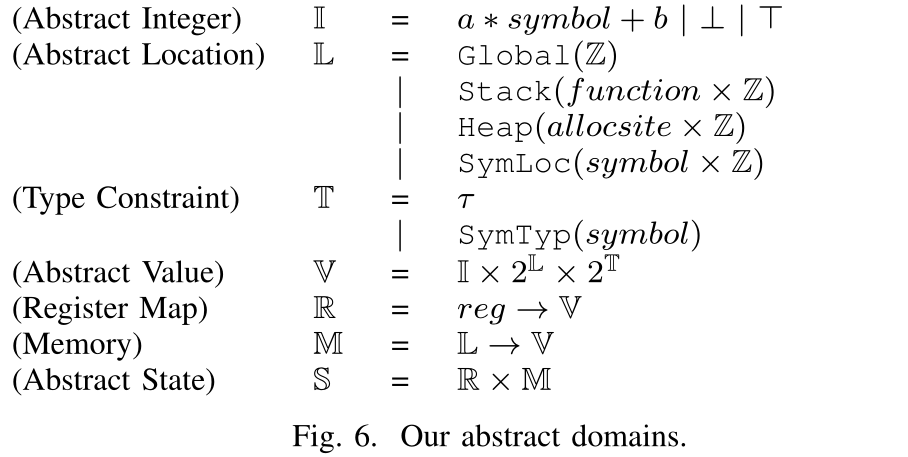

**整数抽象**：寄存器或者内存，使用带有symbol线性表达式表示，可以是具体的，也可以是符号化的

**位置抽象**：表示一个值可能的位置

- Global(a)：表示位于a地址的一个全局变量
- Stack(f,o)：表示位于f函数栈帧上，且偏移为o的局部变量
- Heap(a,o)：表示位于a堆对象上，且偏移为o的内存单元
- SymLoc(s,o)：表示位于一个符号化指针s，且偏移为o的位置

在抽象领域中嵌入类型约束，可以是具体的类型，也可以是符号类型

> 假设一个函数只有一个参数（整数或者指针），先假设为整数，其符号化为$1*α_1+0$，同时符号化位置为$SymLoc(α_2,0)$，由于不知道类型约束，创建一个符号化类型约束$SymTyp(α_3)$，最后为该变量生成抽象值V为$<α_1,SymLoc(α_2,0),SymTyp(α_3)>$，在函数分析完成之后，通过这些符号来获取该函数参数化摘要。

#### 语义抽象

使用B2R2的IR中的语义定义抽象语义，并在NTFUZZ中实现了完整的语法


定义$U:exp→S→V$，表示表达式exp使得通过抽象状态S来返回抽象值V，对于抽象状态S，S[0]返回抽象状态中的寄存器映射

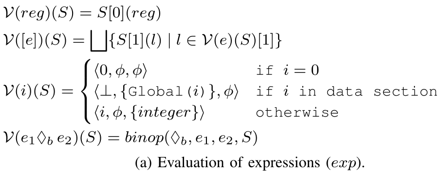

定义$F:stmt→S→S$表示语句stmt计算给定抽象状态S转换到了新抽象状态S（函数客制化语义）

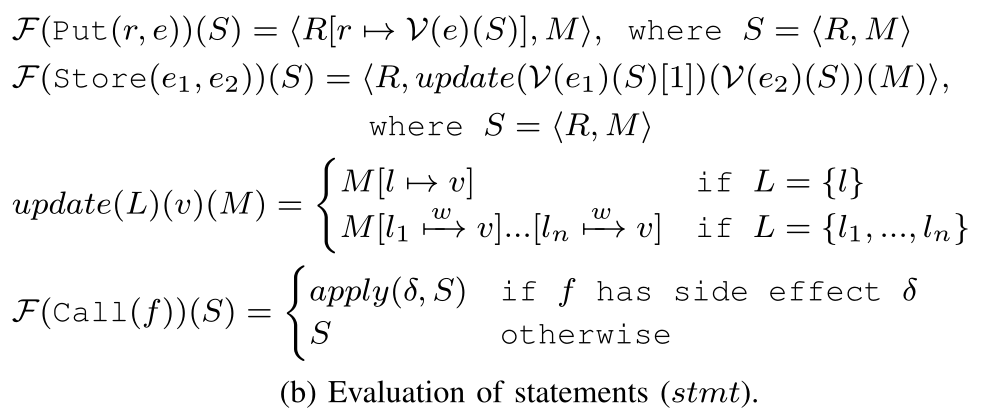


### Type Inferrer

#### 结构体推断

如果一个syscall参数不是指针，可以通过图六定义的抽象域轻松推断出具体类型，但如果参数为指针的时候必须检测内存状态才能推断出指针类型，以图4为例


对于第9行，参数y的表达式抽象值为$<⊥,{Heap(Line 3,0)}, ∅>$，因此我们要继续分析搜索相关的内存单元。p在第3行处分配，所以对所有$Heap(Line 3,∗)$形式的内存单元进行搜索（其中*表示任意偏移），可以得到$Heap(Line 3,0)$和$Heap(Line 3,4)$对这块内存进行修改，最后结合抽象值可以确认该结构体类型。

如果内存分配在栈上，那么分析会更加复杂

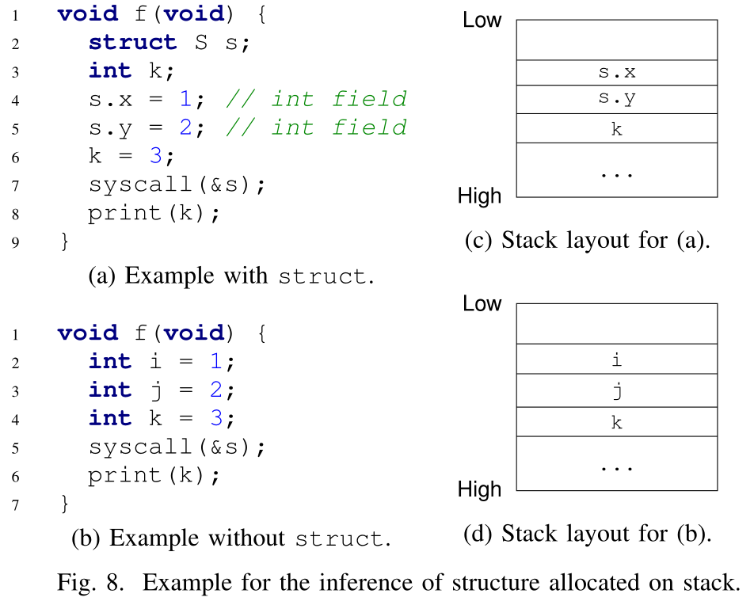

函数f在栈上分配了结构体s，在二进制层面，初始化结构体的s.x和s.y与初始化两个普通变量不会有任何区别，因此如果一个系统调用的参数是一个指向栈的指针的话，我们并没有办法去区分是一个结构体还是一个普通的变量。如果认为是一个结构体的话，那么必须识别结构体的边界。

通过观察函数的内存访问模式来启发式地解决这个问题。

- 当定义了相邻的堆栈变量但从未使用时，我们将其视为传递给syscall的结构体。

- 如果没有任何定义就使用了这样的变量，我们将其视为由syscall初始化的结构体变量。

在a中，要推断行7中的参数类型，为了得到结构体s的边界，先检查他的下一个位置也就是`s.y`，`s.y`在行5中定义但函数中从未使用，于是将其判定为结构体s的一部分；相反对于`k`，在行8中使用到，那么就不一定属于结构体s。这里是否在函数中使用的判定使用到了可达性分析和活跃变量分析（涉及编译原理的知识）。

#### 数组推断

主要有两种方法：

- 已归档的API中已知的数组可能会流入syscall中，数组大小通常由一个变量进行声明，这意味着数组大小会作为单独的参数传递给某一函数。如图9中，结构体Data的声明中存在SAL注释`_File_size_(n)`，表示数组buf大小由n指定。当结构体Data通过已归档的API流入函数f时，我们就可以知道syscall_1的第一个参数是int数组的指针，第二个参数是数组的大小。
- 通过内存分配来直接推断数组类型，在函数g中行8，可以直接获取p指向堆空间的大小，因此可以第一个参数为一个数组指针，数组大小由第二个参数提供。

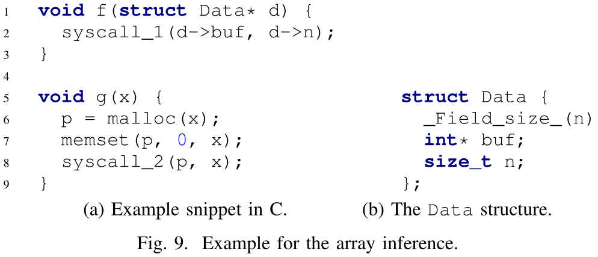

#### 冲突处理

由于相同的syscall会从多个不同的调用语句进行调用。将不同调用语句获得的参数类型信息聚合起来，选择绝大多数的结果作为syscall最终的类型。

## KERNEL FUZZER

### Launcher

通过拦截种子应用程序的syscall请求来实现Fuzzer，在执行程序的过程中对syscall参数进行变异，这种也称为基于HOOK的fuzzing。文中直接修改SSDT表来实现syscall hook，但在x86-64系统中并不支持这种HOOK机制，必须使用Debugging相关的API才能对syscall进行HOOK，所以目前NTFUZZ仅支持x86下的Windows系统。

### Mutator

变异器要满足以下两个要求：

- 变异器需要从静态分析器中获取到类型感知的结果信息
- 变异过程中不应该被syscall的错误处理程序卡住

#### 类型感知变异

- Integer types(int, long, ...)：使用和AFL的变异策略，bit翻转、算数变异等；
- String types (char*, ...)：随机字符替换、字符串扩充、随机截取字符串；
- Handle type (HANDLE)：无变异，Handle类型变异容易导致错误处理；
- Struct types：对结构体中的每个成员采取对应的变异策略；
- Array types：若知道目标数组的大小，对数组中每个成员进行对应类型的变异，否则只变异第一个成员；
- Pointer types：对指针指向的类型进行对应变异，也对指针变量的数值做整数变异。

由于变异可能会降低出发bug的概率，文中通过一个判定机制来决定是否对参数进行变异。

#### 懒变异

由于内核可能返回一种让应用程序中止的错误，导致在程序中执行较早的syscall会有更多的机会发生突变，这会导致变异概率的不公平性，错误处理例程会影响基于hook的模糊处理。

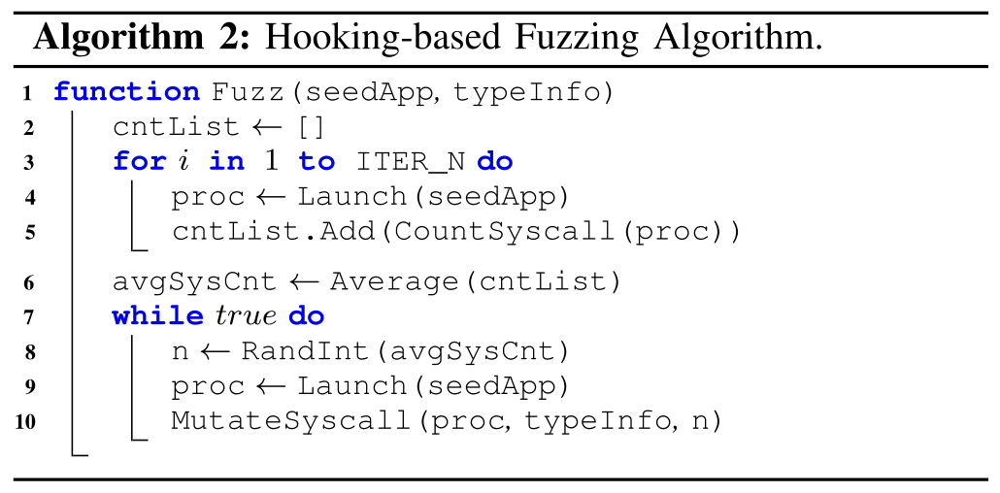

懒变异主要思想是，将变异策略关掉直到达到某一随机点，具体算法如上图所示：

- 首先当没变异的时候估计种子程序中syscall的数量
- 计算数量平均值avgSysCnt
- 从(0, avgSysCnt)随机生成n
- 直到种子程序执行n个syscall之后开始对输入进行变异

### Crash Detector

内核态错误会直接导致蓝屏重启，配置虚拟机当系统崩溃时dump内存信息，在系统重启后发送到真是主机，同时fuzzer可以在内存中存储变异的payload，这样就可以对crash进行分析和复现。

# EVALUATION

评估主要围绕四个问题：

- RQ1：静态分析的准确率和规模化程度如何
- RQ2：变异率如何影响Fuzz效率
- RQ3：类型感知的fuzz是否真的有效
- RQ4：NTFuzz能否在最新版的Windows上找出未知漏洞，和其他的fuzz工具相比如何

实验环境：

- RQ1：Intel i7-6700 3.4GHz CPU and 64GB of memory
- RQ2-RQ4：two cores of Intel Xeon E5-2699 2.2GHz CPU and 4GB of memory to each VM running under VirtualBox- 6.1.0

WIndows版本：

- RQ2：Windows 10 17134.1 build, released in April 2018
- RQ4：Windows 10 18362.592 released in January 2020

种子程序：

- AdapterWatch 1.05
- Chess Titans
- DxDiag
- PowerPoint 2019 10361.20002
- SpaceSniffer 1.3.0.2
- SumatraPDF 3.2
- Unity Sample
- WordPad

## 静态分析表现

### 准确率

从API 文档中收集已知的结构信息：64个系统调用，326个参数作为ground truth，实验证明静态类型推断的准确率达到了69%。错误来源主要为：空指针以及栈上的结构体

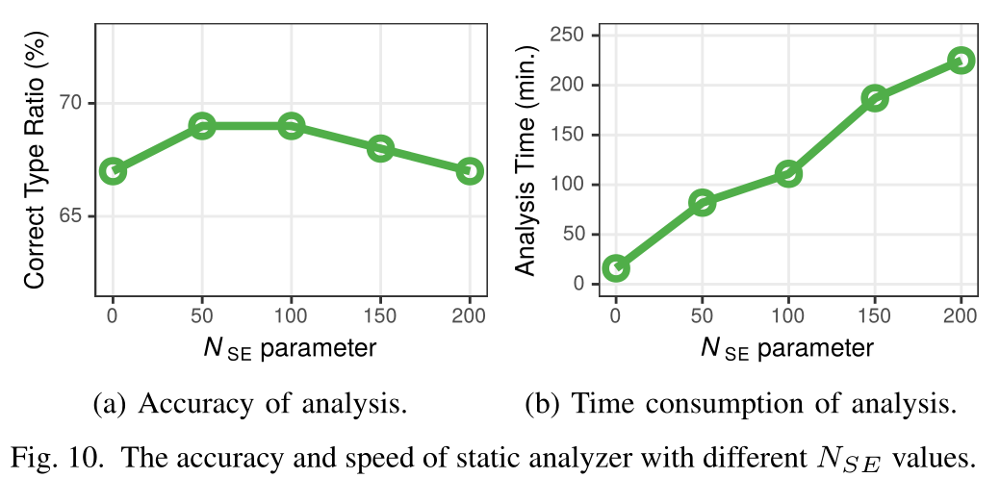

### 规模化程度

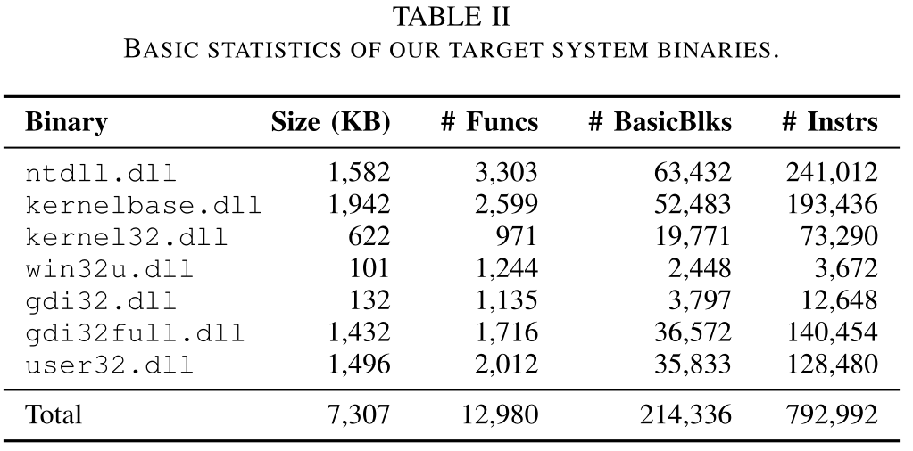

## 变异率影响

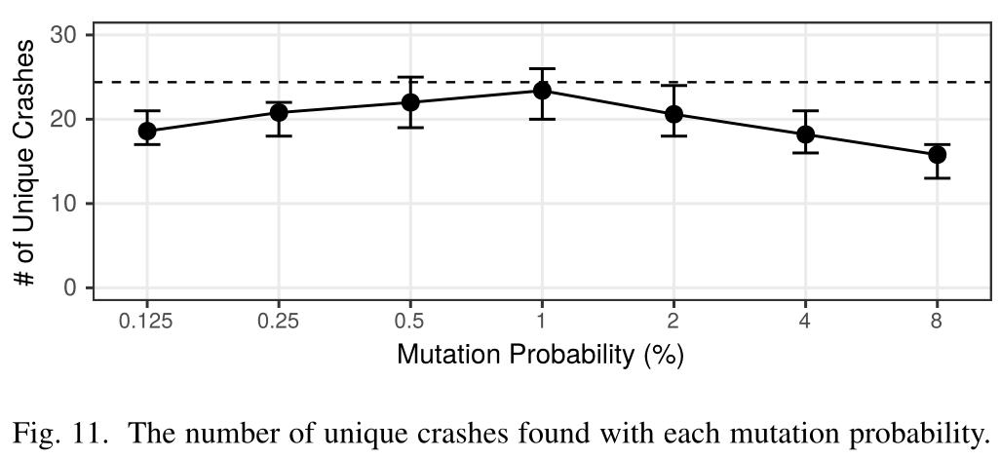

## 类型推断对FUZZING的影响

Type-unaware：禁用静态分析部分的类型感知变异，仅采用对整数的变异策略

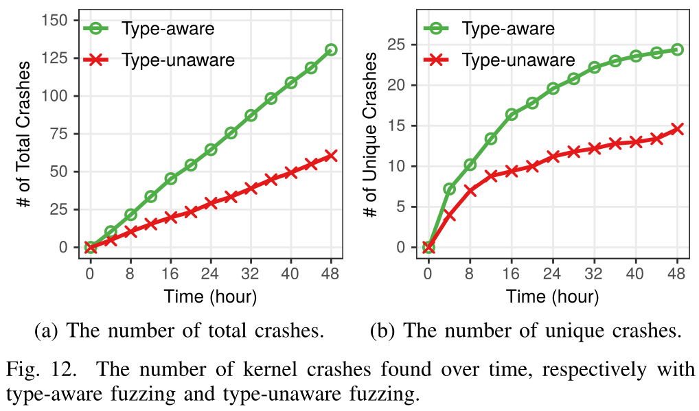

## 真实漏洞发现

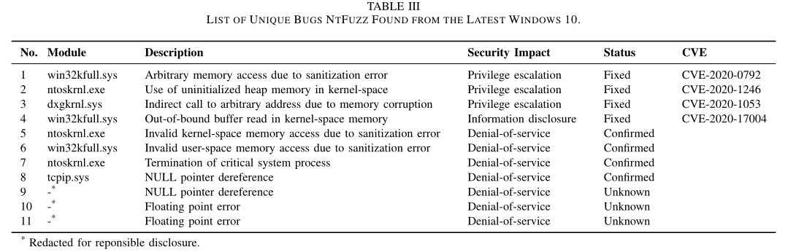

## fuzzer对比

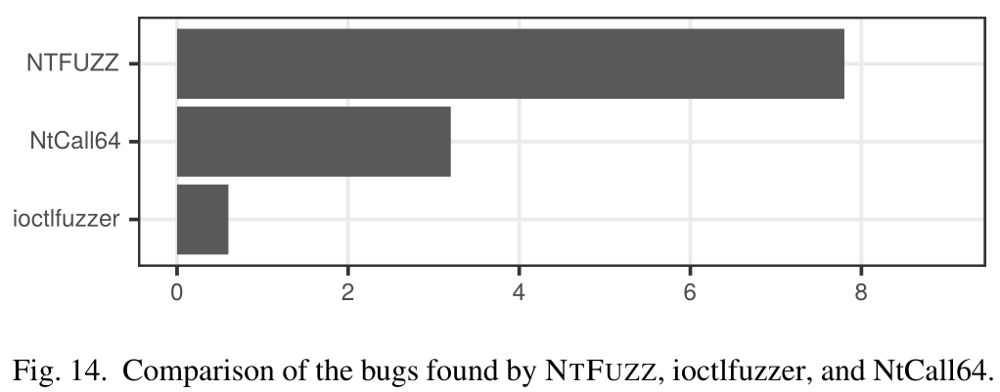