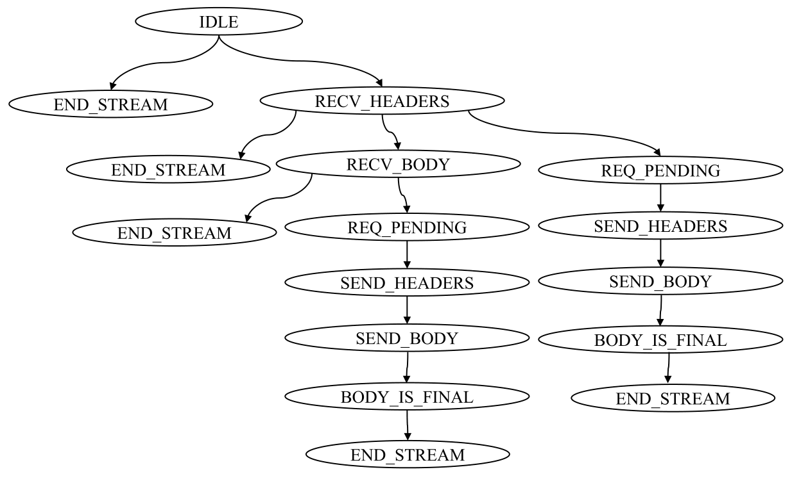

# Abstract

如果一个bug只能在特定的状态下暴露，那么模糊器需要提供一个特定的事件序列作为输入，以便在bug出现之前将协议带入该状态。我们称这些bug为“有状态”bug。如果不了解协议，模糊器就很难发现这种有状态的bug。因此，一个关键挑战是在没有明确协议规范的情况下覆盖状态空间。因此，在协议实现中查找有状态bug需要部分地发现协议的状态空间。模糊状态软件系统需要结合状态识别策略。这种状态识别可以根据手动指导或自动分析进行。 

在这项工作中假设有状态协议模糊化，可以避免对状态标识进行手动注释。建议自动识别这些状态变量，并在模糊化过程中跟踪分配给它们的值序列，以生成探索状态空间的“映射”。

实验证实，我们的有状态模糊器发现有状态bug的速度是我们扩展的基线灰盒模糊器的两倍。从初始状态开始，我们的模糊器执行一个数量级的状态转换序列，覆盖代码的速度比基线模糊器快两倍。我们的模糊器发现了一些重要协议实现中的零日缺陷，并分配了8个CVE。

# Introduction


H2O实现要求，HEADER帧要先于DATA帧到达，并在HEADER帧到达时，将状态变量设为特定的值，当收到DATA帧时，这个状态变量被检查。若处理DATA帧的代码存在bug，需要一系列特定的输入来触发，称为有`Stateful bug`（状态bug）。假如一个输入先发送DATA帧然后再传HEADER帧，显然DATA帧无法得到处理。

有状态灰盒Fuzzer的`主要目标`应该是绘制并有效地探索未知状态空间，以发现有状态bug。 其从状态反馈得到的状态空间构造一个轻量的抽象（本例子的状态反馈为状态变量值的序列），然后用这个抽象最大化访问为观测到状态的概率。

`识别状态空间`，本文认为协议通常使用状态变量显式编码，这些状态变量被赋值并与命名常量进行比较。用if或switch等语句实现程序状态逻辑。在状态变量被赋予新值时插桩`call runtime`，`runtime`用来构建`状态转移树STT`。STT在输入测试用例时记录状态变量被赋予的值，STT以全局数据结构实现，可以与Fuzzer共享。图1就是H2O构建的STT。STT在`in-memory fuzzer`中可以用于那个生成的测试用例转向状态空间测试不足的部分（引导测试）。

`Stateful greybox fuzzing`策略：

1. 将可以触碰STT中新节点的种子加入语料库。仅代码覆盖率不足以捕获不同请求间的顺序。相反，我们应该捕获代码所涵盖的状态。添加发现STT新节点的种子有助于更好的覆盖空间。
2. 关注那些能触碰到STT很少访问的节点的种子，或其后代更有可能可以STT走不同的路径的种子。 
3. 关注种子中的一些关键字节，其变异会触发STT中的STT新节点。

`Results`，在libfuzzer中实现有状态灰盒fuzzing，称为SGFuzz。

Contribution：

- 提出了一种自动方法来识别和捕获协议实现的探索状态空间
- 介绍了SGFUZZ的设计和实现，它是一个有状态的灰盒模糊器，在广泛使用和良好模糊化的程序中发现了12个新的bug
- 根据最先进的和基线状态灰箱模糊器对SGFUZZ进行了全面评估。
- 公开所有数据、脚本和工具，以促进再现性。 

# MOTIVATION

本文主要使用HTTP2和H2O（HTTP2的实现）来做讲解。


## The HTTP2 Protocol

HTTP2会将每个HTTP请求拆分为header、body等对应的帧，帧是HTTP2中最小单元。同一个请求的帧构成一个stream，在服务器端必须按序处理。HTTP2定义了流状态机，调整帧的处理顺序，处理不同的帧时，访问不同的状态。如接收HEADER帧时对应状态`receiving header`；接收DATA帧时对应状态`receiving body`。

图2为`RFC 7540`中定义的HTTP2流状态机。在初始`idle state`时，当前或远程参与者可以发送/接收`push promise`帧（PP）或`header`帧（H）。`push promise`帧只是将流标记为`reserved`，而`header`帧将流标记成`open`。在`open`状态下，处理所有帧，包括数据帧。`end stream`（ES）帧将开放流标记为半关闭，`half-closed`流标记为`closed`。在任何状态下，如果发送/接收到`reset`（R）帧，则流标记为close.

## H2O 实现

支持HTTP , HTTP2和HTTP3，本文主要聚焦HTTP2。

H2O使用专用变量存储当前协议状态（State Variables），这里为enum变量，8个流状态被定义如下：

- **State (0).** H2O_HTTP2_STREAM_STATE_IDLE
- **State (1).** H2O_HTTP2_STREAM_STATE_RECV_HEADERS
- **State (2).** H2O_HTTP2_STREAM_STATE_RECV_BODY
- **State (3).** H2O_HTTP2_STREAM_STATE_REQ_PENDING
- **State (4).** H2O_HTTP2_STREAM_STATE_SEND_HEADERS
- **State (5).** H2O_HTTP2_STREAM_STATE_SEND_BODY
- **State (6).** H2O_HTTP2_STREAM_STATE_SEND_BODY_IS_FINAL
- **State (7).** H2O_HTTP2_STREAM_STATE_END_STREAM

本文也用这种命名常量的方法来定义状态。

## Challenges

### 响应码不统一


### 覆盖率不充分 

图3所示，函数`handlerequest_body_chunk`④处理③数据帧时，仅当`stream->state`的当前值为`..RECV_BODY`时才执行。仅当使用有效的头帧1预先调用`handle_headers_frame`程序时①，`stream->state`设置为`..RECV_BODY` ②。代码覆盖率不能捕获到这种要求的顺序，先发DATA后发HEADER，可以覆盖①③两个处理函数，但很难触发④；相反先发HEADER后发DATA，可以触发④。

# Methodology

主要目标是在不了解协议的情况下捕获协议状态空间。现有观察结论是，协议状态一般由所谓的状态变量显式表示。

## Offline State Variable Identification

实现第一步就是自动识别源码中的状态变量。如何追踪一个协议实现中的当前状态？

调研50个开源协议实现，全部都指定给特殊状态变量的命名常量来跟踪当前状态。 其中44个用enum枚举，6个用#define来表示状态常量。本工作不需要人工写提取代码，实现全自动识别状态变量。比如，协议在实现过程中与参考文档保持直接映射关系。状态转移在实现中是将另一个命名常量赋予状态变量，基于此状态的协议实现可以用switch语句或if语句，而状态变量的值用来相应相应的协议逻辑。

为了识别状态变量，寻找所有的enum类型变量。enum类型的变量只能从指定的命名常量列表中分配。具体来说，用正则表达式自动提取enum类型的所有定义，然后使用这些定义返回至少分配一次的所有枚举变量的列表。 

如表1所示，并不是所有枚举类型的变量都需要是状态变量。第二类是表示所有可能的`响应或错误代码`的枚举类型，这种被AFLNET间接用于状态识别。第三类表示`配置变量`的所有可能配置选项，这类变量只在服务器启动时或会话开始时分配一次。


## State Transition Tree Data Structure



为了捕获由输入序列的协议状态转换，监视状态变量值的序列。 所有线程中所有状态变量的所有观察值序列都存储在同一状态转换树中，这是一种数据结构，表示模糊器已探索的整个状态空间。

> State Transition Tree （STT）
>
> 状态转换树中的节点表示程序执行期间状态变量的值。每个节点只有一个父节点和零个或多个子节点。若只有一个状态变量，则特定节点的父节点和子节点分别表示该节点创建前后的状态变量值。若有多个状态变量，节点的父节点或子节点可以表示不同状态变量的值。节点到其子节点的每条边表示任何状态变量的值更改，表示状态转换。全局角度来看，树只有一个表示初始状态的根节点，从根节点到叶节点的每条路径都表示执行程序期间的唯一状态转换序列。 


合并相同叶节点来构建有向图，简单高效准确复原相比官方文档定义的状态机，且粒度更细。

## State Transition Tree Construction

### 编译时插桩

利用Python脚本，在协议实现中将命名常量分配给状态变量之前，插入一个`runtime`调用。Method 1中用RE来匹配代码中状态变量被赋予新值的所有指令。插入函数将状态变量名和命名常量的值传递给`runtime`。没用LLVM是因为enum值在IR中会被替换成整型。

### runtime STT的生成

在模糊活动期间，在协议实现的所有执行过程中，`runtime`使用插桩调用传递的信息来逐步构造STT。 STT数据结构在runtime组件中实现，其指针指向最后访问的节点（最初是根节点）。每个节点使用变量名和其值进行区分，由插桩指令进行传递。调用runtime后，runtime会检查上次访问的节点的子节点是否已经存在匹配的节点，未找到会创建一个新的子节点，然后其指针会指向已存在的或新创建的子节点。每个测试样例运行结束后都会将指针重置到根节点。

使用互斥锁来保护STT更新时不受并发影响，来支持协议实现中的多线程。提供选项来限制单个测试用例的最大状态重复次数，当某个状态重复次数超过时，其后续将被忽略。这使在Fuzzing过程中用树结构来管理状态转换。

## Handling Implicit States

实现也会存在隐式状态：数据库和文件系统发生更改；一些内存已分配但从未释放 。隐式状态会随着时间累积，并在各种连接重置后继续存在。STT只能跟踪显式状态，为了探索隐式状态空间，我们让隐式状态聚合而不重置。

由于是进程内fuzzing，待测服务器不用重启，性能大大提升，允许在消息交换中聚合隐式状态，启用选项来保存执行程序的所有输入列表。fuzzer报告crash后，逐渐最小化该列表，指导最小列表触发该crash。

# Fuzzing Algorithm

SGFUZZ在运行时递增地构造STT，并按如下方式使用它：

1. 保留能提高STT覆盖率的测试用例
2. 为那些有更大概率能提高STT覆盖率的种子分配更多能量
3. 种子筛选时，优先那些与STT新节点有关的字节，这些新节点有更多概率可以提高STT覆盖率

```
-----------------------------------------------------------------
Algorithm 1 Stateful Greybox Fuzzing
-----------------------------------------------------------------
Input: Seed Corpus T
	Crashing inputs Tx = Ø
	for each t ∈ T do
		Et = 1 // initial energy
	end for
	State transition tree STT = Ø
	repeat
		t = choose_next(T,E)
		t′ = mutate(t,STT)
		STT = execute(t′,STT)
		if t′ crashes then
			return t′
		else if is_interesting(t′,STT) then
			add t′ to T
			t′ = identify_bytes(t′,STT)
			for each ti ∈ T do
				Eti = assign_energy(ti,STT)
			end for
		end if
	until timeout reached or abort-signal
Output: Crashing Input tx
-----------------------------------------------------------------
```


在libfuzzer中实现该算法1，并称为SGFuzz，对LIBFUZZER修改部分用红色指出。

## State Coverage Feedback

**加入interesting的种子，两个指标：状态和覆盖率**

原理是最大化STT覆盖率来最大化状态空间的覆盖率。STT每个新节点都表示当前状态变量序列的新值，表明当前状态转移序列下的新状态。

## Energy Schedule

**将更多的能量分配给有更大潜力产生新状态的种子** 

我们的算法还为执行有效状态转换的种子分配了更多能量，有效状态转换对应于有效协议行为。 

## Fuzzing Individual Bytes

