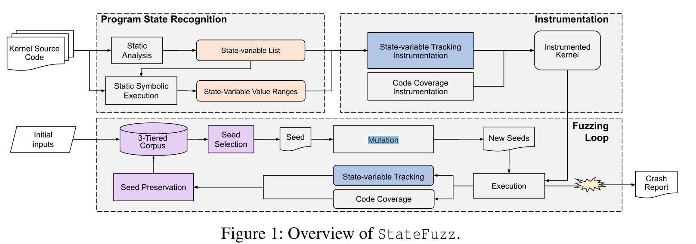
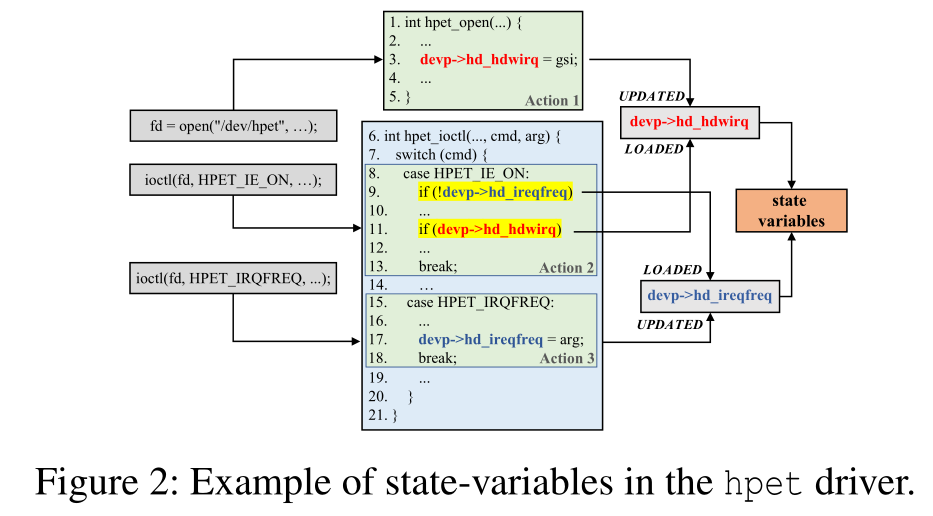

# Abstract

现有的覆盖率引导Fuzzer通常倾向于使用触发新代码的测试用例，而放弃使用触发以往相同代码的测试案例。 然而，这并不是最优的做法，使用相同代码的新测试用例可能比以前的测试用例更好，因为它可能会触发对代码探索和错误，从而发现有用的新程序状态。 

StateFuzz思路：使用静态分析来识别目标程序状态变量的值，然后对目标程序进程插桩，在运行过程中追踪这些值来构建程序状态。最后使用这些状态信息对能触发新状态的测试用例进行排序，并使用了三维反馈机制微调覆盖引导Fuzzer的进化方向。 

实现了StateFuzz的原型，并在Linux上游驱动程序和Android驱动程序上进行了评估。评估结果表明，StateFuzz可以有效地发现新代码和漏洞。它发现了18个未知漏洞和2个已知但未修补的漏洞，与最先进的模糊器Syzkaller相比，代码覆盖率和状态覆盖率分别提高了19%和32%。

# Introduction

Limitations：

以代码覆盖率为核心，在测试过程中对程序其他反馈不敏感。实际上，大量程序（包括设备驱动程序和网络服务等）具有复杂的内部程序状态，如果未达到特定状态，则不会继续执行或崩溃。

一些探索程序状态的Fuzzer：

- IJON：使用不同形式的手动标记状态表示； 
- InsvCov：使用程序的可能不变量作为边界来划分程序状态空间；
- AFLNet：使用服务器的响应代码作为程序状态来驱动网络协议模糊化；
- StateAFL：通过对特定进程内存执行位置敏感的哈希来识别程序状态。 

在开发状态感知模糊解决方案时，需要回答三个问题：

1. what are program states?

   一般来说就是程序上下文，程序变量、内存和寄存器的值。但是由于数量庞大，难以事件中完全追踪这些状态，。必须关注那些对Fuzzing起至关重要的状态子集，以及如何减少状态空间。

2. how to recognize program states and track them during fuzzing?

   列举了以上几种状态Fuzzer定义的状态。

3. how to utilize program states to guide fuzzing?

   IJON用手动注释的状态覆盖来替换AFL的bitmaps；AFLNet追踪状态转换，并结合代码覆盖率，用一个新的种子语料库存储发现新状态的测试用例。

StateFuzz定义的状态变量特征：

1. 长的生存周期
2. 可以被用户更新
3. 可以影响程序的控制流活内存访问指针

这些状态变量的值组合成程序状态，是一种粗粒度的状态。

为了有效地跟踪程序状态，我们减少了程序状态组成中使用的状态变量的数量以及每个状态变量的值空间：

1. 用相关的状态变量对，而不是所有状态变量的组合来建模程序状态；
2. 对于每个状态变量，我们可以识别它可能采用的一组值（或值范围），其中不同的值选择代表不同的状态；
3. 将每个状态变量的值空间划分为几个范围，并跟踪在Fuzzing过程中是否命中这些范围。

设计了三维引导机制：

1. 代码覆盖率
2. 若输入可以名字两个变量的新值范围组合，且这两个变量都在相关的状态变量对中，则认为这个输入是interesting的；
3. 若输入改变了状态变量的上下限，也认为是interesting的。当上一个引导失效时，此引导仍适用，如当无法确定状态变量的值范围时。

Contribution：

- 为状态富裕的程序（如驱动程序）提出了一种新的模糊化解决方案StateFuzz，以通过将程序状态作为反馈来提高模糊化效率；
- 提出用状态变量建模程序状态，并使用静态分析和符号执行自动识别状态；
- 设计一种新的三维反馈机制，帮助模糊器有效地探索程序状态，同时增加代码覆盖率；
- 实现了一个StateFuzz原型，并在实际驱动程序上进行了评估，发现了驱动程序中的18个新漏洞，同时实现了比现有方法更高的代码覆盖率。 


# MOTIVATION

## Example

覆盖率引导的Fuzzer将忽略使用相同代码路径的测试用例，即使它们已经探索了新状态，并且很难发现依赖于新状态的新代码或漏洞。因此，在模糊化过程中探索程序状态并对触发新状态的测试用例进行优先级排序是至关重要的，即使它们可能不会触发新代码。 

## 程序状态

程序状态是由程序维护的特定执行上下文，用于记住之前的事件或用户交互。

文章从包含关键字“state machine”的开源项目中收集了50个代码Commit，这表明程序正在处理某些状态。 结果表明，在50次提交中，有48次提交的状态由布尔/整数或枚举类型的变量表示；对于其他两个提交，一个使用函数指针表示状态，另一个使用包中的状态代码表示状态。 因此可以利用包含关键信息的变量来表示程序状态。 


# StateFuzz Design Detail


## 状态建模

### 状态变量

如之前所述

### 程序状态

程序状态理想情况应该由所有状态变量组成，但由于性能限制，需要对数量进行优化：

1. 只用程序状态中相关的状态变量对，类似与AFL里的edge（两个基本块对），并用实验来证实这种猜想。若控制流或内存访问指针（直接或间接）受到这两个变量的影响，我们将两个状态变量标记为**相关**。 如两个变量分别被两个条件语句检查，且这两个条件声明是嵌套的，则认为这两个变量是相关的。
2. 状态空间的值空间很大，但只接收大小有限的值，提出将变量值空间划分为几个范围，并Fuzzing过程中追踪是否命中每个值范围

## Overview



分为三部分：program state recognition、program instrumentation、the fuzzing loop.

### Program state recognition

首先分析Linux驱动程序的源代码，通过提取状态变量、状态变量的值选择以及状态变量之间的相关性来识别程序状态。

具体就是，利用静态分析识别由不同输入阶段触发的程序操作，并识别由多个程序操作访问的共享变量。为了使跟踪状态变量切实可行，我们进一步分析了它们的值（或值范围）选择。利用静态符号执行来收集每个状态变量的值约束，并推断其不相交的值范围。 

### program instrumentation

对目标程序（即Linux驱动程序）进行插桩，以跟踪程序状态覆盖率以及代码覆盖率（如KCOV提供的[28]）。具体来说，给定已识别的状态变量，我们首先使用 SVF[44] 执行 alias analysis （别名分析），以识别状态变量的别名。然后在编译期间，StateFuzz检查每条存储指令的目标指针。如果目标指针指向状态变量或状态变量的别名，则该指令将被插桩以跟踪要存储的值。更准确地说，它将跟踪值范围边和极值，以生成程序状态覆盖反馈。 

### Fuzzing Loop

通过将程序状态反馈应用于种子保存和种子选择过程，我们扩展了代码覆盖率引导模糊器的模糊循环。具体来说，我们将保留发现新值范围边缘或状态变量新极值的输入，以及发现新代码的输入。然后，应用一种精细的选择策略，从这些不同类型的保存种子中选择变异输入。

## Program State Recognition

这部分是 StateFuzz 的核心所在，分为三部分：识别程序行为、识别状态变量、推断状态变量值的范围。



### Recognize Program Actions

图2为程序行为例子，代码来自驱动 hpet。首先，许多程序操作在全局操作结构中初始化；其次，驱动程序可以通过ioctl接口的子命令执行程序操作。

基于Linux驱动程序代码的这些约定，我们利用静态分析来识别程序操作。对于包括read、write、open、poll和mmap在内的系统调用，我们分析它们的源代码以定位将函数处理程序分配给全局操作结构的初始值设定项。这些指定的函数处理程序是程序操作的入口点。对于ioctl系统调用，我们扩展了工具DIFUZE[14]，以执行过程间和路径敏感分析，并识别所有支持的子命令。与每个子命令关联的代码段是一个程序操作。 

### Recognize State-variables

不同的程序操作有时必须通过状态变量来协调程序状态。因此，状态变量通常由多个程序操作共享。

为了识别状态变量，基于CG来分析每个程序动作的代码，并识别其访问的变量。如果变量可以回溯到全局变量或结构字段，那么我们将把它们标记为候选状态变量，因为状态变量应有长的生命周期。分析完所有程序操作后，过滤所有候选状态变量，只保留那些能被程序操作更新并由另一个程序操作加载的候选状态变量（丢弃那些没有被程序操作读或写的变量）。如图2中的`devp->hd_ireqfreq` 和 `devp->hd_hdwirq` 会被hi识别为状态变量。

### Infer State-variables' Value Ranges

在源代码的抽象语法树（AST）上执行过程间和路径敏感的静态符号执行来推断每个状态变量的值范围。为了避免路径爆炸，我们的符号执行一次只分析一个源代码文件（即模块内分析），这大大减少了路径的数量。通过类型和名称在AST中定位状态变量 ，然后探索每个程序路径，并在探索过程中识别与状态变量相关的路径约束。如果有一条路径的约束涉及这两个状态变量，我们将确定两个相关的状态变量。通过约束求解器，可以推断状态变量的临界值（将改变路径约束的值）。然后，我们使用这些临界值作为边界来分割状态变量的值空间。 

如状态变量`devp->hd_ireqfreq`和`devp->hd_hdwirq`分别在第9行和第11行中检查为0。`devp->hd_ireqfreq` 会导致两个分支，分别当 `!=0` 和 `==0` 时。可以得到三个边界值 -1, 0, 1。将`devp->hd_ireqfreq`的值空间分为4个：[INT_MIN，-1]、（1,0]、（0,1]、（1，INT_MAX]。

## Fuzzing Loop

对驱动插桩追踪状态变化后，fuzzer进入fuzzing循环。采用遗传算法引导fuzzer探索更多程序状态，保存并排序那些发现新代码或新状态的用例。主要介绍如何通过三维反馈机制来优化引导过程，种子保留和筛选策略。

### Three-dimension Feedback Mechanism

#### 代码覆盖率

重用Syzkaller现有代码覆盖反馈，该维度能够保存发现新代码的用例

#### 值范围 🤔

应用了一个新的反馈值范围反馈。若用例触发新的值范围边，就表示触发了一个新状态，会发出反馈信号，改为都能够保存发现新程序状态的用例。与遗传算法配合使用时，可以实现智能状态空间探索。 

如`devp->hd_ireqfreq`和`devp->hd_hdwirq` 都有四个值范围，当`devp->hd_ireqfreq`从0变为1，其值范围从 (-1,0] 变为 (0,1]。因此，将产生这两个变量的新的值范围。

#### 极值 🤔

有时由于缺少约束或无法求解的约束，无法解析某些状态变量的值范围。发现一个新的极值也意味着程序进入一个新状态。我们提供了另一个新的反馈维度，可以交替跟踪状态变量的极值。具体来说，模糊器记录测试历史中每个状态变量的上下界，并在新的测试用例将状态变量设置为超出其边界时发出反馈信号。反馈的这个维度使模糊器能够保存触发极端值的测试用例。

### Seed Preservation and Selection Strategy

根据每个种子触发的反馈信号类型设计了一个三层种子库来保存种子。

#### Seed Preservation

提供一个三层种子语料库分别存储发现新代码、新值范围边和新极值的种子。如果一个种子同时触发多个反馈，那么它可以存储在多个层中。 

有时发现新值范围边但执行类似代码的种子可能会填满队列，从而阻止模糊器探索其他代码。为了减少这种局部性，我们使用种子的路径对种子进行聚类，并且我们不仅调度种子，还调度后期种子选择阶段的聚类（如bucket）。 

```
--------------------------------------------------------------------------
 Algorithm 1 Seed Preservation Algorithm
--------------------------------------------------------------------------
Input: s, the test case to be processed
Output: T1, tier 1 of corpus to store seeds discover new code edges
Output: T2, tier 2 of corpus to store seeds discover new value-range edges
Output: T3, tier 3 of corpus to store seeds discover new extreme values

	T1 = T3 = [ ], T2 = { }
	coverage, cfgPathHash ← execute(s)
	if findNewCode(coverage) then
		T1 ← T1 ∪ {s}
	end if
	if findNewValueRangeEdge(coverage) then
		if cfgPathHash IN T2 then
			T2[cfgPathHash] ← T2[cfgPathHash] ∪ {s}
		else
			T2[cfgPathHash] = /0
			T2[cfgPathHash] ← T2[cfgPathHash] ∪ {s}
		end if
	end if
	if findNewExtremum(coverage) then
		T3 ← T3 ∪ {s}
		T3 ← minimize(T3)
	end if
------------------------------------------------------------------------------
```

首先，如果测试用例发现了新代码，则将其添加到种子语料库的第1层。

其次，如果测试用例发现了新的值范围边，StateFuzz会将测试用例添加到Tier-2中的特定bucket中，该bucket由执行的基本块地址的散列索引。如果这个测试用例的路径对StateFuzz来说是新的，那么StateFuzz会在Tier-2中创建一个新的bucket，并存储这个测试用例，否则，它会将这个测试用例存储在一个现有bucket中。

第三，如果测试用例发现了新的极值，它将被添加到种子语料库的第三层。然后StateFuzz更新极值记录，并删除以前发现过期极值的种子，以最小化语料库。 由于最小化机制，第三层中的种子数量不是很大，我们不需要使用桶来聚类种子。

#### Seed Selection

```
-----------------------------------------------------------------------------
Algorithm 2 Seed Selection Algorithm
-----------------------------------------------------------------------------
Input: T1, tier 1 of corpus to store seeds discover new code edges
Input: T2, tier 2 of corpus to store seeds discover new value-range edges
Input: T3, tier 3 of corpus to store seeds discover new extreme values
Output: s, the selected seed

Pr = 3, Pc = 3 # predefined probability hyper-parameters
r = randInt(Pr*Pc) # generate a integer in [0, Pr*Pc) randomly
if r < Pr then
	# with probability 1/Pc
	s ← T1[ randInt() % len(T1) ]
else if r < Pr+Pc then
	# with probability 1/Pr
	keys ← getMapKeys(T2)
	pathHash ← keys[ randInt() % len(keys) ]
	bucket ← T2[pathHash]
	s ← bucket[ randInt() % len(bucket) ]
else
	# with probability 1-1/Pr-1/Pc
	s ← T3[ randInt() % len(T3) ]
end if
---------------------------------------------------------------------------------
```

StateFuzz根据预定义的概率超参数$P_r$和$P_c$选择种子语料库的一层。这里，我们只让三层语料库具有相同的被选择概率（即Pr=3和Pc=3）。

之后从选定的Tier中选择一个种子。如果选择了Tier-1或Tier-3，StateFuzz会从层中随机选择一个种子进行进一步突变。如果选择了Tier-2，StateFuzz首先从该层随机选择一个bucket，然后从该bucket中选择一个随机种子进行进一步的变异。 不同的bucket可能会获得相同的选择机会，避免陷入局部最优解的情况。每个bucket代表一条控制流路径，因此此种子选择策略将确保彻底探索不同的路径。在每个bucket中，可能有多个种子触发不同的状态。当选择此存储bucket时，此种子选择策略将尝试探索不同的状态。 

# Implementation

​                                                              **Table 2: Implementation details of StateFuzz.**

| Component         | Tool              | Lines of Code   |
| ----------------- | ----------------- | --------------- |
| State Recognition | DIFUZE, CRIX, CSA | #2,500 (C++)    |
| Instrumentation   | LLVM Sancov, SVF  | #500 (C++)      |
| Fuzzing Loop      | Syzkaller         | #3,800 (Go)     |
| Glue scripts      | -                 | #1,000 (Python) |
| total             |                   | #7,800          |

对应以上分为三部分：识别程序状态、程序插桩、fuzzing循环

 在第一个组件中，StateFuzz使用DIFUZE[14]的修改版本来识别驱动程序的操作。此外，它通过LLVM过程识别由不同程序操作共享和访问的状态变量，其中利用CRIX[13]的两层基于类型的间接调用分析来构建调用图。它收集状态变量约束，并通过Clang  static Analyzer（CSA）[1]通过模块内静态符号执行推断每个状态变量的值范围。 

在第二个组件中，为了更精确地跟踪状态变量，StateFuzz使用污点分析工具SVF查找状态变量的别名，并跟踪对这些别名的访问。我们用名称（对于不属于结构类型的全局变量）或其类型（对于结构字段）而不是特定指针来标记状态变量，这是一种保守的解决方案，不需要复杂的指针分析。我们利用SVF查找无法通过名称或类型识别的状态变量别名，作为状态变量的补充。所有覆盖范围和程序状态跟踪指令都使用LLVM  SanCov进行检测。 

为了跟踪状态，StateFuzz使用目标程序跟踪状态变量的值。在编译期间，如果目标指针指向状态变量或其别名，则StateFuzz会在每条存储指令后插入跟踪代码。 对于通过调用内存复制函数（如copy_from_user和memcpy）写入状态变量的操作，解析这些函数的目标内存类型，以根据类型检查目标内存中是否包含状态变量。

第三个组件基于现有的内核模糊引擎Syzkaller。与Syzkaller类似，StateFuzz使用三个字典来存储三维的覆盖率。对于值范围维度，我们将状态变量ID和命中范围ID拼接为状态变量的值范围单位。然后，对于相关状态变量对中的两个变量，我们计算其值范围单位的哈希值（即两个单位的哈希值），以表示值范围边缘。字典键是值范围边，值是边的命中次数。对于极值维度，字典键是状态变量ID，字典值是它们的极值。

# Evaluation

实验主要回答以下问题：
• **RQ1: Are the state representation expressive and meaning-ful? Is there any state explosion issue? (Section 5.2)**
**• RQ2: Can StateFuzz explore more states than existing approaches? (Section 5.3)**
**• RQ3: Can StateFuzz achieve higher code coverage than other existing approaches? (Section 5.4)**
**• RQ4: Can StateFuzz discover vulnerabilities in Linux drivers? (Section 5.5)**
**• RQ5: How do different feedback dimensions affect StateFuzz’s performance? (Section 5.6)**

## Setup

第一个实验，在服务器上用QEMU模拟测试`kernel v4.19`，对于Syzkaller和StateFuzz，我们分别为它们分配了8个VM，每个VM有两个vCPU（即分配了16个vCPU）。 对于Syzkaller和StateFuzz，我们分别为它们分配了8个VM，每个VM有两个vCPU（即分配了16个vCPU）。 

第二个实验，在Pixel-4手机上测试`MSM-4.14 kernel`。MSM-4.14中的许多设备驱动程序依赖于QEMU无法模拟的真实电话外围设备，从而阻止了MSM内核在QEMU上启动。按照以下方式进行手机模糊化：

1. 按照Android调试文档的指示为手机构建和闪存镜像5，
2. 在手机上生成和执行测试用例（即运行syz fuzzer和syz  executor），
3. 在通过USB调试连接到手机的PC机上监视模糊器（即运行syz manager），按照Syzkaller文档6的指示。PC机运行Ubuntu 18.04 LTS

在这两种环境中，我们都使用LLVM编译内核，并启用`KCOV`和`KCOV_ENABLE_COMPARISONS`来收集代码覆盖率，开启`KASAN`检测运行中的bug。实验中涉及的所有Fuzzer都应用`DIFUZE`生成的相同系统调用模板，只有`DIFUZ`提取的系统调用才能进行模糊化。为了区别于Syzkaller和HFL的原始版本，我们使用`Syzkallar-D`和`HFL-D`分别指原始Syzkaler应用DIFUZE系统调用模板和原始HFL应用DIFUZE系统调用模板。所有Fuzzer都是用空的初始种子运行的。

Linux upstream kernel 跑48小时，将 MSM kernel 跑72小时，所有模糊时间预算都不包括用于建立状态模型的时间。为了减少偏差，我们将所有实验重复三次。 

## State Model Evaluation (RQ1)
